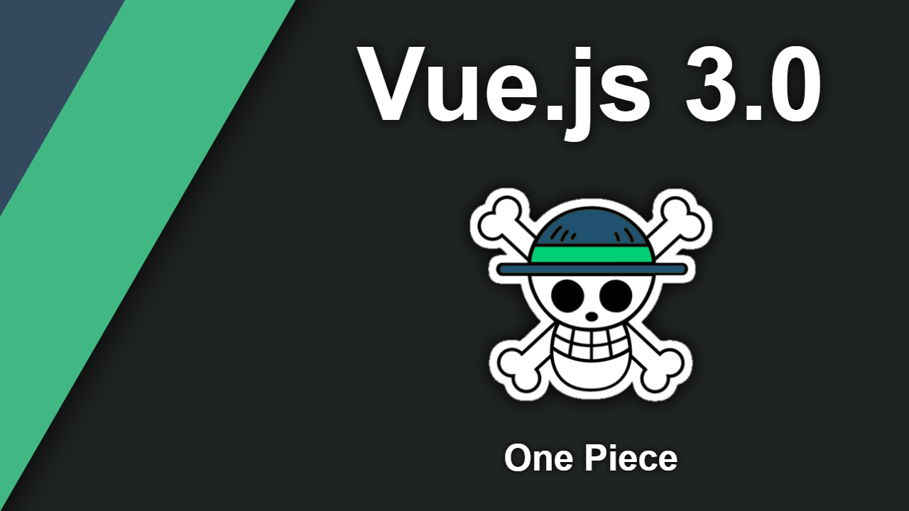

## Qu'est-ce que c'est ?

[Vue.js](https://v3.vuejs.org) est un framework de dévelopement web basé sur la **componentization** comme [React](https://fr.reactjs.org) ou [Angular](https://angular.io). La particularité de Vue est qu'il se veut facile à maitriser et à intégrer à des projets divers tout en restant capable de créer des single-page applications complexes. \
La dernière majeure version **Vue.js 3.0** est sortie le 18 septembre 2020 avec pour nom de code **One Piece**. Cette release change énormément de choses dans l'utilisation et le fonctionnement global du framework. Dans ce tuto on ne s'intéressera qu'à cette version.

## Installation

Il existe 3 manières différentes d'implémenter Vue dans vos projets :

### 1. L'importer comme un "Content Delivery Network" package

Cela signifie que votre applications ira directement téléchager la version de Vuejs spécifiée au runtime. Pour cela il suffit de rajouter cette ligne dans votre html :

```html
<script src="https://unpkg.com/vue@next"></script>
```

Cette pratique rapide est assez efficace pour du prototypage mais elle est déconseillée sur le long terme.

### 2. L'importer comme package npm

Pour un import un peu *propre* on peut utiliser le Node Package Manager (ajouter lien vers tuto Node pas ecore écrit). Pour cela on va lancer la commande suivante dans le dossier `root` du projet :

```shell
npm install vue@next # avec npm directement
# OU
yarn add vue@next # en passant par yarn
```

Cette commande va installer la dernière version de Vue.js dans le dossier node_modules ainsi que toutes ces dépendances.

### 3. Utiliser le CLI (Command Line Interface) officiel de Vue

Vue nous offre une [CLI](https://cli.vuejs.org/guide) avec beaucoup de fonctionnalités trés itéressantes pour le développement d'applications web basées sur le framework :

- génération de composants Vuejs
- local server avec hot-reload
- lint-on-save
- ...

Il faut d'abord installer le CLI globalement sur notre machine pour pouvoir l'utiliser directement depuis n'importe où :

```shell
npm install -g @vue/cli @vue/cli-service-global # avec npm directement
# OU
yarn global add @vue/cli @vue/cli-service-global # en passant par yarn
```

Pour tester l'installation on peut executer la commande suivante :

```shell
vue --version
```

Pour utiliser le CLI avec Vue 3.0 il nous faut `@vue/cli 4.5` ou supérieur.
