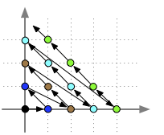
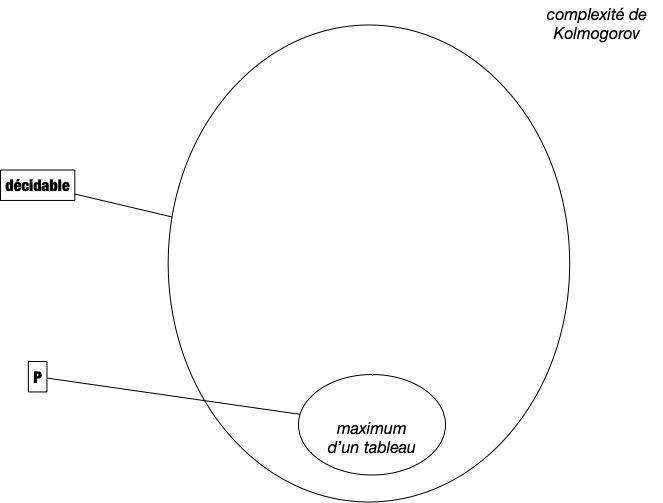

Les classes de problèmes et leurs significations donnent toujours des problèmes aux étudiants. Ils ne sont certes pas aidés par la terminologie qui, lorsqu'elle n'est pas cryptique, peut induire en erreur. Nous allons tenter d'être le plus clair possible en n'introduisant que ce qu'il est nécessaire de jargon pour comprendre l'enjeu de cette classification.

## Algorithmes, décideurs et vérifieurs

Rappelons qu'un algorithme est [dans toute sa généralité](../../bases-théoriques/calculabilité/#algorithme-fonction-N){.interne} une fonction de $\mathbb{N}$ dans $\mathbb{N}$ et qu'[un décideur](../../écrire-algorithmes/problème/#décideur){.interne} est un algorithme dont la sortie est soit OUI (que l'on associe à 1) soit NON (associé à 0).

On va commencer par montrer qu'un algorithme peut être vu comme un décideur, ce qui nous permettra ensuite de nous restreindre aux [problèmes de décision](../../écrire-algorithmes/problème/#problème-décision){.interne}.

Commençons par démontrer que $\mathbb{N}^2$ et $\mathbb{N}$ sont en bijection (on pourrait utiliser l'argument de [la partie calculabilité](../../bases-théoriques/calculabilité/#algorithme-fonction) en recodant les différents paramètres mais ne boudons pas notre plaisir en utilisant, et en la démontrant, la bijection classique que l'on doit au mathématicien [Cantor](https://fr.wikipedia.org/wiki/Georg_Cantor)) :


$\mathbb{N}^2$ et $\mathbb{N}$ sont en bijection.


Remarquons que tout élément de $\mathbb{N}^2$ est un point du plan :


On peut les parcourir en suivant les diagonales :



On chemine alors comme ça :

1. $(0, 0)$
2. $(1, 0)$
3. $(0, 1)$
4. $(2, 0)$
5. $(1, 1)$
6. $(0, 2)$
7. $(3, 0)$
8. $(2, 1)$
9. $(1, 2)$
10. $(0, 3)$
11. $(4, 0)$
12. ...

Et on associe à un entier $(x, y)$ son ordre de cheminement $O((x, y))$ (par exemple $O((2, 1)) = 8$).

Ce cheminement est clairement une bijection.

On peut donc aussi associer un unique entier à tout couple d'entiers avec $O^{-1}$ ($O^{-1}(6) = (0, 2)$ par exemple).



$\mathbb{N}^p$ et $\mathbb{N}$ sont en bijection pour tout entier $p$.


La démonstration précédente montre que $\mathbb{N}^p = \mathbb{N}^2 \times \mathbb{N}^{p-2} $ est en bijection avec $\mathbb{N} \times \mathbb{N}^{p-2} = \mathbb{N}^{p-1}$ pour tout $p>2$.



Écrivez le pseudo-code de la fonction $O^{-1}$ qui associe un couple $(x, y)$ unique à un entier $i$ passé en paramètre.



```text
Nom : O^{-1}
Entrée : un entier i
Programme :
    x = y = 0
    k = 0
    tant que k < i:
        si x == 0:
            x = y + 1
            y = 0
        sinon:
            x = x - 1
            y = y + 1
    Retour (x, y)
```




À partir du pseudo-code de $O^{-1}$, il est facile d’écrire le pseudo code de $O$ : faites le.



```text
Nom : O
Entrée :  un couple (u, v) d'entiers
Programme :
    x = y = 0
    i = 0
    tant que (u, v) ≠ (x, y):
        i = i + 1
        si x == 0:
            x = y + 1
            y = 0
        sinon:
            x = x - 1
            y = y + 1
    Retour i
```


Comme un algorithme est une fonction $f: \mathbb{N} \rightarrow \mathbb{N}$, on peut lui associer de façon équivalente la fonction $v_f$ ci-dessous :

$$
v_f(n, m) = \left\\\{
    \begin{array}{ll}
        1 & \mbox{si } f(n) = m\\\\
        0 & \mbox{sinon.}
    \end{array}
\right.
$$

On peut voir l'algorithme $v_f$ comme un vérifieur. Il vérifie que le second paramètre est la sortie du premier paramètre. On reparlera de ces algorithmes dans la suite, pour l'instant ils nous permettent de montrer que l'espace d'arriver d'un algorithme peut être uniquement deux valeurs. Un algorithme peut être vu comme une fonction de :

$$f: \mathbb{N}^2 \rightarrow \\{0, 1 \\}$$

Et comme $\mathbb{N}^2$ est en bijection avec $\mathbb{N}$ :


Un **_algorithme_** est une fonction de :

$$f: \mathbb{N} \rightarrow \\{0, 1 \\}$$



Un décideur est donc une notion a priori plus générale qu'un algorithme puisque l'on peut les écrire sous la forme d'un décideur ! On ne va bien sur pas uniquement utiliser des décideurs en pratique, loin de là, mais cela montre que l'on peut se contenter de considérer les propriétés théoriques des problèmes de décisions puisqu'on pourra les appliquer sans perte de généralité aux autres problèmes.

Avant de passer à l'étude théorique des problème de décision pour lesquels il existe un algorithme de résolution ([les problèmes de décision décidables](../../écrire-algorithmes/problème/#décidable){.interne}) analysons les 3 formes d'algorithmes (que l'on a montré équivalentes) utiles :


On peut représenter un algorithme sous 3 formes équivalentes utiles en théorie :

- les **_fonctions_** : $A(x) = y$, avec $x, y \in \mathbb{N}$ qui permettent le calcul effectif,
- les **_décideurs_** : $A(x) = b$, avec $x \in \mathbb{N}$ et $b \in \\{0, 1\\}$ qui permettent de séparer les entiers en 2, les entiers _vrais pour $A$_ : $\\{ x \vert A(x) = 1 \\}$, et les autres
- les **_vérifieurs_** : $A(x, y) = b$, avec $x, y \in \mathbb{N}$ et $b \in \\{0, 1\\}$ qui, associé à un problème algorithmique $P$, permettent de vérifier si le couple $(x, y)$ est tel que $y$ soit une solution de $P$ avec $x$ comme entrée.



## Problèmes utilisables en pratique

Pour qu'un [problème algorithmique](../../écrire-algorithmes/problème/){.interne}) puisse être utilisé en pratique, il faut bien sûr qu'il soit [décidable](../../écrire-algorithmes/problème/#décidable){.interne}, c'est à dire qu'il existe un algorithme permettant de le résoudre. Mais parmi ces derniers, pour être utile en pratique, encore faut-il que l'on puisse les traiter en temps raisonnable (la durée d'une vie humaine par exemple). On va donner deux définitions du terme *traiter*. Commençons par la plus évidente : la résolution.


### Problèmes P


Un problème algorithmique est dit ***polynomial*** s'il existe un algorithme de complexité polynomiale en la taille de son entrée permettant de le résoudre.

L'ensemble des problèmes polynomiaux est nommé $P$.


On a vu un certains nombre de problèmes polynomiaux, on peut par exemple citer :

- Trouver le maximum d'un tableau d'entiers dont [on a démontré que sa complexité était linéaire](../../complexité-problème/#recherche),
- Trier un tableau d'entiers dont [on a démontré que sa complexité était $\mathcal{O}(n\ln(n))$](../../problème-tris/complexité-problème) où $n$ est la taille du tableau,



Le cas du [problème de l'exponentiation](../../projet-expenentiation/étude-algorithmique) est intéressant car on a démontré qu'il était en $\mathcal{O}(\ln(n))$ où $n$ est la valeur de l'exposant. Il n'est donc pas évident au premier coup d'œil que cela est bien polynomial en la taille des entrées, c'est à dire 2 entiers.

En informatique théorique l'unité d'information est le bit, la taille de l'entrée d'un algorithme est toujours égale au nombre de bits nécessaires pour la stocker. Pour un entier il s'agit donc du logarithme en base 2 de sa valeur et donc le problème de l'exponentiation est bien polynomiale, il est même linéaire en la taille de l'entrée...

### Problèmes et vérificateur 

Il existe de nombreux problèmes dont on ne connait pas la complexité, ou dont on ne connait pas d'algorithme polynomiaux pour les résoudre. Citons en 3 pour se fixer les idées :

- [somme de sous-ensemble](https://fr.wikipedia.org/wiki/Probl%C3%A8me_de_la_somme_de_sous-ensembles)
- [sac à dos](https://fr.wikipedia.org/wiki/Probl%C3%A8me_du_sac_%C3%A0_dos)
- [isomorphisme de graphes](https://fr.wikipedia.org/wiki/Isomorphisme_de_graphes)

Si l'on ne connait pas d'algorithme polynomiaux pour résoudre les 3 problèmes ci-dessus, on peut en revanche vérifier efficacement (*ie.* polynomialement) si une solution en est une ou pas.

> TBD exemple avec sous-ensemble

Cette notion de vérification est cruciale. Si on ne sait pas construire de solutions nous même mais que quelqu'un arrive avec une solution potentielle, il faut pouvoir vérifier qu'elle est correcte avant de l'utiliser. Sans cette condition le problème n'a pas de solution réaliste : toute valeur peut être solution on ne peut pas savoir avant d'essayer.

Formalisons la notion de vérification efficace

> TBD déf avec algo qui vérifie une solution

> TBD dire que l'algo vérifieur c'est comme une preuve mathématique prouvable par un humain
> TBD dire que le certificat n'est pas toujours la solution, par exemple pour le problème de décision


### Problèmes NP

> TBD dire que vérifieur ne marche pas bien avec décision. Ici on parle plus de reconnaissance de mots, d'un langage

Pouvoir reconnaitre efficacement (*ie.* polynomialement) si une valeur est solution à un problème est une notion plus générale que seulement pouvoir la calculer (on peut utiliser l'algorithme de calcul pour vérifier) et est une condition nécessaire pour que l'on puisse utiliser une solution potentielle : on doit pouvoir vérifier/démontrer qu'une proposition de solution en est bien une avant de l'utiliser.

Formalisons cette notion :
faire avec le certificat


Un problème algorithmique est dit ***polynomial*** s'il existe un algorithme de complexité polynomiale en la taille de son entrée permettant de le résoudre.
> TBD le faire avec la solution.



La notion de problème utilisable en pratique est donc ceux dont la reconnaissance est efficace (*ie.* polynomiale) :
Ces 3 problèmes ont 
> TBD : bipartition
> TBD : isomorphisme de graphe
> TBD : sac à dos

> TBD : attention ne veut pas dire non polynomial...

On déduit de la partie précédente que :

## Décision
faire la définition avec le certificat.
np difficile

np et co np


Problème algorithmique et problème de décision sont également deux notions équivalentes : on peut se restreindre à considérer [les problèmes de décision décidables](../../écrire-algorithmes/problème/#décidable){.interne} (ceux dont il existe un algorithme permettant de le résoudre).


Parmi ces

> TBD

> problème NP = vérifiable = ceux qui sont utiles en pratique

1. algorithme = résout quelque chose et plein de façon de résoudre
2. définition d'un problème
3. facile à voir si ok ou pas
4. Complexité d'un programme :
   1. monter que selon la forme log, n n^k et 2^n c'est pas pareil
      1. nombre max / heure
      2. nombre max / puissance de machine
   2. déf et parler de O, Theta
5. ex : SAT
   1. def et utilisabilité
   2. SAT et 3-SAT : deux problèmes équivalent
6. classes de problèmes
