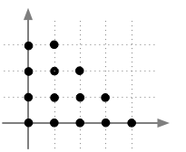

Les classes de problèmes et leurs significations donnent toujours des problèmes aux étudiants. Ils ne sont certes pas aidés par la terminologie qui, lorsqu'elle n'est pas cryptique, peut induire en erreur. Nous allons tenter d'être le plus clair possible en n'introduisant que ce qu'il est nécessaire de jargon pour comprendre l'enjeu de cette classification.

## Algorithmes et décideurs

Rappelons qu'un algorithme est [dans toute sa généralité](../../bases-théoriques/calculabilité/#algorithme-fonction-N){.interne} une fonction de $\mathbb{N}$ dans $\mathbb{N}$ et qu'[un décideur](../../écrire-algorithmes/problème/#décideur){.interne} est un algorithme dont la sortie est soit OUI (que l'on associe à 1) soit NON (associé à 0).

On va commencer par montrer qu'un algorithme peut être vu comme un décideur, ce qui nous permettra ensuite de nous restreindre aux [problèmes de décision](../../écrire-algorithmes/problème/#problème-décision){.interne}.

Commençons par démontrer que $\mathbb{N}^2$ et $\mathbb{N}$ sont en bijection (on pourrait utiliser l'argument de [la partie calculabilité](../../bases-théoriques/calculabilité/#algorithme-fonction) en recodant les différents paramètres mais ne boudons pas notre plaisir en utilisant, et en la démontrant, la bijection classique que l'on doit au mathématicien [Cantor](https://fr.wikipedia.org/wiki/Georg_Cantor)) :


$\mathbb{N}^2$ et $\mathbb{N}$ sont en bijection.


Remarquons que tout élément de $\mathbb{N}^2$ est un point du plan :



On peut les parcourir en suivant les diagonales :


On chemine alors comme ça :

1. $(0, 0)$
2. $(1, 0)$
3. $(0, 1)$
4. $(2, 0)$
5. $(1, 1)$
6. $(0, 2)$
7. $(3, 0)$
8. $(2, 1)$
9. $(1, 2)$
10. $(0, 3)$
11. $(4, 0)$
12. ...

Et on associe à un entier $(x, y)$ son ordre de cheminement $O((x, y))$ (par exemple $O((2, 1)) = 8$).

Ce cheminement est clairement une bijection.

On peut donc aussi associer un unique entier à tout couple d'entiers avec $O^{-1}$ ($O^{-1}(6) = (0, 2)$ par exemple).



$\mathbb{N}^p$ et $\mathbb{N}$ sont en bijection pour tout entier $p$.


La démonstration précédente montre que $\mathbb{N}^p = \mathbb{N}^2 \times \mathbb{N}^{p-2} $ est en bijection avec $\mathbb{N} \times \mathbb{N}^{p-2} = \mathbb{N}^{p-1}$ pour tout $p>2$.



Écrivez le pseudo-code de la fonction $O^{-1}$ qui associe un couple $(x, y)$ unique à un entier $i$ passé en paramètre.



```text
Nom : O^{-1}
Entrée : un entier i
Programme :
    x = y = 0
    k = 0
    tant que k < i:
        si x == 0:
            x = y + 1
            y = 0
        sinon:
            x = x - 1
            y = y + 1
    Retour (x, y)
```




À partir du pseudo-code de $O^{-1}$, il est facile d’écrire le pseudo code de $O$ : faites le.



```text
Nom : O
Entrée :  un couple (u, v) d'entiers
Programme :
    x = y = 0
    i = 0
    tant que (u, v) ≠ (x, y):
        i = i + 1
        si x == 0:
            x = y + 1
            y = 0
        sinon:
            x = x - 1
            y = y + 1
    Retour i
```


Comme un algorithme est une fonction $f: \mathbb{N} \rightarrow \mathbb{N}$, on peut lui associer de façon équivalente la fonction $f'$ ci-dessous :

$$
f'(n, m) = \left\\\{
    \begin{array}{ll}
        1 & \mbox{si } f(n) = m\\\\
        0 & \mbox{sinon.}
    \end{array}
\right.
$$

Un algorithme est alors une fonction de :

$$f: \mathbb{N}^2 \rightarrow \\{0, 1 \\}$$

Et comme $\mathbb{N}^2$ est en bijection avec $\mathbb{N}$ :


Un **_algorithme_** est une fonction de :

$$f: \mathbb{N} \rightarrow \\{0, 1 \\}$$



Algorithme et décideurs sont donc deux notions équivalentes !

## Problèmes utilisables en pratique

On en déduit que problème algorithmique et problème de décision sont également deux notions équivalentes :


On peut se restreindre à considérer les problèmes de décision qui sont solvable par un algorithme.


> TBD

> problème NP = vérifiable = ceux qui sont utiles en pratique

1. algorithme = résout quelque chose et plein de façon de résoudre
2. définition d'un problème
3. facile à voir si ok ou pas
4. Complexité d'un programme :
   1. monter que selon la forme log, n n^k et 2^n c'est pas pareil
      1. nombre max / heure
      2. nombre max / puissance de machine
   2. déf et parler de O, Theta
5. ex : SAT
   1. def et utilisabilité
   2. SAT et 3-SAT : deux problèmes équivalent
6. classes de problèmes
