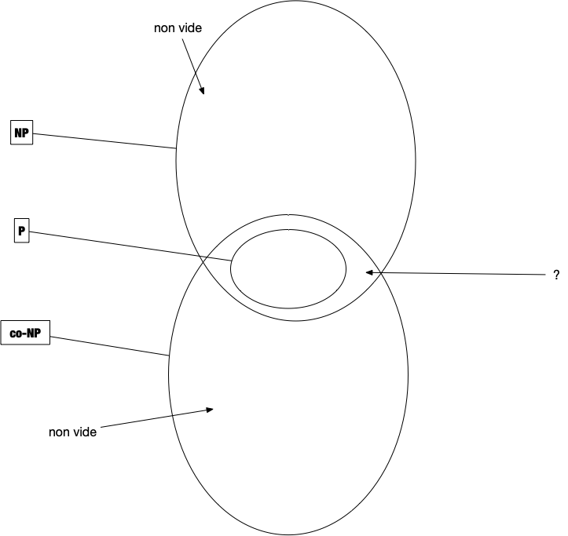

> TBD changer les exemple de SAT à autre chose.


[Classe co-NP](https://fr.wikipedia.org/wiki/Co-NP)


Un problème de décision est dans NP si on peut vérifier facilement qu'il ne répond pas OUI à tord et à travers. On ne lui demande rien s'il répond NON.

Prenons par exemple le problème SAT sous la forme d'un problème de décision :

```
nom : dec-SAT
Entrée : une conjonction de clauses.
Question : existe-t-il une assignation des variables satisfiable ?
```

Lorsque l'on répond OUI, il faut donner une raison (le certificat), c'est à dire exposer une assignation que l'opn peut vérifier. Pour répondre NON il faut vérifier toutes les assignations et montrer que ce n'est pas possible. C'est la différence en "il existe" (une assignation correcte, d'ailleurs là voilà) et "quelque-soit" (l'assignation la conjonction de clauses sera fausse).

Pour vérifier qu'il n'y a pas de réponse au problème de décision il n'y a pas de certificat à demander, il faut faire tous les cas.



**_Un problème (de décision) est dit_** co-$NP$ s'il existe un vérifieur efficace $v$ tel que pour toute entrée $e$ **fausse** du problème il existe $t$, appelé **_certificat de_** $e$ tel que $v(e, t)$ soit vrai.



Si l'on change le problème SAT en :

```
nom : tautologie
Entrée : une conjonction de clauses.
Question : Toute assignation des variables est-elle satisfiable ?
```

Ce problème n'est plus clairement dans NP car on ne connaît pas d'autre certificat que de de vérifier toutes les clauses, ce qui n'est pas polynomial. Ce problème est cependant clairement dans co-NP puisqu'il suffit d'exhiber ue assignation non vraie.

On voit bien que NON et OUI ont des comportements différents à cause du certificat polynomial à vérifier.


Une définition alternative de co-NP est souvent faite en utilisant les langages :



Un langage est dans co-$NP$ si sont complémentaire est dans NP.



Par exemple le langage des nombres composés qui correspond au problème de décision :

```
nom : composé
Entrée : un entier n
Question : n est-il composé ?
```

est dans NP. Son complémentaire, le langage composé des nombres premiers est dans co-NP. Comme le problème de décision [premier est dans $P$](https://annals.math.princeton.edu/wp-content/uploads/annals-v160-n2-p12.pdf) ceci est clair puisque l'on a clairement que :



La classe $P$ est dans $NP$ et dans co-$NP$.



Si le langage associé à un problème de décision est dans $P$. alors son complémentaire l'est aussi.


De là, si $P=NP$ alors $NP$=$co-NP$ mais cela a tout de même peut de chance d'être vrai. On ne sais pas grand chose de la relation entre NP et co-NP, à part la proposition suivante :



- $NP$ n'est pas strictement inclut dans co-$NP$.
- co-$NP$ n'est pas strictement inclut dans $NP$.



Supposons que $NP$ est strictement inclut dans co-$NP$. Il existe alors un problème de décision $p$ qui est dans co-$NP$ et pas dans $NP$ et soit $L$ sont langage. Son complémentaire $\overline{L}$ est alors dans $NP$ qui est dans inclut dans co-$NP$ ce qui implique que le complémentaire de son complémentaire $\overline{\overline{L}}$, qui vaut $L$, est dans $NP$ ce qui est impossible.

La seconde assertion se démontre de la même manière.



On a donc que $P \subseteq NP \cap co-NP$ et que si $NP \neq co-NP$ alors $NP \backslash co-NP$ et $co-NP \backslash NP$ sont non vide. En revanche on ne sait pas si $P = NP \cap co-NP$.
En supposant $NP \neq co-NP$ ce qui est supposé par la quasi-majorité des informaticiens on a la figure suivante :



## Problèmes co-NP complets

On peut montrer exactement de la même manière que pour le théorème de cook que la problème Tautologie est co-NP Complet. C'est à dire que pour tout problème $p$ de décision de co-NP il existe une réduction polynomiale telle que $p$ est inférieure à Tautologie.

Si $NP \neq co-NP$ les problème NP-complets et co-NP complets sont disjoints :



Si $NP \neq co-NP$ alors :

- les problèmes NP-complets ne sont pas dans co-$NP$
- les problèmes co-NP-complets ne sont pas dans $NP$



Soit $P$ un problème NP-complet qui est également dans co-NP et $p$ un problème de NP. On a alors $p \leq P$ et comme $P$ est également dans co-NP on a que $p$ est dans co-NP (la machine qui répond non pour $P$ répond aussi non pour $p$ en utilisant les algorithmes de la réduction).

Comme $p$ a été pris au hasard, tout problème de NP est dans co-NP ce qui est faut par hypothèse.

Le second item se démontre exactement de la même manière.


On a finalement trois cas possible :

1. P = NP = co-NP = NP-complet = co-NP-complet. Ce cas est hautement improbable, en tous les cas la quasi totalité des informaticien n'y croient pas.
2. P $\subsetneq$ NP = co-NP$. Dans ce cas NP-complet = co-NP-complet. Ce cas est très improbable, en tous les cas la très grande majorité des informaticiens n'y croient pas non plus.
3. P $\subsetneq$ NP ≠ co-NP$ qui est le cas admis par la quasi totalité des informaticiens. On se retrouve dans le schéma ci-après.



[np et co-np](https://www.youtube.com/watch?v=Hx6sfus7PIk&list=PLdUzuimxVcC0DENcdT8mfhI3iRRJLVjqH&index=46)

