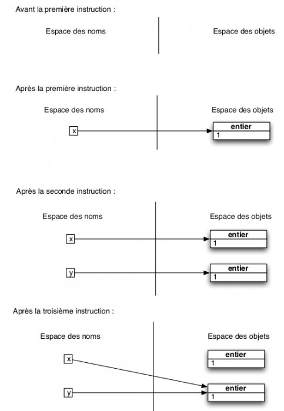


Utilisez la console de <https://console.basthon.fr/> pour exécuter les divers exemples et exercices


<!-- début résumé -->

Les variables permettent à l'interpréteur de se rappeler d'objet qu'il a crée lors d'exécutions précédentes. Sans elles, on ne pourrait exécuter que des lignes indépendantes les unes entre elles : bref, on ne pourrait rien faire d'intéressant.

<!-- end résumé -->


Une variable est un ***nom*** auquel est associé un objet.

Pour associer un nom à un objet on utilise l’opérateur d’affectation `=` tel que:

```txt
nom = objet
```



A gauche de l’opérateur `=` se trouve un **nom** (en gros, quelque chose ne pouvant commencer par un nombre) et à droite un **objet**. Dans toute la suite du programme, dès que l'interpréteur python rencontrera le nom, il le remplacera par l'objet.


Un nom n'est **PAS** une chaîne de caractères. Une chaîne de caractère est un objet alors qu’un nom n’est qu’un alias vers un objet.


Il est important de comprendre que l’opérateur d’affectation `=` n’est pas symétrique. À gauche, des noms et à droite, des objets.

## Espace de nom { #espace-nom }

Un **espace de noms** est un endroit où python stocke les noms. Une variable est un nom d'un espace de noms. Les espaces de noms sont hiérarchisées et tout en haut se trouve l'espace de nom **global** qui est créé lorsque l'interpréteur est lancé.


Si vous voulez en savoir plus sur les espaces de noms, vous pouvez consulter le cours sur [la mémoire et espace de noms]({{ "/cours/algorithme-code-théorie/code/mémoire-espace-noms" | url }})


## Affectation des objets à l'espace de noms

Attardons nous un moment sur ces notions car elles seront cruciales plus tard pour appréhender les possibilités offertes par les objets.

Considérons le programme suivant :

```python
x = 1
y = 1
x = y
```



La figure montre le résultat après chaque instruction. On voit qu’un même objet peut parfaitement
avoir plusieurs noms. Cependant, à un nom correspond un unique objet. Les objets qui n’ont plus de
noms sont supprimés à intervalles réguliers (c’est ce qu’on appelle le [garbage collector](https://towardsdatascience.com/memory-management-and-garbage-collection-in-python-c1cb51d1612c)) puisque l’on ne peut plus y accéder.

Le mécanisme décrit précédemment (remplacement des noms par les objets référencés avant exécution
de l’instruction) montre que l’on peut affecter plusieurs noms en même temps, comme le montre l’exemple suivant qui échange les objets des noms `i` et `j` :

```python
i = 2
j = 3
i, j = j, i
```

Enfin, il est possible d'affecter plusieurs noms à un même objet. Par exemple l'exemple suivant affecte le même entier 1 aux noms `x` et `y` :

```python
x = y = 1
```

> TBD : exercice variables de Pierre

## Supprimer un nom

On peut supprimer un nom en utilisant le mot clé `del`.

Dans une console :

```python
>>> x = 2
>>> print(x)
2
>>> del x
>>> print(x)
Traceback (most recent call last):
  File "<stdin>", line 1, in <module>
NameError: name 'x' is not defined
```
