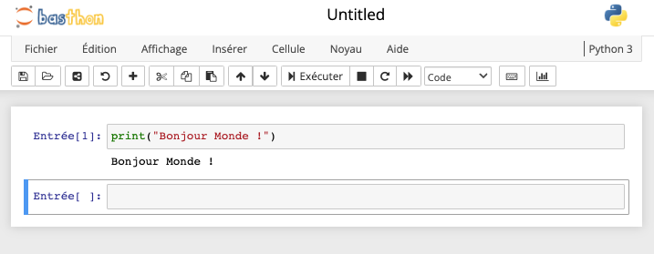
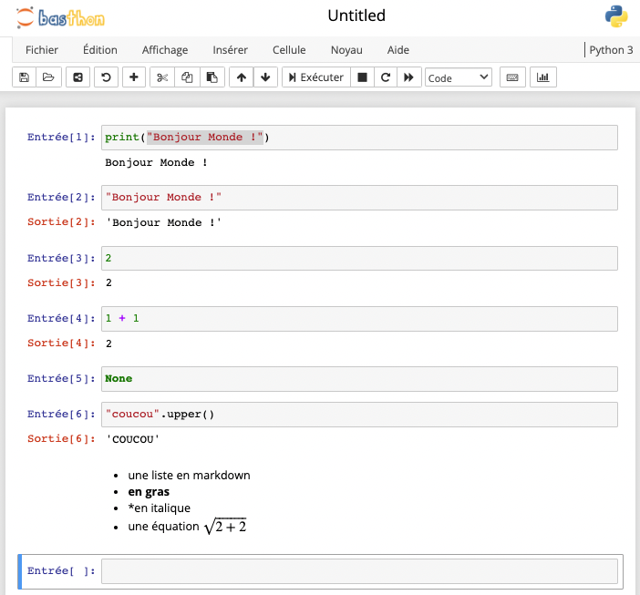
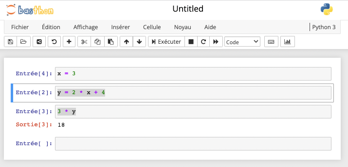

<!-- début résumé -->

Utiliser des notebooks pours écrire du code python.

<!-- end résumé -->

Les notebooks python ont été rendus populaire par la société Jupyter. Stricto sensu, c'est une interface web à [IPython](https://fr.wikipedia.org/wiki/IPython) (une console python conviviale).

## Notebook

### Sur le web

Il existe beaucoup de solutions pour utiliser un Notebook sur internet. On peut en citer deux :
Sur internet :

* <https://basthon.fr/> : pour un usage scolaire
* <https://colab.research.google.com> : pour un usage professionnel. Mais nécessite un compte google pour fonctionner.

Regardons à quoi ça correspond :



Vous allez vous retrouver sur le site <https://notebook.basthon.fr/>


Vous devriez avoir quelque chose du genre :




Si votre notebook n'est pas vide, recréez en un nouveau : *menu Fichier > Nouveau Notebook > Python 3*



Écrivons notre premier programme :



1. Dans la cellule votre notebook écrivez : `print("Bonjour Monde !")`{.language-}
2. assurez vous que le type de la cellule soit bien *code*
3. cliquez sur le bouton *Exécuter*



Vous devriez avoir quelque chose du genre :



Félicitations ! vous avez écrit votre premier notebook !

### Usages

L'utilisation d'un notebook est très adapté aux usages interactifs, car on voit directement le résultat de l'exécution de quelques lignes de codes. C'est pourquoi l'usage des notebook est généralisé :

* en data science
* dans l'enseignement
* dans la production de rapport

En revanche, un notebook n'est pas adapté du tout à l'écriture de programmes conséquents car il ne possède aucun des outils de développement requis.


L'usage d'un notebook est adapté lorsque notre code est destiné à être lu par des humains plutôt qu'un ordinateur.


## Utiliser

### Code d'une cellule

Une cellule est constituée d'une ou plusieurs lignes de code qui peuvent être exécutées.


Appuyer sur la touche entrée ajoute une ligne à la cellule, ne l'exécute pas.


A l'exécution, elles seront envoyées à l'interpréteur et une sortie (si elle existe) est affichée.

### Sortie d'une cellule

Après l'exécution du code d'une cellule, son résultat est présenté en dessous ce celle-ci. De façon plus précise :


Le résultat de la cellule est **la valeur de la dernière ligne**.


La valeur de la dernière ligne est souvent le résultat d'une fonction, mais cela peut tout aussi bien être juste un objet :



Dans la deuxième cellule votre notebook écrivez : `"Bonjour Monde !"`{.language-} puis exécutez là.



Vous devriez avoir quelque chose du genre :


La deuxième cellule contient une chaîne de caractère, elle est affichée comme sa sortie après exécution.

La différence avec la sortie de la première cellule est que `print`{.language-} est une fonction **qui ne rend rien**, elle ne fait qu'afficher des choses à l'écran.

```python
>>> x = print("Bonjour monde !")
Bonjour monde !
>>> print(x)
None
>>> 
```

Ce qui est affiché n'est donc pas son retour, mais son action (afficher des choses) : il n'y ait pas de quotes autour de *Bonjour Monde !* : ce n'est **pas** une chaîne de caractère python (comparez avec la sortie de la deuxième cellule qui elle est une chaîne de caractères python.)

Essayons de rendre tout ça un peu plus clair :


Dans un notebook :

1. tapez `2`{.language-} dans une cellule puis exécutez là.
2. tapez `1 + 1`{.language-} dans une cellule puis exécutez là.
3. tapez `None`{.language-} dans une cellule puis exécutez là.
4. tapez `"coucou".upper()`{.language-} dans une cellule puis exécutez là.



Vous devriez avoir quelque chose du genre :


1. La valeur de la cellule contenant `2`{.language-} est un entier valant 2
2. La valeur de la cellule contenant `1 + 1`{.language-} est un entier valant 2
3. La valeur de la cellule contenant `None`{.language-} est rien du tout et n'est donc pas affiché
4. La valeur de la cellule contenant `"coucou".upper()`{.language-} est le résultat de la méthode `upper()` appliquée à la chaîne `"coucou"`{.language-} : c'est la chaîne de caractère `"COUCOU"`{.language-}

### Type de cellules

Une cellule n'est pas forcément du code. Si vous cliquez sur le menu déroulant type de la cellule (il devrait y avoir marqué "code"), vous pouvez changer le type de la cellule en :

* code
* markdown
* texte brute
* titre

Les 2 types utilisés sont :

* code : pour écrire du python
* markdown : pour écrire du [markdown]({{ "/tutoriels/format-markdown"  }})

L'intérêt est qu'avec le markdown vous pouvez introduire ou commenter le résultat de cellules de code.


Dans une cellule changez son type en *markdown*, puis écrivez le code suivant :

```markdown
* une liste en markdown
* **en gras**
* *en italique*
* une équation $\sqrt{2+2}$
```

Puis exécutez la cellule.



Vous devriez avoir quelque chose du genre :




Lorsque l'on exécute une cellule au format markdown, le code disparaît et est remplacé par sa version compilée.


## Interpréteur

Le notebook n'est une interface à un interpréteur, nommé ***noyau***.

### Variables

Comme le noyau est unique, les variables définies dans une cellule peuvent être utilisées dans d'autres cellules.


Dans un nouveau notebook :

1. dans la première cellule, écrivez le code `x = 1`{.language-} puis exécutez la cellule
2. dans la seconde cellule, écrivez le code `y = 2 * x + 4`{.language-} puis exécutez la cellule
3. dans la troisième cellule, écrivez le code `3 * y`{.language-} puis exécutez la cellule


Vous devriez obtenir ceci :



Une affectation est considérée comme ne rendant rien. Il n'y a donc pas de sortie d'affichée si la la dernière ligne d'une cellule est une affectation.



### Ordre d'exécution

Le numéro entre crochet à gauche de la cellule est son ordre d'exécution. En re-exécutant une cellule, elle repasse dans l'interpréteur et son ordre d'exécution va changer.

Dans la figure ci-après, on a remplacé le code de la cellule d'ordre deux par `x = 3`{.language-} puis on l'a re-exécuté. Son ordre d'exécution vaut maintenant 4 et non plus 1 :



Les autres cellules ne sont pas exéctuées, et donc sans ordre d'exécution, on aurait l'impresion que le notebook est faux : si $x = 3$ $3 y$ devrait valoir $30$ et non pas 18...



Il faut alors re-exécuter toutes les cellules : *Menu cellule > Exécuter tout*


