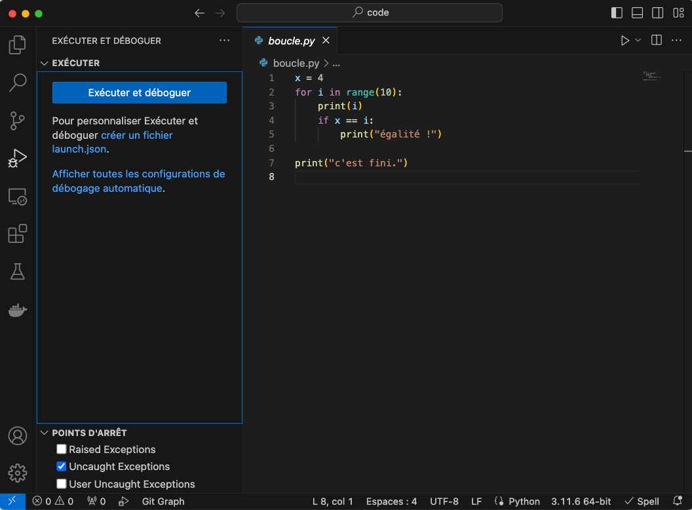
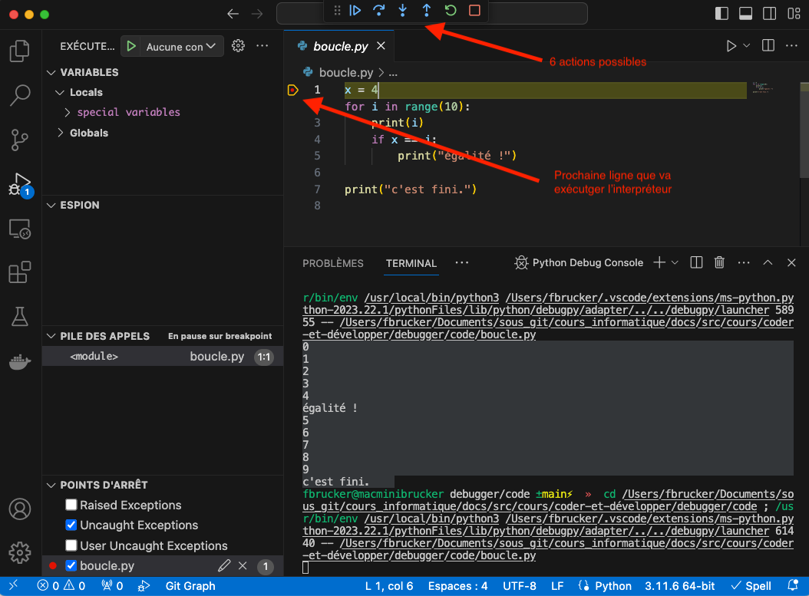
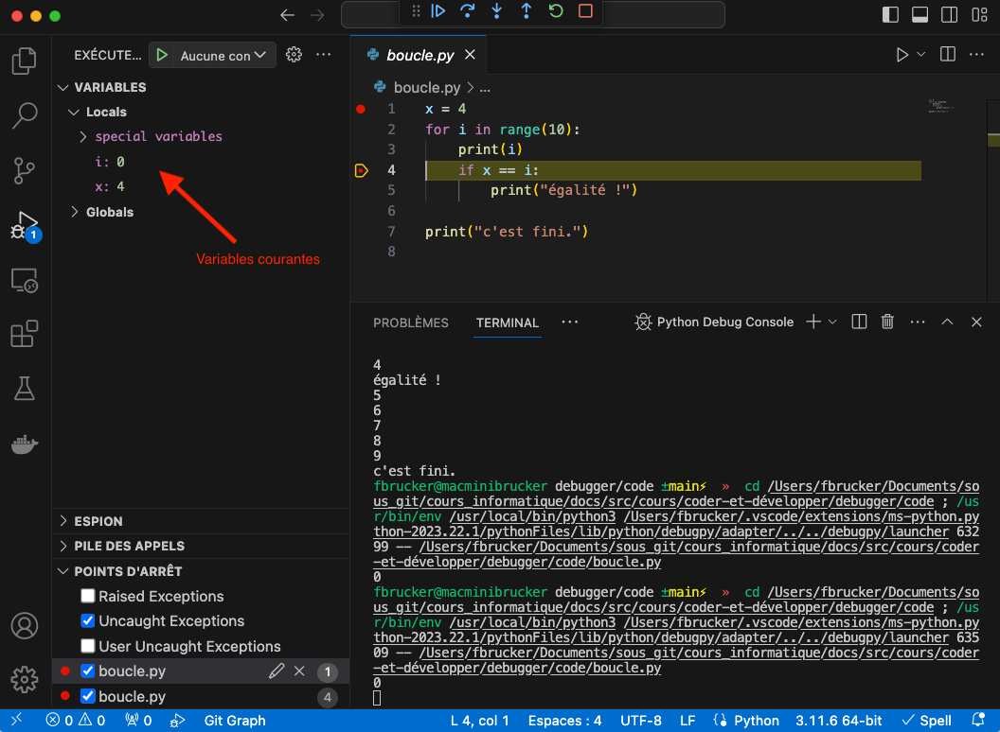



- <https://www.youtube.com/watch?v=7qZBwhSlfOo>
- <https://www.youtube.com/watch?v=KEdq7gC_RTA&list=PLQzZ4krxwT9Yay3kz8ly4wXiYJHzMtsWi>



Le ***débogueur*** (***debugger***) est un moyen d'exécuter le code ligne à ligne et de pouvoir visualiser et modifier l'état interne de l'interpréteur. Ceci permet de très rapidement corriger un programme.


Créez un dossier que vous nommerez `debugger`{.fichier} et ouvrez le en tant que projet dans vscode.


L'idée est de remplacer les divers `print`{.language-} utilisés pour visualiser un problème par une exécution contrôlée du code et de pouvoir stopper son exécution à des endroit prédéterminés appelés breakpoint.

## Breakpoint et exécution pas à pas


Créez un fichier `boucle.py`{.fichier} dans votre projet et copiez/collez y le code ci-après.


```python#
x = 4
for i in range(10):
    print(i)
    if x == i:
        print("égalité !")

print("c'est fini.")

```


Faites en sorte que les numéros de lignes correspondent.


### Exécution du debugger

On peut exécuter le programme via le debugger de plusieurs façons :

- `menu exécuter > démarrer le débogage`
- choisir le menu exécuter (`menu affichage > exécuter`) puis cliquer sur exécuter et déboguer.


À la première utilisation, il vous sera demandé de choisir une configuration de débogage , choisissez : `Fichier python Déboguer le fichier Python actuellement actif`



Vous pouvez refaire votre choix en allant dans le `menu Exécuter` puis en choisissant soit `Ouvrir les configurations` soit `Afficher les configurations`.






1. Allez dans le menu exécuter : `menu affichage > exécuter`
2. cliquez sur le bouton bleu `Exécuter et déboguer`



Si vous n'avez pas de bouton bleu c'est peut-être que vous avez ajouté des configurations de débogage à l'insu de votre plein gré. POur les supprimer, supprimez le dossier `.vscode`{.fichier} qui a du apparaître dans votre projet (clique droit dessus puis choisissez supprimer).


Une fois le programme lancé il a du s'exécuter et afficher dans le terminal :

```text
0
1
2
3
4
égalité !
5
6
7
8
9
c'est fini.
```

Il ne s'est rien passé de plus que si vous aviez exécuté votre programme python normalement.

C'est normal par il faut demander explicitement au débogueur de s'arrêter un créant un [***point d'arrêt***](https://fr.wikipedia.org/wiki/Point_d'arr%C3%AAt_(informatique)) (***breakpoint***).

### Création d'un breakpoint

Pour créer [un point d'arrêt (breakpoint)](https://code.visualstudio.com/docs/editor/debugging#_breakpoints) :

- `menu exécuter > activer/désactiver le point d'arrêt`
- cliquer sur la gouttière du fichier, à gauche des numéros de lignes (vous savez que vous êtes au on endroit lorsque un disque rouge foncé apparaît)
- appuyer sur la touche `<F9>`

Une fois le breakpoint placé, un point rouge doit apparaître dans la gouttière du fichier :



Placez un breakpoint à la ligne 1 du fichier `boucle.py`{.fichier} (identique à l'image ci-dessus).


On voit que le breakpoint est actif car il est sélectionné en bas à gauche du panneau du débogueur

### Lancement du débogueur


Avec le breakpoint de la ligne 1 actif, exécutez le débogueur en cliquant sur le bouton `Exécuter et déboguer`. Vous devriez vous retrouver dans l'état de la figure ci-dessous.




Le breakpoint est placé à la ligne 1 : l'interpréteur s'est arrêté **juste avant d'exécuter cette ligne**.

On a plusieurs types d'actions possibles (le nom de l'action apparaît lorsque la souris est placée dessus) :

- les actions bleues, `Continuer`, `pas à pas principal`, `pas à pas détaillé` et `pas à pas sortant`  qui gèrent l'exécution de l'interpréteur :
  - `Continuer` : l'interpréteur se lance et s'arrête à l prochaine ligne avec un breakpoint qu'il rencontre
  - `pas à pas principal` (*step over*) : l'interpréteur exécute la ligne
  - `pas à pas détaillé` (*step into*) : si la ligne consiste à exécuter une fonction que l'on a écrite, l'interpréteur d'arrête juste après l'appel de la fonction
  - `pas à pas sortant` : si l'interpréteur exécute une fonction que l'on a écrite, l'interpréteur continue son exécution jusqu'à ce qu'il sorte de la fonction
- l'action verte, `Redémarrer`, qui redémarre le débogueur
- l'action rouge, `Arrêter`, qui stoppe le débogueur

#### Action `Continuer`


Cliquez sur l'action bleue `continuer`.


L'interpréteur à continué son exécution jusqu'à trouver une ligne avec un breakpoint, ce qu'il n'a pas trouvé.


Ajoutez un breakpoint à la ligne 4 puis :

1. re-exécutez le débogueur
2. cliquez sur l'action `Continuer`



Vous devriez vous retrouver dans l'état suivant :



On voit l'état interne de l'interpréteur avec les deux variables `i`{.language-} (valant 0) et `x`{.language-} valant 4.


Ces deux variables sont également des variables globales.


#### Action `pas à pas principal`


Cliquez sur l'action `pas à pas principal`.


L'interpréteur est remonté en ligne 2. Puisque `i`{.language-} est différent de `x`, le bloc conditionnel n'est pas considéré. Voyez que l'instruction `for`{.language-} n'est pas exécuté puisque `i`{.language-} vaut toujours 0.


Cliquez sur l'action `pas à pas principal`.


La ligne 2 a été exécutée :  `i`{.language-} vaut bien 1.


Cliquez sur l'action `Continuer` jusqu'à ce que `i` soit égal à 4.


Vous devez vous retrouver devant l'état suivant :



Cliquez sur l'action `pas à pas principal`.


L'interpréteur à du s'arrêter en ligne 5


Cliquez sur l'action `pas à pas principal`.


Vous devriez voir la ligne `égalité` s'afficher dans le terminal.


Supprimez le breakpoint de la ligne 4 en cliquant sur le disque rouge qui lui est associé dans la gouttière.


Vous pouvez également supprimer un breakpoint en lui cliquant droit dessus dans le panneau du débogueur et en choisissant `Supprimer le point d'arrêt`.



Cliquez sur l'action `Continuer`.


L'interpréteur va continuer son exécution jusqu'à la fin du programme.


L'utilisation de breakpoints  permet d'accéder à **un point d’intérêt spacial** (une ligne) dans l'exécution du programme.


### Breakpoint conditionnel

Supposons que l'on veuille juste vérifier que notre condition if fonctionne bien. On s'en fiche des cas où `i`{.language-} est différent de `x`{.language-} lors de l'exécution du programme, donc inutile de s'arrêter à chaque fois que l'interpréteur passe en ligne 4.

Pour cela, on peut créer des breakpoint conditionnels :



1. Cliquez droit dans la gouttière de la ligne 4 et choisissez `Point d'arrêt conditionnel...`
2. Choisissez comme condition d'arrêt l'expression `i == x`{.language-}



Placement du breakpoint conditionnel :


Valeur du breakpoint conditionnel, en passant la souris dessus :




Exécuter le débogueur puis cliquer sur `Continuer` une fois l'interpréteur arrêté au breakpoint de la ligne 1.



Vous devriez vous arrêter au breakpoint de la ligne 4, mais `i`{.language-} vaut 4 (donc `x`{.language-}).


L'utilisation de breakpoints conditionnels permet d'accéder à **un point d’intérêt temporel** (ligne + condition) dans l'exécution du programme.


Pour finir cette partie, sortons du débogueur :


Cliquer sur l'action `Arrêter` pour stopper le débogueur.


## Gestion des Fonctions


Créez un fichier `boucle-fonction.py`{.fichier} dans votre projet et copiez/collez y le code ci-après.


```python
def test_égalité(i, x):
    print(i)
    if x == i:
        print("égalité !")


x = 4
for i in range(10):
    print(i)
    test_égalité(i, x)

print("c'est fini.")

```

Ce programme va vous permettre de voir :

- les actions `pas à pas détaillée` et `pas à pas sortant`
- le concept de variables locales et globales

### Actions pas à pas détaillée et sortant

\
> TBD step_into ne marche qu'avec nos fonctions, pas ceux de python (on ne connaît pas le code de print par exemple.)

### Variables locales/globales

## Pile d'appels

```python
def factorielle(n):
    if n <= 1:
        return n
    else:
        return n * factorielle(n - 1)


print(factorielle(10))

```

> TBD
>
> - montrer les appels successifs aux fonctions : stacks
> - faire une fonction récursive pour montrer les appels.

## Watchpoint

> TBD :
> -  utiliser les watch à la place des prints
> - utiliser des breakpoint conditionnels
> - variables locqle/globale


```python
def élague(x, crible):
    y = 2 * x
    while y < len(crible):
        crible[y] = False
        y += x


def nouveau_max_premier(ancien_max, crible):
    nouveau_max = ancien_max
    while not crible[nouveau_max]:
        nouveau_max -= 1

    return nouveau_max


def nouveau_min_premier(ancien_min, crible):
    nouveau_min = ancien_min
    while not crible[nouveau_min]:
        nouveau_min += 1

    return nouveau_min


n = 1000


crible = [True] * (n + 1)
crible[0] = False
crible[1] = False

x = 2
max_premier = len(crible) - 1

while x ** 2 < max_premier:
    élague(x, crible)
    max_premier = nouveau_max_premier(max_premier, crible)

    if x < max_premier:
        x = nouveau_min_premier(x + 1, crible)


premiers = [i for i in range(len(crible)) if crible[i]]

print("Les nombres premiers plus petits que", n, "sont :")
print(premiers)

```

> TBD : tout refaire faire.