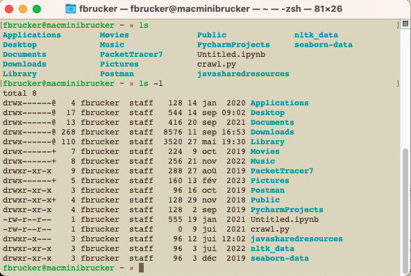

Qu'est-ce que le terminal ? Comment le trouver et taper des commandes.

## Introduction

Le terminal est l'outil utilisé pour taper des commandes qui seront ensuite exécutées par votre ordinateur. On appelle ça le [CLI](https://fr.wikipedia.org/wiki/Interface_en_ligne_de_commande).

Même si cela est intimidant, le CLI est le moyen le plus efficace d'interagir avec votre ordinateur car, contrairement aux applications :

* on peut ajouter des paramètres aux instructions
* on gère facilement les entrées et les sorties des commandes
* c'est automatisable par des scripts.

Enfin, c'est souvent la seule façon d'interagir avec un ordinateur distant.

Vous pouvez a priori utiliser votre ordinateur uniquement avec un terminal. L'interface graphique n'est qu'un ajout sympathique mais non indispensable à l'utilisation d'un ordinateur. Alors bien sur vous n'utiliserez pas le terminal tout le temps mais savoir s'en servir pourra vous faire gagner un temps fou lorsque vous faites de l'informatique.


Utiliser le terminal vous procure en plus ce petit sentiment grisant d'[être en prise directe avec la matrice](https://www.youtube.com/watch?v=MvEXkd3O2ow).


## Accéder au terminal

Il y plusieurs moyen d'accéder à l'application terminal.

### Via des menus



Dans le menu démarrer choisissez `toutes les applications` en haut à droite de la fenêtre. Le terminal est à la lettre `T` :

Le terminal s'appelle aussi parfois [powershell](https://learn.microsoft.com/fr-fr/powershell/scripting/overview?view=powershell-7.3), à ne pas confondre avec *l'invite de commande* (commande `cmd`) qui est là pour des raisons de compatibilités mais qu'il ne faut jamais utiliser soit même.




[l'aide de Mac](https://support.apple.com/fr-fr/guide/terminal/apd5265185d-f365-44cb-8b09-71a064a42125/mac) pour trouver le terminal.

L'application se trouve dans le dossier `/Application/utilitaires`{.fichier} que l'on peut facilement atteindre avec le `finder` :

1. `menu Aller > utilitaires``
2. une nouvelle fenêtre `finder` apparaît : double-cliquez sur l'icône "Terminal".

Une fois dans l'application `Terminal` vous pouvez ouvrir une nouvelle fenêtre dans le menu *Shell > Nouvelle Fenêtre > Nouvelle fenêtre avec le profil - ...* (les "..." correspondent à votre profil de fenêtre).




Rechercher terminal dans les applications :

Vous pouvez aussi utiliser le raccourci clavier global `<CTRL> + <ALT> + T` :



### Via l'explorateur de fichier

[L'explorateur de fichier](../fichiers-navigation/#explorateur) est un moyen simple d'accéder à un terminal directement placé dans le dossier voulu.



Dans l'explorateur cliquez droit sur le dossier, puis choisissez `Ouvrir dans le Terminal` :




Dans le finder cliquez droit sur le dossier, puis choisissez `services > Nouveau terminal au dossier` :





Cliquer croit sur un dossier dans l'explorateur et choisissez `Open in Terminal` :



### Via un IDE

La plupart des éditeurs de textes permettent d'ouvrir directement des terminaux. Si vous utilisez [vscode](https://code.visualstudio.com/) par exemple, vous pouvez directement ouvrir un terminal (voir [le tuto](../éditeur-vscode/terminal){.interne}).

## Épingler le terminal


Le terminal est super utile, ça vaut le coup d'ajouter un raccourci pour lui, histoire de l'avoir toujours sous la main.


Cliquer droit sur l’icône terminal dans la barre des taches et cliquer sur `Épingler à la barre des tâches` :



Avec une fenêtre finder dans le dossier `Applications/Utilitaires` glisser/déposez l’icône du terminal dans la barre des tâches.


Cliquer droit sur l’icône terminal dans la barre des taches et cliquer sur `add to favorites`:



## Utiliser le terminal

Maintenant que vous avez trouvé le terminal, ouvrez une fenêtre terminal :

Vous êtes devant ce qu'on appelle [***un prompt***](https://en.wikipedia.org/wiki/Command-line_interface#Command_prompt)*, ou *invite de commande*. Le prompt s'arrête juste avant le curseur, qui marque l'endroit où seront tapées les commandes.


C'est simple à utiliser. On tape une commande, on appuie sur entrée et la commande s'exécute.


Ces commandes peuvent être de 2 types :

* soit des noms de fichiers qui sont *exécutables* (ce sont des programmes)
* soit des instructions compréhensibles par le terminal comme `ls` (si si, c'est compréhensible par le terminal) par exemple.

Le terminal ci-après montre le résultat de la commande `ls` (on a tapé `ls` sur le clavier suivie de la touche entrée) :

[La commande `ls`](http://www.man-linux-magique.net/man1/ls.html) affiche les fichiers du dossier maison. En comparant avec un explorateur de fichier, on voit bien que les fichiers sont identiques :

Les commandes unix ont souvent pleins d'option, par exemple `ls` permet d'afficher les fichiers en liste avec plein d'informations supplémentaires, en utilisant l'option `-l` :

