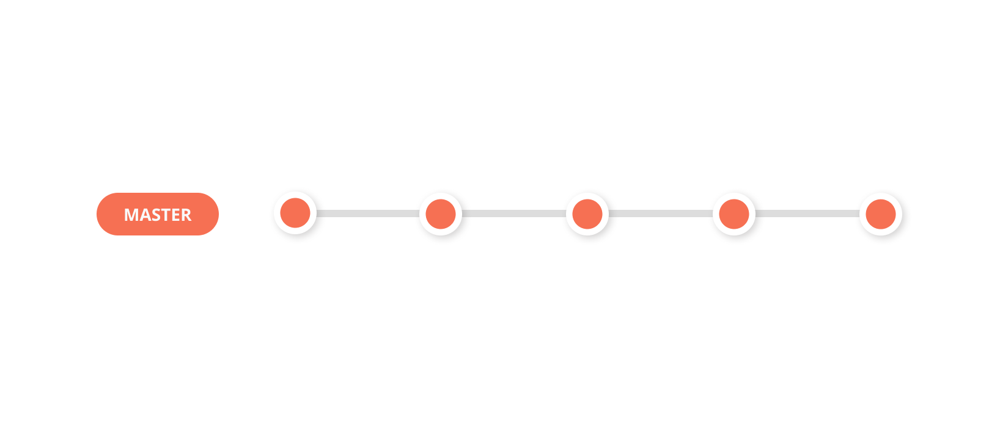
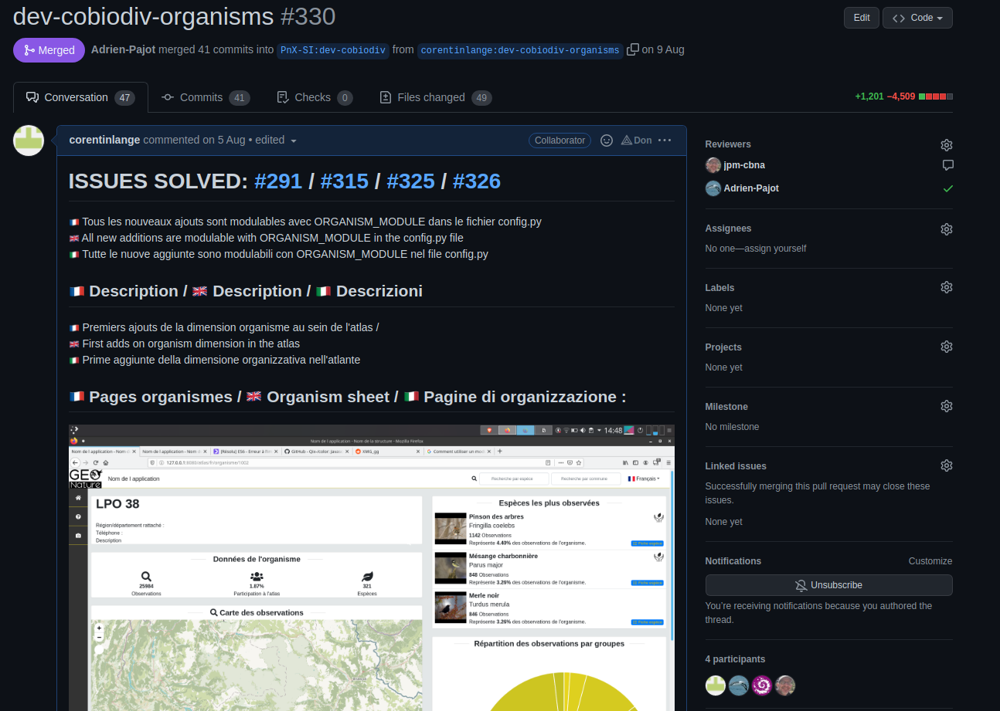

<!-- début résumé -->

Une fois apte à cloner un repo, le modifier, faire des commits, il est bien de savoir comment bien le faire !

<!-- fin résumé -->

[GitHub](https://github.com/) est très répandu pour le développement en équipe. Il peut-être une vraie aide à la productivité si il est bien utilisé, ou au contraire, rajouter une perte de temps et des nombreuses prises de têtes sans bonnes pratiques.

Ci-dessous quelques petites clés pour bien utiliser [GitHub](https://github.com/) & [GitLab](https://gitlab.com/) ! Tout ces conseils sont fortement inspirés de projets open-source, ces derniers maintenant une relecture et des règles de participations très claires afin de permettre au maximum de personnes de participer.

Deux repos qui, selon moi, sont très bien réalisé et celui du projet open-source [Atom](https://github.com/atom/atom) (un ide multi-languages personnalisables)

## Workflow

Le *"workflow"*, ou flux de travail en français (à bas les anglicismes) sont les petites règles à adopter pour avancer dans son travail dans de bonnes conditions en minimisant les potentielles pertes de temps créées par une mauvaise gestion.

Pour travailler en équipe, à l'aide de GitHub, il est bon de garder un schéma de travail harmonieux afin de faciliter la relecture des autres qui passeront derrière nous.

Je vous présente des méthodes de travail que l'on peut retrouver afin de gagner du temps, avoir une meilleure lisibilité ainsi que une meilleure intégration continue.

### Le No-flow



C'est souvent ce qu'on utilise la première fois en se servant de git et github : chacun pousse sur la branche main lorsqu'il ou elle a rajouté une fonctionnalité, corrigé un bug, modifié une partie déjà existante.

Travailler de cette manière est très peu pratique pour :

* la relecture du code
* une intégration continue
* un nombre de personnes participant élevé
* éviter des conflits de merge (que l'on veut au plus souvent éviter)

Ce tutoriel est ici en grande partie pour vous montrer d'autres modes de travail afin de parfaire l'expérience et l'efficacité du travail à plusieurs sur un projet.

### Le Git Flow


#### Branches

Il existe une sémantique des branches, libre à chacun de se la réapproprier mais faire comme tout le monde ça aide souvent à la compréhension !

#### `main`

Cette branche contient le code de production (celui actuellement utilisé sur votre produit/système fonctionnel).
Tout le code de développement(branch develop) est fusionné dans master au fur et à mesure que les features,etc... ont été dûment testées et validées.

#### `develop`

Cette branche contient le code de pré-production. Lorsque les fonctionnalités sont terminées, elles sont fusionnées dans la branche de développement pour de futurs tests avant validation pour "partir en prod".

#### `feature/<nom feature>`

Les branches feature sont utilisées pour développer de nouvelles fonctionnalités pour les prochaines versions. Elles peuvent être dérivées de develop et doivent être fusionnées avec develop(jamais main directement !).

On ajoute après le / le nom de la feature ajoutée, par exemple : feature/filter_dog pour l'ajout d'un filtre chien sur votre application.

#### `hotfix/<nom hotfix>`

Les branches hotfix sont nécessaires pour agir immédiatement sur un statut non désiré de master. Peut se ramifier à partir de master et doit fusionner dans master et develop.

#### `release/<nom release>`

Les branches de version prennent en charge la préparation d'une nouvelle version de production. Elles permettent de corriger de nombreux bogues mineurs et de préparer les méta-données pour une version. Peut se ramifier à partir de develop et doit fusionner avec master et develop.

### git flow init


<https://danielkummer.github.io/git-flow-cheatsheet/index.fr_FR.html>


git flow est une extension git qui une fois installée et initialisée pour votre projet (avec la commande `git flow init`) crée automatiquement toutes ces branches.

Une liste de commandes est associées directement à cet outil afin de gérer au mieux l'utilisation du workflow.


Il est clair qu'initialiser ce workflow pour un petit travail de rendu pour les cours est surdimensionné. Ce dernier est à utiliser dans des cas de projets sur long terme pour assurer une bonne intégration continue.


### Nom des Commits


<https://www.conventionalcommits.org/en/v1.0.0/>


La forme du nom de ses commits est aussi important, une liste de commits mal nommés peut vite devenir illisible et occasionner des pertes de fluidité pour la relecture.

Message de commit :

* titre du message : \<type\> [scope (optionnel)]: \<description\>
  * type :
    * **feature** : Ajout d’une nouvelle fonctionnalité
    * **test** : Ajout de tests
    * **bugfix** : Correction d’un bug
    * **hotfix** : Correction d’un bug critique
    * **chore** : Nettoyage du code
    * **experiment** : Expérimentation de fonctionnalités
    * ...
  * scope : Optionnel. l'endroit dans le code où les modification on été faites
    * **api** : changement dans l'api
    * **lang** : ajout d'une traduction dans une nouvelle langue
    * **style** : changement dans le css
    * ...
  * description : en une courte phrase d'une ligne.

* corps du message : à n'utiliser que si nsi vous avez besoin d'ajouter beaucoup de description à votre commit. Cela doit être rare

### Gitmoji


<https://gitmoji.dev/>


Pour aller encore plus loin on peut voir apparaître désormais des émojis dans les commits pour améliorer la relecture.

Il est conseillé de le mettre soit avant votre scope soit directement le remplacer avec.

Exemple de commits:

* Sans scope:
  * :bug: correction of bad codes
  * :zap: accelerated program launch on windows

* Avec scope:
  * :hammer: refact: refactored sql db
  * :rotating_light: fix: compiler problems


Personnellement je préfère garder le scope.



Le tableau [ici](https://gist.github.com/parmentf/035de27d6ed1dce0b36a) vous aide à trouver l'émoji associé au commit que vous souhaitez.


Vous pouvez vous même rédiger votre tableau dans votre **CONTRIBUTING** ! (On en parle plus bas)

## Pull Request (PR)

Il est fortement conseillé de passer par une Pull Request à chaque fois que l'on souhaite ajouter une modification sur un projet. Il permet d'avoir une première relecture par un ou plusieurs relecteurs pouvant commenter votre code là où il ferait défaut.

Elles sont aussi un bon moyen d'apporter des infos sur une contribution, de définir à quelles issues elles répondent en les identifiants directement dans le commentaire.



Comme vous pouvez le voir sur cette capture, sur une pull_request vous avez la possibilité d'assigner :

* Des **relecteurs** : devant donner leur aval pour accepter le merge
* Des **labels**: afin de trier les différentes pull request (ex : hotfix, feature,...)
* Définir si la pull request s'inscrit dans un projet ou/et à des milestones (un outil de gestion de projet présent sur github)
* Lier des **issues** qui seront automatiquement fermées au moment du merge de la pull request dans la branch master du projet

Cet outil permet ainsi d'"empaqueter" des commits au sein d'un ajout d'une plus grande quantité de modifications dans le projet.

## Issues

De la même manière que les Pull Requests, il est possible de créer des issues (ou problèmes) afin de mettre l'accent sur :

* l'ajout d'une fonctionnalité
* une dis-fonctionnalité

Une bonne issue doit être bien rédiger afin d'aider la personne qui va s'en occuper :

* si ajout d'une fonctionnalité :
  * bien décrire la fonctionnalité voulue
  * son fonctionnement
  * des visuels.
* si dis-fonctionnalité :
  * visuels,
  * comment l'erreur s'est produite ?
  * sur quelle machine ?
  * avec quelle version ?
  * si reproductible, expliquer comment la reproduire
  * indiquer des pistes si vous en avez

Je vous redirige [vers le contributing](./#contributing){.interne} afin d'aider les gens à leur rédaction d'issues.

## Gestion du repo - Documentation

Il est important de bien documenter son repository sur GitHub afin d'aider à la compréhension de ce dernier : que ce soit pour un projet fermé si de nouveaux développeurs arrivent dans l'équipe, ou bien dans une dynamique open-source pour toute personne souhaitant participer au projet.

Les fichiers Markdown(.md) sont donc vos meilleurs amis pour aider à la compréhension du projet.

### Readme


<https://www.makeareadme.com/>


C'est le fichier `README.md`{.fichier} visible directement sur votre repo quand on arrive dessus, il est à placer dans le fichier racine de votre projet. Il contient les informations qui sont généralement nécessaires pour comprendre le sujet du projet. Il est écrit en **markdown**(.md), comme tout ce site d'ailleurs, qui est un langage de balisage léger.

On y retrouve en général :

* le nom du projet
* son installation
* son utilisation
* des visuels

Vous pouvez vous inspirer du  [readme d'Atom](https://github.com/atom/atom#readme)

### <span id="contributing"></span> Contributing

Il est d'usage aussi de réaliser un fichier markdown `CONTRIBUTING.md`{.fichier} afin d'expliquer à toutes personnes participant au code/projet comment :

* bien faire leur commits dans ce projet
* ce qui est autorisé ou non
* un "template" pour les issues
* un "template" pour les pull requests

Vous pouvez vous inspirer du **CONTRIBUTING** de [Atom](https://github.com/atom/atom/blob/master/CONTRIBUTING.md), ainsi que celui de [GodotEngine](https://github.com/godotengine/godot/blob/master/CONTRIBUTING.md) (Moteur de jeux open-source).

Ces derniers sont très explicites et aident vraiment à obtenir des commits, pull requests de qualités étant une grande aide à toute personne souhaitant participer.

[Atom_contributing](https://github.com/atom/atom/blob/master/CONTRIBUTING.md)
[Godot_contributing](https://github.com/godotengine/godot/blob/master/CONTRIBUTING.md)

## Versioning - sémantique des versions


<https://semver.org/lang/fr/>


Pour les versions de votre projet il existe une sémantique précise.
On peut résumer cette sémantique à l'aide de ce graphe ci-dessous.

```shell
<major>.<minor>.<patch>-<label>
```

Par exemple :

```text
1.0.0-beta1 
```

On retrouve dans la version de son projet :

* le numéro de version **MAJEUR** : Quand les changements apportés ne sont pas rétrocompatibles, vulgairement de gros changements
* le numéro de version **MINEUR** : Quand les ajouts sont rétrocompatibles
* le numéro de version de **CORRECTIF/PATCH** : Pas d'ajouts de fonctionnalités mais uniquement des corrections.
* un **LABEL** facultatif: Pour apporter des précisions sur le type de version
  (ex: beta/alpha/stable)

## Bibliographie

* <https://docs.github.com/en/get-started/quickstart/github-flow>
* <https://github.com/atom/atom>
* <https://makeareadme.com>
* <https://github.com/godotengine/godot/>
* <https://semver.org/lang/fr/>
* <https://zepel.io/blog/5-git-workflows-to-improve-development/>
* <https://gitmoji.dev/>
