<!-- début résumé -->

Création et maintient d'un projet avec Github.

<!-- fin résumé -->

On en profitera pour voir le fonctionnement basique de git :

- commit
- branches
- merge

## Créer un projet

1. 
2. 

Résultat : 

Les _commit_ sont les mises à jour du projet.



Chaque **_commit_** est associé à une **_branche_** (ici `main`) et est obligatoirement constitué de :

- du nom de la personne qui a effectué le commit, ici `Test-cours-ecm`
- du numéro du commit, ici `da919d7` (donné automatiquement).
- d'un message (d'une ligne) décrivant le commit, ici `initial commit`



Voir [ce doc](https://medium.com/@jonathan_finch/git-commit-hash-number-theory-770f67ec492d) pour voir comment est calculé le numéro du commit.


## Faire des commits

### Ajout de fichiers

1. 
2. 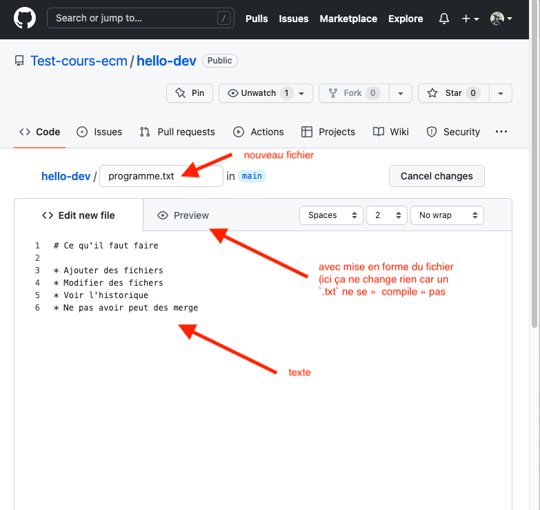
3. 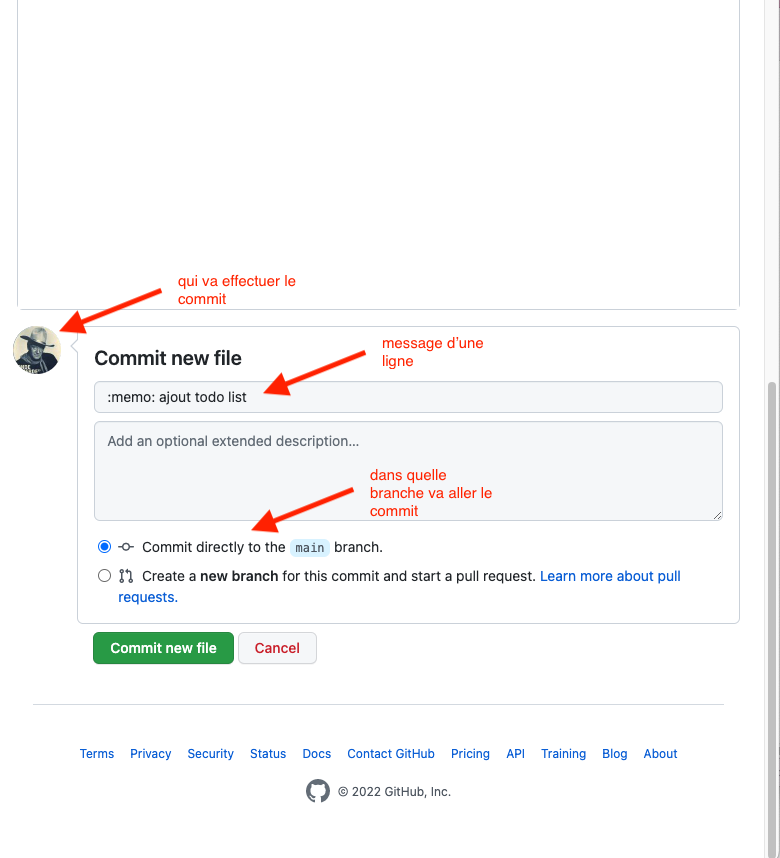
4. 


On a utilisé <https://gitmoji.dev/> pour le commit. Mettre un émoji en premier caractère du message permet de facilement identifier le but du commit.


Notre projet a maintenant 2 commits. En cliquant sur le texte _32 commits"_, on voit l'historique de notre projet sur la branche principale (`main`) :

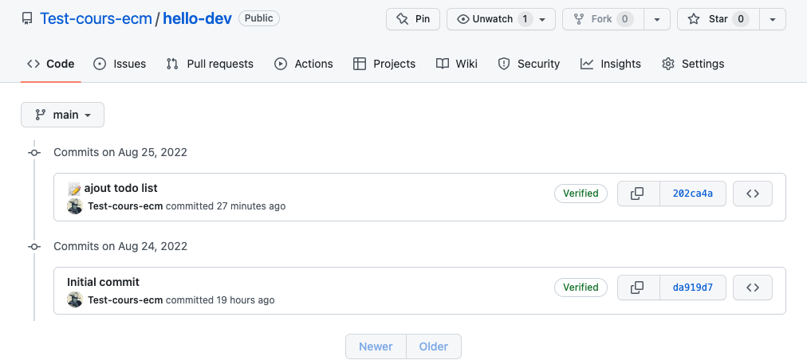

En cliquant sur le numéro de commit, on voit le détail de celui-ci :


Nous rentrerons plus en détails de ce tout cci signifie un peut plus tard. Mais La façon dont est représenté le commit suit la syntaxe des [GNU `diffutils`](https://www.gnu.org/software/diffutils/manual/diffutils.html). Pour nous :

1. on a modifié le fichier `programme.txt`{.fichier}
2. `@@ -0,0 +1, 6 @@` : on a supprimé aucune ligne et on a ajouté les lignes 1 à 6.
3. à droite on voit les lignes ajoutées en vert avec un `+` devant elles

### Modifier un fichier

Nous allons maintenant modifier le fichier `readme.md`{.fichier} qui est aussi un fichier texte écrit au format [Markdown]({{ "/tutoriels/format-markdown.md"  }}). POur que ce fichier soit agréable à la lecture, github le compile en html, mais — en vrai — c'est juste du texte.

1. 
2. 
3. 
4. 
5. 

Notre nouveau commit :

1. Notre fichier modifié est maintenant 
2. Son historique montre qu'il a été modifié par 2 commit 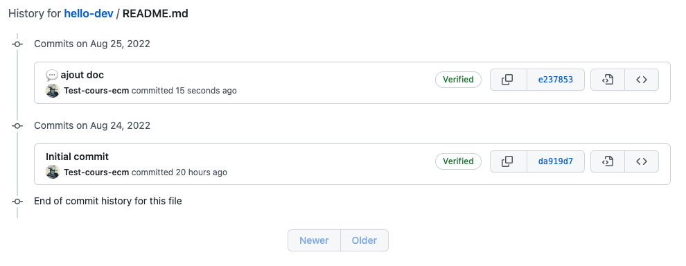
3. Le dernier commit a modifié son contenu 

## Changer de branche

Je suis content de mon projet, mais soit :

- j'aimerai tester des modifications sans être sûr de les conserver
- j'aimerai corriger un bug mais sa correction risque de prendre un peu de temps

De plus, je ne voudrai pas juste travailler dans mon coin et tout commiter une fois que ce sera fini car :

- le travail risque de prendre du temps et plusieurs commits
- si je travaille dans mon coin, lorsque j'aurai fini, les autres membres du projets auront certainement modifié le code.

La solution à ce problème consiste à ajouter **une branche** au projet.

### Création d'une nouvelle branche

1. 
2. On clique :
   - pour ajouter une nouvelle branche : 
   - on indique son nom et la branche à copier : 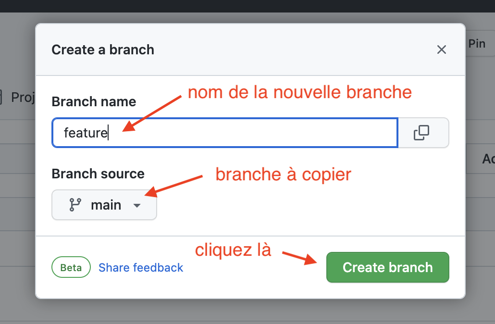
3. On peut maintenant changer de branche :
   - on retourne à la page de gestion de projet et on voit qu'on a 2 branches : 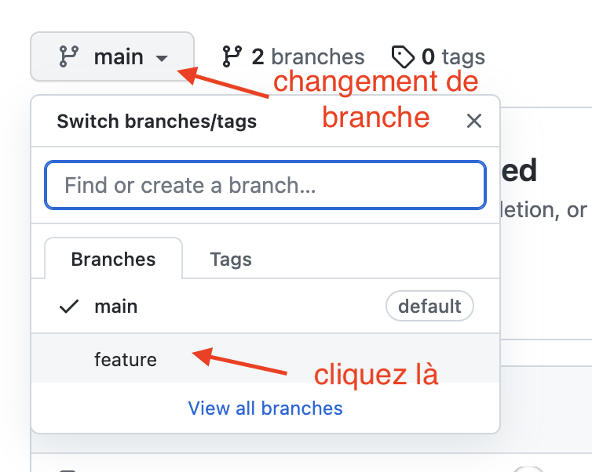
   - passage sur une autre branche : 

### Travail sur la nouvelle branche

1. ajout d'un fichier : 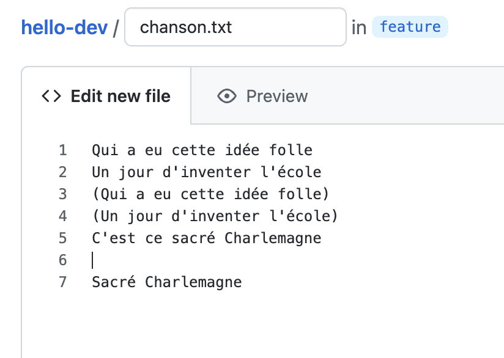
2. modification d'un fichier : 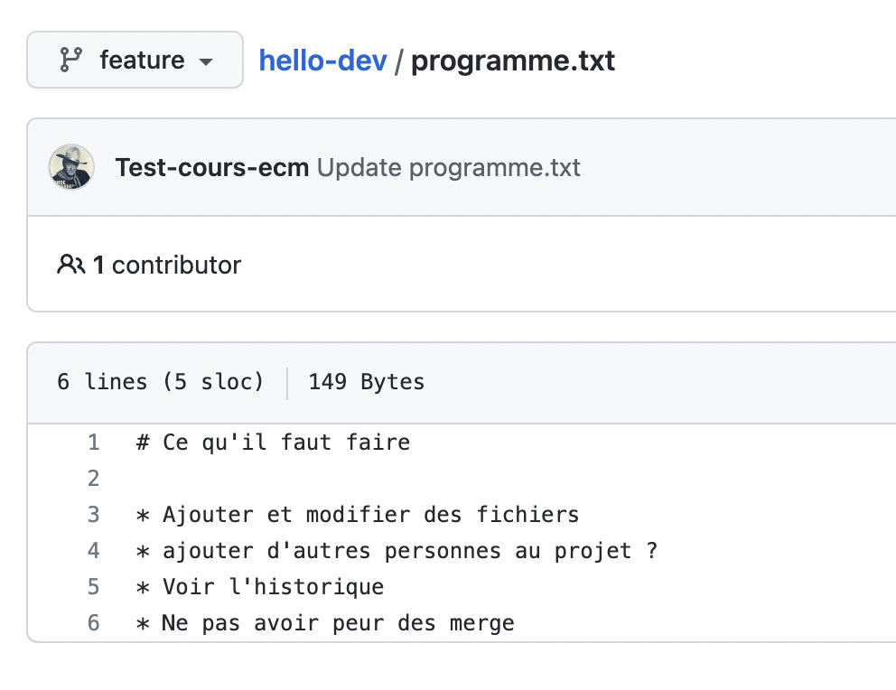

On obtient alors les commits sur la branches feature :

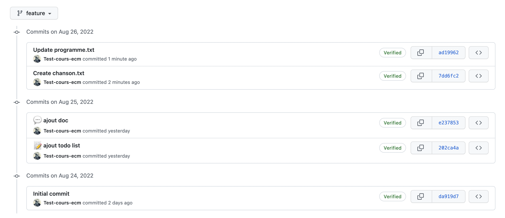

Les 3 premiers commits sont communs à la branche main (allez dans _"insights/network"_ pour voir le graphe de dépendances) :


Pour bien voir que les branches sont indépendantes, ajoutons un commit sur la branche main, en modifiant le fichier `programme.txt`{.fichier} :

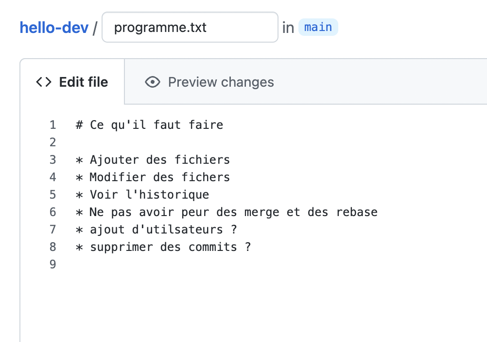

Le graphe de dépendance à maintenant deux histoires qui divergent :

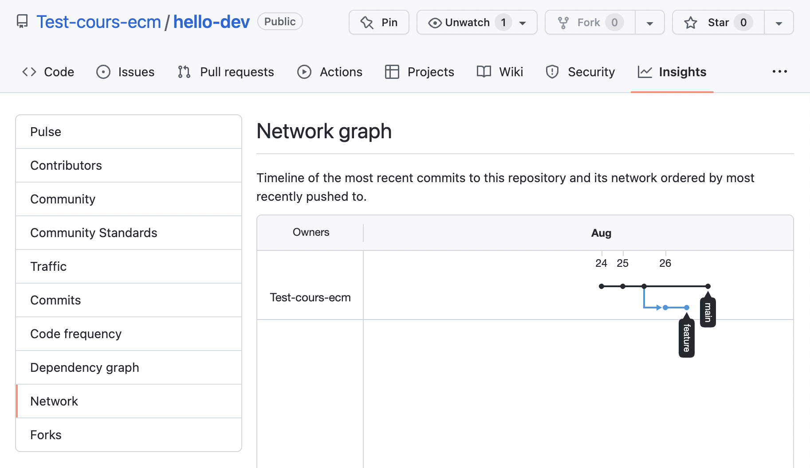

### Fusion de branches

Notre feature est terminée, nous voulons ajouter ses modifications dans la banche main. Ceci n'est pas possible directement car il y a également eu des modifications dans la branche main.

Il faut amener les modifications de la branche `feature` dans la branche `main` sans tout casser. Git permet de faire ceci avec deux opérations :

- merge
- rebase

#### merge

La situation actuelle est celle-ci :

```text

main : A -> B -> C -> F
                   \
feature :            -> D -> E

```

Et nous voulons arriver à ceci :

```text

main : A -> B -> C -> F ---------> G
                   \          /
feature :            -> D -> E

```

Il faut fusionner (`merge`) la branche `feature` dans la branche `main` puis supprimer `feature` car elle n'est plus utile.

Pour cela :

1. on va créer une `pull request` : 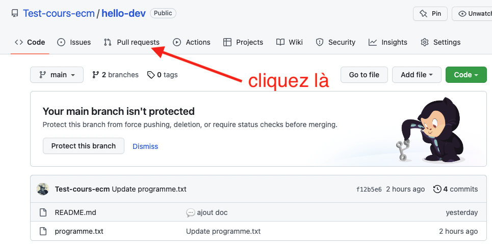
2. ce qu'on veut : 
3. ce n'est pas possible de faire ça automatiquement car il y a des mélanges de lignes :  L'ajout de fichier s'est passé sans problème en revanche, git le fait tout seul.
4. On clique sur `create pull request` pour créer la requête : 
5. En cliquant sur la requête, on voit qu'elle ne peut être résolue automatiquement : 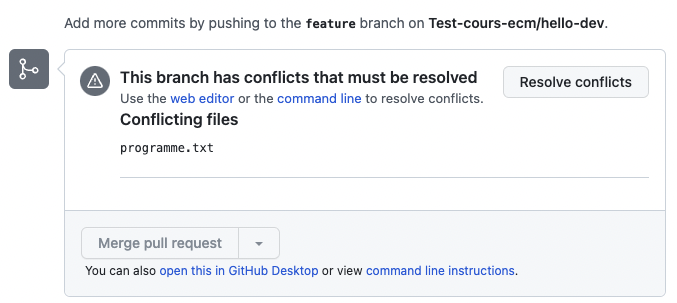
6. Qui sont dans le fichier `programme.txt`: 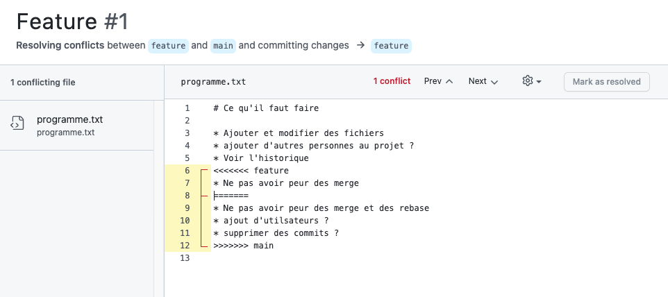
7. Chaque conflit (il peut y en avoir plusieurs par fichier) est toujours représenté comme ça :

```text
<<<<<< [nom d'une branche ou d'un commit]
[contenu de la branche]
====== autre branche
[contenu de l'autre branche]
>>>>>> [nom de l'autre branche ou de l'autre commit]
```

Résoudre un confit consiste à choisir une branche ou à faire un mélange des branches pour arriver à un texte sans les `<<<<<<`, `>>>>>>` et `=====`. Puis cliquez sur `mark as resolved Pour notre problème : 

Une fois la fusion exécutée, notre graphe de dépendance est :


On peut alors supprimer la branche `feature` qui ne nous est plus d'aucune utilisée. On ne peut donc plus faire de commits sur cette branche, mais son existence est conservée dans l'historique :


#### annuler un commit

L'opération `revert` permet de revenir en arrière et d'annuler un commit ou un _"pull request"_ (le commit fautif n'est pas supprimé).


Supprimer un commit n'est pas une opération recommandée lorsque des collaborateur ont pu avoir accès à celui-ci. Cela les désynchroniseraient. On préfère faire un `commit revert` qui crée un commit qui revient en arrière : on ne supprime pas le commit fautif, on l'annule en refaisant le contraire de ce qu'il a fait. Ceci assure que les utilisateurs restent synchronisés.



Nous allons ici _annuler_ notre pull request :

1. 
2. 
3. 

Nous venons de créer une `pull request` pour supprimer une pull request. On peut maintenant la résoudre :

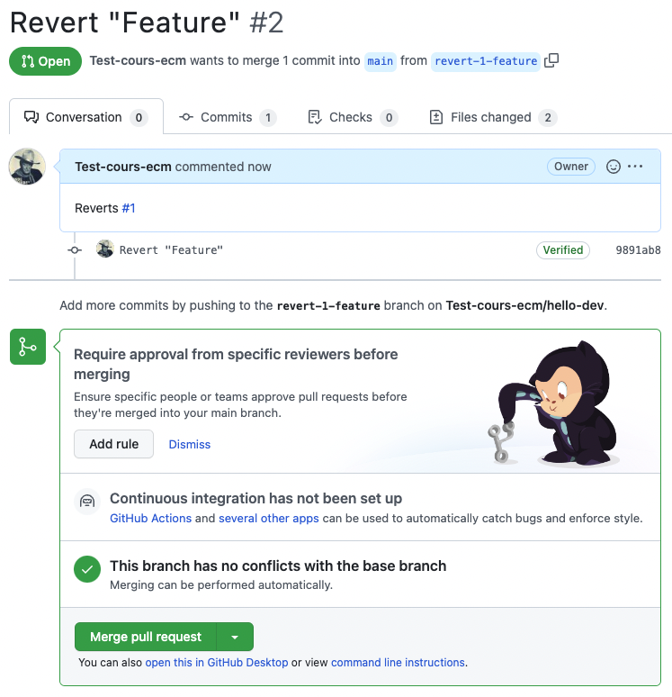

Et on se retrouve comme avant le merge, avec un graphe de dépendance encore un peu plus compliqué :

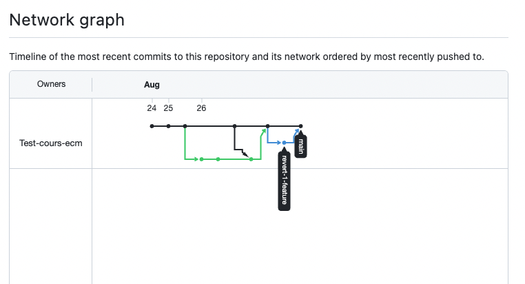

Git se débrouille tout seul

## Ajouter des collaborateurs au projet

C'est très facile :

1. 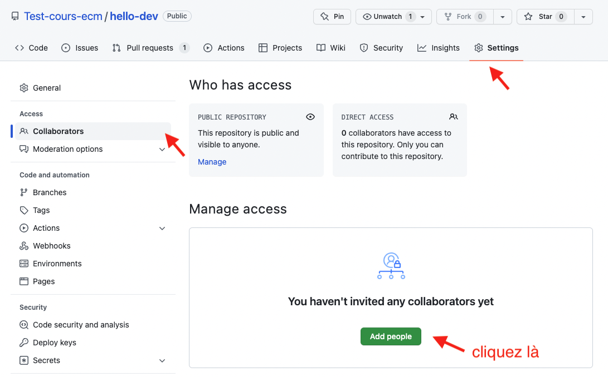
2. 
3. sur le compte invité, on peut accepter l'invitation : 
4. de retour dans l'interface du projet, on voit les collaborateurs : 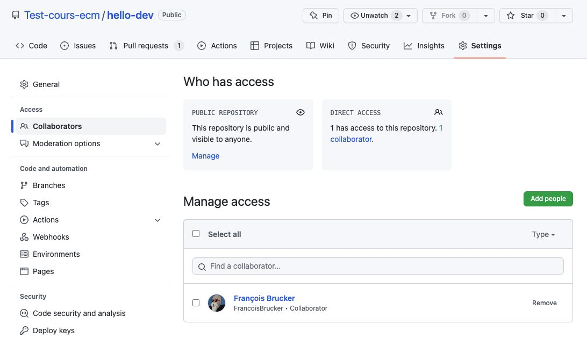

Toutes les personnes peuvent maintenant ajouter et modifier des fichiers
