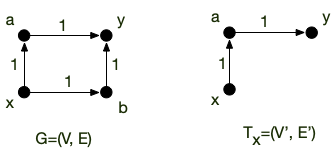
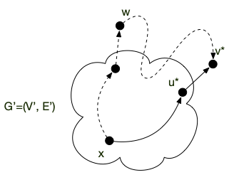
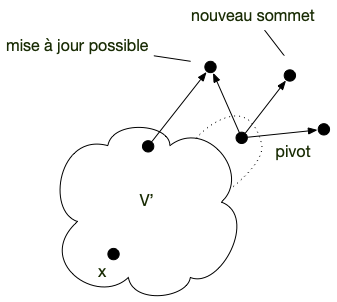
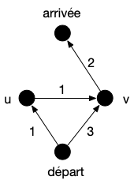

L'[algorithme de Dijkstra](https://fr.wikipedia.org/wiki/Algorithme_de_Dijkstra) permet, à partir d'un graphe orienté valué **positivement**, de trouver un chemin de longueur minimum entre deux sommets $d$ (départ) et $a$ (arrivée).

## Principe

L'algorithme de Dijkstra cherche à créer un **_arborescence_** à partir d'un graphe initial $G$. Précisons cela.



Soit $G =(V, E)$ un graphe orienté, $f$ une valuation positive des arcs de $G$ et $x$ un sommet du graphe. Une **_arborescence_** $T_{x} = (V', E')$ est un graphe tel que :

- $x \in V'$
- $V' \subseteq V$ et $E' \subseteq E$
- il existe un chemin $c^T_{xy}$ **unique** entre $x$ et $y$ dans $T_{x}$ pour tout sommet $y \in V'$
- pour tout $y \in V'$, tout chemin $c^G_{xy}$ entre $x$ et $y$ dans $G$ est tel que $f(c^G_{xy}) \geq f(c^T_{xy})$ : le chemin dans $T_x$ est **minimum**



Par exemple :



La définition d'une arborescence garantit le fait que tout ses chemins sont de poids minimum pour $G$. Remarquez de plus que pour tout graphe orienté $G$, il existe au moins une arborescence pour chacun de ses sommets puisque $T_{x} = (\\{x\\}, \varnothing)$ en est une quelque soient $x$ et $G$.

Enfin, la proposition suivant montre que l'on peut faire _grossir_ les arborescences :


Soit $G =(V, E)$ un graphe orienté valué par une fonction positive $f$. Et $T_x = (V', E')$ une de ses arborescence.

Si :

$$
W = \\{ uv \mid uv \in E, u \in V', v \in V \backslash V' \\}
$$

N'est pas vide alors il existe un arc $u^\star v^\star \in W$ tel que :

$$f(c^T_{xu}) + f(u^\star v^\star) = \min_{uv \in W}(f(c^T_{xu}) + f(uv))$$

Et

$$
T' = (V' \cup \\{v^\star\\}, E' \cup \\{ u^\star v^\star \\})
$$

est également une arborescence de $G$



Comme on ne rajoute qu'un arc à $E'$ pour créer $E''$, il ne peut exister qu'un seul chemin pour aller de $x$ à un autre sommet $y$ de $G'' =(V'', E'')$.

Il nous reste à prouver que le chemin pour aller de $x$ à $v^\star$ dans $G''$ est bien un chemin de poids minimum dans $G$. Pour cela, supposons qu'il existe un autre chemin entre $x$ et $v^\star$ dans $G$. Comme $x \in V''$, on peut noter $w$ le premier sommet de ce chemin qui n'est pas dans $V'$. Comme $w \neq v^\star$ (sinon les deux chemins seraient identiques) on se retrouve dans le cas de la figure ci-dessous :



Le poids du chemin en pointillé de $x$ à $w$ est par construction plus grand que le poids du chemin allant de $x$ à $v^\star$ (en trait plein). Comme les poids sont positifs, le chemin en pointillé de $x$ à $v^\star$ est donc de poids supérieur à celui en trait plein.



Le principe de l'algorithme de Dijkstra qui cherche un plus court chemin entre deux sommets $x$ et $y$ d'un graphe orienté valué par une fonction positive $f$ est alors :

1. partir de l’arborescence $T_{x} = (\\{x\\}, \varnothing)$
2. tant que $W = \\{ uv \mid uv \in E, u \in V', v \in V \backslash V' \\}$ est non vide faire grossir l’arborescence
3. si le dernier sommet ajouté est $y$, l'algorithme s'arrête et rend le chemin entre $x$ et $y$ dans l'arborescence

L'implémentation naïve de cet algorithme serait cependant d'une complexité importante car on recalculerait trop souvent les mêmes choses.

## <span id="implementation-Dijkstra"></span> Implémentation

L'idée de l'algorithme de Dijkstra est d'implémenter le principe précédent de façon optimale.

### Pseudo-code

On cherche à trouver un plus court chemin entre deux sommets, nommées `départ` et `arrivé`, d'un graphe orienté $G$ valué par une fonction positive $f$.

```python#
Entrées :
    Un graphe G=(V,E)
    une fonction de coût f positive

Initialisation :
    prédécesseur[départ] = départ  # pour retrouver les chemins

    coût[départ] = 0  # distances
    coût[u] = +∞ pour tous les autres sommets u

    V_dijkstra = {départ}  # les sommets de l'arborescence

    pivot = départ  # pivot est le dernier élément ajouté à l'arborescence

Algorithme :
    tant que pivot ≠ arrivé :
        # mise à jour des coûts
        pour tous les voisins x de pivot dans G qui ne sont pas dans V_dijkstra :
            si coût[x] > coût[pivot] + f(pivot, x):
                coût[x] = coût[pivot] + f(pivot, x)
                prédécesseur[x] = pivot

        # ajout d'un élément à la structure
        soit u un élément de V \ V_dijkstra tel que coût[u] soit minimum

        pivot = u
        ajoute pivot à V_dijkstra


    # restitution du chemin (pivot = arrivé au départ)
    chemin = []
    x = pivot
    tant que x ≠ départ:
        ajoute x au début de chemin
        x = prédécesseur[x]

Retour :
    chemin

```

A chaque étape on ajoute un nouveau sommet de la frontière (un sommet dont le coût est non infini, c'est à dire un sommet $y \notin V'$ tel qu'il existe $x \in V'$ et $xy \in E$) à la structure que l'on appelle `pivot`{.language}

L'astuce est de voir que si l'on stocke les coûts, on a uniquement besoin de les mettre à jour lorsque l'on ajoute un nouveau sommet dans la structure :



### <span id="implementation-Dijkstra-python"></span> Python

Une implémentation en python en utilisant le codage par dictionnaire des graphes et une valuation également codée par un dictionnaire dont les clés sont les arcs et les valeurs la valuation est donnée ci-après :

```python#
def dijkstra(G, f, départ, arrivé):
    prédécesseur = {départ: départ}
    coût = {départ: 0}
    V_dijkstra = {départ}

    pivot = départ
    while pivot != arrivé:
        for x in G[pivot]:
            if x in V_dijkstra:
                continue

            if (x not in coût) or (
                coût[x] > coût[pivot] + f[(pivot, x)]
            ):
                coût[x] = coût[pivot] + f[(pivot, x)]
                prédécesseur[x] = pivot

        new = None
        for x in G:
            if (x in V_dijkstra) or (x not in coût):
                continue

            if (new is None) or (coût[new] > coût[x]):
                new = x

        pivot = new
        V_dijkstra.add(pivot)

    chemin = [arrivé]
    x = arrivé
    while x != départ:
        x = prédécesseur[x]
        chemin.append(x)
    chemin.reverse()

    return chemin
```

L'algorithme précédent peut être décomposé en plusieurs parties :

1. initialisation (lignes 2 à 4) : `prédécesseur`{.language-} et `coût_entrée`{.language-} sont des dictionnaires et `V_dijkstra`{.language-} un ensemble
2. boucle principale, qui correspond au `while`{.language-} (lignes 6 à 27). Cette boucle est composée de deux parties :
   1. mise à jour (lignes 8 à 16) : on considère tous les voisins de `pivot`{.language-} qui ne sont pas encore dans `V_dijkstra`{.language-} (test des lignes 9 et 10) et on les met à jour si nécessaire (lignes 12 à 16) : soit on les découvre pour la première fois (`x not in coût_entrée`{.language-}) soit on à mieux (`coût_entrée[x] > coût_entrée[pivot] + f[(pivot, x)]`{.language-})
   2. recherche d'un nouveau `pivot`{.language-} (lignes 18 à 27) : on choisit un sommet non encore examiné de coût d'entrée le plus faible
   3. la boucle principale s'arrête une fois que l'on choisi l'arrivé comme `pivot`{.language-}
3. construction du chemin (lignes 29 à 34) : on remonte de prédécesseur en prédécesseur en partant de `arrivé`{.language-} jusqu'à remonter en `départ`{.language-}.

### Déroulement de l'algorithme

Avant de voir comment il fonctionne, testez le. Le graphe ci-après représente les différents vols et leurs durées entre différentes villes d'Europe :


Le codage en python est alors le suivant pour le graphe :

```python
G = {
    "Paris": {"Hambourg", "Amsterdam", "Londres"},
    "Hambourg": {"Stockholm", "Berlin"},
    "Amsterdam": {"Hambourg", "Oslo", "Londres"},
    "Londres": {"Édimbourg"},
    "Stockholm": {"Oslo", "Rana"},
    "Berlin": {"Stockholm", "Amsterdam", "Oslo"},
    "Oslo": {"Rana"},
    "Édimbourg": {"Amsterdam", "Oslo", "Rana"},
    "Rana": set(),
}
```

Et la fonction de valuation positive :

```python
f = {
    ("Paris", "Londres"): 4,
    ("Paris", "Amsterdam"): 3,
    ("Paris", "Hambourg"): 7,
    ("Hambourg", "Stockholm"): 1,
    ("Hambourg", "Berlin"): 1,
    ("Amsterdam", "Londres"): 1,
    ("Amsterdam", "Hambourg"): 2,
    ("Amsterdam", "Oslo"): 8,
    ("Londres", "Édimbourg"): 2,
    ("Stockholm", "Rana"): 5,
    ("Stockholm", "Oslo"): 2,
    ("Berlin", "Stockholm"): 2,
    ("Berlin", "Amsterdam"): 2,
    ("Berlin", "Oslo"): 3,
    ("Oslo", "Rana"): 2,
    ("Édimbourg", "Rana"): 6,
    ("Édimbourg", "Amsterdam"): 3,
    ("Édimbourg", "Oslo"): 7,
}
```


Faites un déroulé séquentiel de l'algorithme. Dans quel ordre les sommets sont-ils ajoutés dans `V_dijkstra`{.language-} ?


Les différentes étapes de l'algorithme sont représentées dans les graphes ci-dessous.

- La figure se lit de gauche à droite et de haut en bas.
- les sommets de `V_dijkstra`{.language-} sont encadrés en vert
- en orange les valeurs de `prédécesseur`{.language-} et de `coût_entrée`{.language-}
- en magenta `pivot`{.language-} et les modifications de `prédécesseur`{.language-} et de `coût_entrée`{.language-} s'il y en a




### <span id="preuve-Dijkstra"></span> Preuve


Pour un graphe orienté valué positivement $(G, f)$ et deux sommet $a$ et $b$ de $G$, l'algorithme de Dijkstra rend un chemin élémentaire de longueur minimum entre $a$ et $b$ (s'il existe).


On montre par récurrence qu'à chaque étape le chemin de `départ`{.language-} à `pivot`{.language-} constitué en remontant les prédécesseurs de `pivot`{.language-} jusqu'à arriver à `départ`{.language-} est de longueur minimale et de coût `coût_entrée[pivot]`{.language-}.

Au départ `pivot = départ`{.language-}, la propriété est donc vraie. On la suppose vrai jusqu'à l'itération $i$ (qui correspond au fait que l'on ait $i$ sommets dans `V_dijkstra`{.language-}). A l'étape $i+1$, on a choisi `pivot`{.language-} qui minimise le coût d'entrée parmi tous les sommets qui ne sont pas encore dans `V_dijkstra`{.language-}.

Comme tous les chemins alternatifs entre `départ`{.language-} et `pivot`{.language-} commencent en `départ`{.language-}, il existe un arc de ce chemin dont le départ (disons $u$) est dans `V_dijkstra`{.language-} et l'arrivée (disons $v$) n'y est pas. Prenons la première arête $uv$ pour laquelle ça arrive.

Par hypothèse de récurrence, `coût_entree[u]`{.language-} est le coût minimum d'un chemin entre `départ`{.language-} et $u$ et `coût_entree[v]`{.language-} est donc plus grand que `coût_entree[u] + f[uv]`{.language-} (on a examiné ce cas lorsque l'on a fait rentrer $u$ dans `V_dijkstra`{.language-}) et de `coût_entree[pivot]`{.language-} (car c'est le min).

De là, le coût du chemin alternatif est plus grand également que `coût_entree[pivot]`{.language-} **car toutes les valuations sont positives** : notre hypothèse est vérifiée.



### Complexité


La complexité de l'algorithme de Dijkstra est en $\mathcal{O}(\vert E\vert + (\vert V \vert)^2)$


On ajoute à chaque étape un élément, donc il y a au pire $\vert V \vert$ étapes. A chaque choix on compare les voisins de `pivot`{.language-}. Ces comparaisons sont donc de l'ordre de $\mathcal{O}(\delta(\mbox{pivot}))$ opérations. Comme `pivot`{.language-} est différent à chaque étape, toutes ces comparaisons sont de l'ordre de $\mathcal{O}(\sum\delta(\mbox{pivot})) = \mathcal{O}(\vert E \vert)$ opérations.

On prend ensuite le minimum parmi les éléments de `V_dijkstra`{.language-}, ce qui prend $\mathcal{O}(\vert V \vert)$ opérations.

La complexité totale est alors en :

<p>
\[
\mathcal{O}(\underbracket{\vert E\vert}_{\mbox{mises à jour du coût d'entrée}} + \underbracket{(\vert V \vert)^2}_{\vert V \vert \mbox{ choix de pivot}})
\]
<\p>



En déduire que la complexité de l'algorithme de Dijkstra est en $\mathcal{O}(\vert V \vert^2)$


Clair puisque $\vert E \vert \leq \vert V \vert)^2$.


On le voit dans la preuve de la proposition, le facteur limitant est la partie en $\mathcal{O}(\vert V \vert^2)$ qui n'est pas linéaire en la taille du graphe (en mémoire un graphe occupe de l'ordre de $\mathcal{O}(\vert E \vert + \vert V \vert)$ cases). Celle ci concerne le choix du nouveau pivot en cherchant un minimum de `coût_entree`{.language-}. En optimisant cette opération, on peut drastiquement diminuer la complexité de l'algorithme.

Une optimisation classique est d'utiliser un [tas](<https://fr.wikipedia.org/wiki/Tas_(informatique)>) pour trouver le min. On a alors que :

- une complexité de $\mathcal{O}(1)$ pour prendre un minimum
- une complexité de $\mathcal{O}(\log_2(M))$ où $M$ est le nombre d'éléments du tas pour mettre à jour la structure après chaque modification. Comme il va y a voir au maximum $V$ éléments dans ce tas, on peut borner cette complexité par $\mathcal{O}(\log_2(\vert V \vert))$

Enfin :

- il y a de l'ordre de $\mathcal{O}(\vert V \vert)$ prise de minimum : à chaque choix de `pivot`{.language-}
- il y a de l'ordre de $\mathcal{O}(\vert E \vert)$ modifications : à chaque modification de `coût_entree`{.language-}

On a donc une complexité de choix de `pivot`{.language-} qui passe alors de $\mathcal{O}(\vert V \vert^2)$ à $\mathcal{O}(\vert E \vert \log_2(\vert V \vert))$.

- S'il y a **peu d'arcs**, disons $\vert E \vert = \mathcal{O}(\vert V \vert)$, **c'est beaucoup mieux** puisque l'on a alors une complexité de : $\mathcal{O}((\vert V \vert)\log_2(\vert V \vert))$
- S'il y a **beaucoup d'arcs**, disons $\vert E \vert = \mathcal{O}(\vert V \vert^2)$, c'est **un peu moins bon** puisque l'on a alors une complexité de : $\mathcal{O}((\vert V \vert)^2\log_2(\vert V \vert))$

La complexité de Dijkstra avec un tas est alors : $\mathcal{O}(\vert E \vert + (\vert E \vert + \vert V \vert)\log_2(\vert V \vert))$ ce qui est égal à $\mathcal{O}((\vert E \vert + \vert V \vert)\log_2(\vert V \vert))$ qui est beaucoup mieux que l'implémentation naïve si le graphe est peu dense et un peu moins bonne dans le cas où le graphe est dense.


Il faut souvent en algorithmie choisir l'algorithme ou l'implémentation de l'algorithme en fonction des données que l'on aura à traiter. Il n'y a que très rarement des solutions meilleurs dans tous les cas.


Comme souvent les graphes sont peu dense lorsque l'on cherche un chemin de poids min — pensez à google maps où il y a bien peu de routes par rapport aux nombre d'endroit où l'on peu aller — on utilise souvent cette implémentation.


La [page wikipédia](https://fr.wikipedia.org/wiki/Algorithme_de_Dijkstra#Complexit%C3%A9_de_l'algorithme) précise qu'en utilisant un tas amélioré, dit tas de Fibonacci, on arrive même à faire descendre la complexité totale à $\mathcal{O}(\vert E \vert + \vert V \vert\log_2(\vert V \vert))$, ce qui est du coup tout le temps mieux que la prise de minimum naïve, mais nécessite une structure bien plus compliquée.


## <span id="arborescence"></span> Arborescence

On peut continuer l'algorithme de Dijkstra après que $y$ ait été rentré dans `V_dijkstra`{.language-} et s'arrêter lorsque l'on a plus que des éléments de coût infini à faire rentrer dans `V_dijkstra`{.language-} ou que `V_dijkstra`{.language-} soit égal à $V$.

<span id="preuve-Dijkstra-arborescence"></span>

Montrez que pour tous les sommets $x$ qui ne peuvent pas entrer dans `V_dijkstra`{.language-}, il n'existe pas de chemin entre `départ`{.language-} et $x$ dans $G$


A chaque fois que l'on ajoute un élément dans `V_dijkstra`{.language-} on vérifie tous ses voisins pour mettre à jour le coût d'entrée dans la structure. On procède comme le parcours en largeur et on a montré qu'il trouvait la composante connexe de sa racine.



Montrez que si l'on peut continuer l'algorithme de Dijkstra jusqu'à ce que $V'$ soit égal à $V$ on obtient un graphe $G' = (V, E')$ tel que :

- $\vert E' \vert = \vert V \vert -1$
- il existe un unique chemin entre $d$ et tout autre sommet
- le chemin entre $d$ et $x$ dans $G'$ est de poids minimum dans $G$



Cette preuve dérive directement de la preuve de l'algorithme de Dijkstra que l'on a fait précédemment.


## <span id="a-star"></span> $A^\star$

> TBD : <https://www.youtube.com/watch?v=A60q6dcoCjw>

Un algorithme beaucoup utilisé lorsque le graphe peut changer ou s'il est très grand, voir inconnu (un terrain de jeu) est [l'algorithme $A^\star$](https://fr.wikipedia.org/wiki/Algorithme_A*), qui est une variante de l'algorithme de Dijkstra qui accélère la procédure de choix en sacrifiant l'optimalité : on obtient alors _rapidement_ une solution _acceptable_ plutôt qu'obtenir _lentement_ une solution optimale.

Son principe est identique à celui de Dijkstra, mais plutôt que de prendre à chaque fois l'élément de coût minimum on choisit un élément dont le coût + une distance heuristique $h$ sur sa distance à l'arrivée est minimum. Son pseudo-code est donc identique à celui de Dijkstra à part l'ajout d'un élément à la structure (lignes 23 à 27) qui devient :

```python#23
        # ajout d'un élément à la structure
        soit u un élément de V \ V_dijkstra tel que coût[u] + h(u) soit minimum

        pivot = u
        ajoute pivot à V_dijkstra

```

Cette modification est faite pour considérer moins de sommets que Dijkstra (on ne va pas choisir de sommets inutiles) en estimant la coût qu'il reste à parcourir pour aller de $x$ à l'arrivée.

Notez que si l'heuristique vaut $0$ pour tout sommet, $A^\star$ est exactement l'algorithme de Dijkstra et il trouvera toujours un chemin de poids minimum. On peut montrer que $A^\star$ trouvera aussi des chemins de poids minimum pour des heuristiques particulières :



L'heuristique $h$ est dite **_consistante_** si $h(x) \leq f(c) + h(y)$ pour tout sommet $x$, tout sommet $y$ et $c$ un chemin de poids minimum entre $x$ et $y$

Si $h$ est consistante alors $A^\star$ trouvera un chemin de poids minimum.



> TBD : mettre un dessin explicatif. et peut-être expliquer mieux.

Procédons par l'absurde. Soit la première étape où l'on choisit de rentrer dans $V'$ un sommet $u$ tel que $\mbox{coût}[u]$ est strictement plus grand que le poids d'un chemin de poids minimum entre $\mbox{départ}$ et $u$. Il existe alors un chemin $c$ allant $\mbox{départ}$ à $u$ de poids plus petit. Soit $u$' le premier élément de ce chemin qui n'est pas dans $V'$. Alors :

1. $u'$ est le premier élément à sortir de $V'$. Si $p'$ est son prédécesseur dans $c$ on a $\mbox{coût}[p'] + f(p', u') \geq \mbox{coût}[u']$ par construction de l'algorithme.
2. $c$ est de poids minimum, c'est donc aussi un chemin de poids minimum pour aller de $\mbox{départ}$ à $p'$
3. le coût de tous les éléments $x$ de $V'$ est égal au poids minimum d'un chemin allant de $\mbox{départ}$ à $x$ : $\mbox{coût}[p']$ vaut le poids de $c$ de $\mbox{départ}$ à $p'$
4. $\mbox{coût}[p'] + f(p', u')$ est égal au coût d'un chemin de poids minimum entre $\mbox{départ}$ à $u'$
5. $\mbox{coût}[u']$ est égal au coût d'un chemin de poids minimum entre $\mbox{départ}$ à $u'$

De plus, comme $u'$ n'a pas été choisit à cette étape on a :

$$
\mbox{coût}[u'] + h(u') \geq \mbox{coût}[u] + h(u)
$$

Comme notre hypothèse est que $f(c) < \mbox{coût}[c]$ on a :

$$
\mbox{coût}[u'] + h(u') \geq \mbox{coût}[u] + h(u) > f(c) + h(u)
$$

En notant $c'$ la fin du chemin $c$ qui commence par $u'$, on a $f(c) = \mbox{coût}[u'] + f(c')$ et donc :

$$
\mbox{coût}[u'] + h(u') > f(c) + h(u) = \mbox{coût}[u'] + f(c') + h(u)
$$

On en déduit que :

$$
h(u')  > f(c') + h(u)
$$

Ce qui est impossible car $h$ est consistante.



La proposition suivante montre que l'on peut donner une définition locale de consistance, qui donne un moyen simple de vérifier ou de construire une heuristique consistante :

Une heuristique $h$ est **_consistante_** si et seulement si pour tout arc $uv$ on a :

$$
h(u) \leq f(uv) + h(v)
$$




Comme $f(c) \leq f(uv)$ avec $c$ est un chemin de poids minimum entre $u$ et $v$ un sens de qu'équivalence est prouvé.

Réciproquement, soit $c = x_0\dots x_{k-1}$ un chemin tel que $h(x_i) \leq f(x_{i}x_{i+1}) + h(x_{i+1})$. On en déduit que $h(x_0) \leq \sum_{i} f(x_{i}x_{i+1}) + h(x_{k-1})$ ce qui conclut la preuve.



Un exemple d'utilisation classique est le parcours d'un robot, d'une voiture, d'un personnage de jeu vidéo, etc dans un espace à 2 dimensions.


Proposez une implémentation de l'algorithme $A^*$ qui trouvera un chemin de poids minimum pour le parcours dans une salle d'un petit robot.



- On peut prendre comme graphe la grille 2D carré de pas 1m par exemple
- s'il y a des murs on ne met pas d'arêtes
- l'heuristique sera la distance entre la position et l'arrivée. Qui est consistante.



Avant de conclure cette partie, donnons une autre condition pour qu'$A^\star$ donne un chemin de poids minimum.



Une heuristique $h$ est dite **_admissible_** si $h(x)$ est plus petite que le poids d'un chemin minimum entre $x$ et $\mbox{arrivée}$ pour tout sommet $x$.

Si l’heuristique de $A^\star$ est admissible **et** qu'à chaque étape de l'algorithme il existe un chemin de poids minimum entre $\mbox{départ}$ et $\mbox{arrivé}$ tel que si deux voisins sont dabs $V'$ alors l'arc est dans l'arborescence **alors** $A^\star$ trouvera un chemin de poids minimum.



Voir <https://en.wikipedia.org/wiki/Admissible_heuristic> et en particulier la [preuve de l'optimalité](https://en.wikipedia.org/wiki/Admissible_heuristic#Optimality_proof).



Notez que admissible est une condition plus faible que la consistance : Elle ne garantie pas à elle seule l'optimalité de l'algorithme. Considérez le graphe suivant qui contient un unique chemin de poids minimum entre $\mbox{départ}$ et $\mbox{arrivé}$ :



L'heuristique admissible mais non consistante suivante : $h(\mbox{départ}) = h(\mbox{arrivée}) = h(v) = 0$ et $h(u) = 3$, $A^\star$ ne trouvera pas la bonne solution (le chemin passant pas $u$ est détruit lorsque l'on met $v$ dans l'arborescence).


Il est possible de rendre l'algorithme $A^\star$ optimal en utilisant uniquement une heuristique admissible, mais au prix d'une complexité potentiellement exponentielle.



1. mettre à jour tous les voisins à chaque itération et pas uniquement ceux qui ne sont pas dans `V_dijkstra`{.language-}
2. si on met à jour un sommet dans `V_dijkstra`{.language-} il faut supprimer de `V_dijkstra`{.language-} tout son sous-arborescence
3. choisir le nouveau pivot se fait dans l'ensemble $\\{ v \mid uv \in E, u \in V', v \notin V' \\}$

Les 3 mécanismes ci-dessus assurent qu'il existe toujours un chemin de poids minimum accessible, mais $A^\star$ peut effectuer un nombre exponentiel d'opérations. Bref, le coût de l'optimalité est très cher, autant utiliser Dijkstra.


On préférera parfois utiliser des heuristique non consistantes voir non admissible (sans changer $A^\star$) si cela permet d'aller plus vite. Cette approche est particulièrement utilisées dans une grande variété de cas d'applications où il est plus important d'aller vite que d'être exact : comme dans les jeux vidéos par exemple où on utilise cet algorithme dans le [_pathfinding_](https://fr.wikipedia.org/wiki/Recherche_de_chemin) par exemple.

## Chemin de poids minimum n'est pas équivalent à chemin de poids maximum

Penser que renverser les inégalités dans l'algorithme de Dijkstra (de rentrer dans la structure à chaque fois l'élément de plus grand coût), permet de trouver un chemin le plus long est une faute.

Donnons un exemple. Le graphe suivant avec une valuation de 1 sur tous les arc :


Le chemin de longueur maximum entre $1$ et $2$ est $132$. L'algorithme où l'on renverse toutes les inégalités trouvera ce chemin si les sommets sont examinés dans l'ordre $1$, $3$ puis $2$, **mais** il ne le trouvera pas si les sommets sont rentrés dans `V_dijkstra`{.language-} dans l'ordre 1, 2, 3 (ce qui est possible).

Même s'il existe des cas où l'algorithme de Dijkstra trouvera le chemin le plus long, il en existe d'autres où il ne le trouvera pas...

## Dijkstra et BFS

> TBD montrer que Dijkstra = BFS + file de priorité
