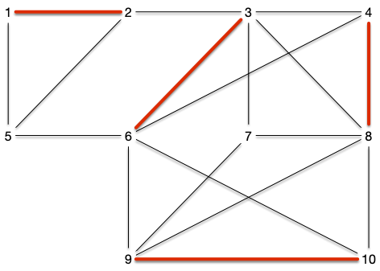
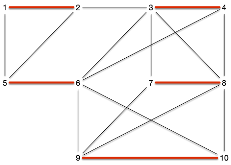
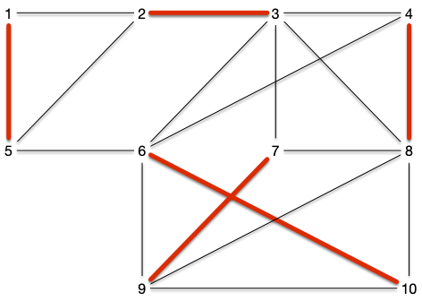

Le problème de couplage peut être défini ainsi :


Soit $G=(V, E)$ un graphe. Un **_couplage_** est un ensemble $M \subseteq E$ tel que si $xy, x'y' \in E$ alors $xy \cap x'y' = \varnothing$ (le degré de tout sommet du graphe $G'=(V, M)$ est strictement inférieur à 2).


Dans un couplage tout extrémité d'une arête n'apparaît qu'une seule fois. Par exemple, les arêtes rouges du graphe ci-dessous :

On définit plusieurs types de couplages selon le graphe :


Soit $G=(V, E)$ un graphe. Un **_couplage_** $M$ est dit :

- **_maximal_** s'il n'existe pas de couplage $M'$ l'incluant (toute arête de $G$ possède une extrémité co;;une avec une arête de $M$)
- **_maximum_** s'il n'existe pas de couplage $M'$ tels que $\vert M'\vert > \vert M\vert$
- **_parfait_** si pour tout sommet de $V$ il existe une arête de $M$ l'ayant comme extrémité. Un couplage parfait ne peut exister que s'il y a un nombre pair de sommet et à forcément $\vert V \vert/2$ arêtes.


Le couplage du graphe précédent par exemple était maximal mais pas maximum. Il possède en effet un couplage parfait :


Montrez que le graphe précédent admet un autre couplage parfait.





## Algorithme glouton

On peut faire la même chose que ce qu'on a vu pour [le problème du postier chinois](../projet-postier-chinois/) en prenant des arêtes une à une tant que c'est possible.

Cet algorithme possède au pire deux fois moins d'arêtes qu'un couplage maximum

> TBD preuve : <https://people.cs.uchicago.edu/~laci/HANDOUTS/greedymatching.pdf>
>

Le problème n'est cependant pas NP-complet comme on pourrait s'y attendre, il est même facile à résoudre algorithmiquement comme va le voir, d'abord dans le cas particulier des graphes biparti puis dans le cas général.

## Chemin augmentant

Dans les exercices de modélisation par des flots, [le problème du transport amoureux](../projet-flots-modélisation/#transport-amoureux){.interne} permettait de résoudre un problème de couplage. En utilisant cette modélisation, et en augmentant les flots d'une valeur entière (toujours 1) une chaîne augmentante est un chemin tel que les arcs sont :

- têtes bêches de la source au puits
- les arcs allant vers le puits sont de flot 0 et peuvent être augmentés
- les arcs allant vers la source sont de flot 1 et peuvent être diminués.

Essayons d'adapter ceci à notre problème de couplage. Commençons par décrire le graphe des relations entre les deux couples de personnes. Marier le plus de héros de roman revient à trouver un couplage maximum dans le graphe suivant :

On a pas besoin d'ajouter une source ou un puits. Ajoutons quelques arêtes au couplage :

Le graphe précédent admet le couplage $M = \\{ \\{\text{Cléopâtre},\text{Achille}\\}, \\{\text{Fanny},\text{Marius}\\} \\}$. Dans le cadre d'une modélisation par flot (avec des arcs, une source et un puits), il resterait encore des chaines augmentante comme : `source -> Juliette -> Rodrigue -> puits` ou encore `source -> Iphigénie -> Achille <- Cléopâtre -> César -> puits`.

Dans notre graphe de couplage ceci s'écrit comme un chemin de longueur impaire dont une arête est alternativement dans le couplage ou non et commence par un sommet qui n'est extrémité d'aucune arête du couplage.


Soit $G=(V, E)$ un graphe et $M$ un de ses couplages.

- un sommet $x$ est :
  - **_libre_** s'il n'est pas extrémité d'une arête de $M$.
  - **_couvert_** s'il est extrémité d'une arête de $M$.
- **_Un chemin alternant_** $x_0\dots x_k$ est tel que :
  - $x_0\dots x_k$ est un [chemin élémentaire](../chemins-cycles-connexite/#définition-élémentaire) de $G$
  - si $x_{i-1}x_{i} \in M$ alors $x_{i}x_{i+1} \notin M$ pour tout $i$
  - si $x_{i-1}x_{i} \notin M$ alors $x_{i}x_{i+1} \in M$ pour tout $i$
- **_Un chemin augmentant_** $x_0\dots x_k$ est un chemin alternant qui commence ($x_0$) et termine ($x_k$) par deux sommets libres.



Dans l'exemple précédent, `Cléopâtre - Achille - Iphigénie` est un chemin alternant mais pas augmentant, alors que `Juliette - Roméo` ou encore `César - Cléopâtre - Achille - Iphigénie` sont des chemins augmentant. On remarque que cette notion (de chemin augmentant) est similaire à celle de chaîne augmentante dans les flots :


Soit $G=(V, E)$ un graphe et $M$ un de ses couplages.

S'il existe un chemin augmentant $x_0\dots x_{2p+1}$ alors l'ensemble :

$$
M' = (M \backslash \\{ x_{1+2i}x_{2i+2} \vert 0 \leq i < p\\}) \cup \\{ x_{2i}x_{2i+1} \vert 0\leq i \leq p\\}
$$

Est un couplage tel que $\vert M' \vert = \vert M \vert +1$



Clair.



### Chemin augmentant et couplage maximum

Comme on s'y attend, la réciproque est également vraie :


Soit $G=(V, E)$ un graphe et $M$ un de ses couplages.

S'il existe n'existe pas de chemin augmentant alors $M$ est un coupage maximum.




Soit $M$ (en vert) un couplage et $M^\star$ (en rouge un couplage optimal). Si $xy \in M$ et $xy' \in M^\star$ on est dans un des deux cas suivant :

Et les autres voisins de $x$ (les arêtes en pointillées) ne sont ni dans $M$ ni dans $M^\star$

De plus si l'arête $xy$ est dans un seul couplage ($M$ ou $M^\star$), au moins une de ses extrémité est couverte par l'autre couplage, sinon les deux sommets $x$ et $y$ seraient libre pour lui et $xy$ serait un chemin augmentant.

Soit alors le graphe $G'=(V, M \cup M^\star)$. Les remarques précédentes  est alors tel que tout sommet est au plus de degré 2 : ses composantes connexes sont soit des chemins soit des cycles alternants.

On conclut la preuve en remarquant que le fait qu'ils soient alternants impose que les cycles et les chemins soient de longueur pairs :

- les cycle car sinon on a deux arêtes du même couplage  qui se suivent
- les chemins sinon il existerait un chemin augmentant pour l'un ou l'autre couplage.

Si par exemple aucune des extrémité du chemin ci dessous ne se prolonge (qu'il y ait ou pas des voisins), alors il existe un chemin augmentant pour pour le couplage rouge :

La parité des cycles et des chemin montre que $\vert M^\star\vert = \vert M\vert$.



On a alors l'équivalence suivante, que l'on doit à Claude Berge :


Soit $G=(V, E)$ un graphe et $M$ un de ses couplages.

$M$ est maximum si et seulement si il existe n'existe pas de chemin augmentant.



### Trouver un chemin augmentant ?

Trouver un chemin augmentant peux se fait exactement comme pour trouver des chaînes augmentante dans [l'algorithme de Ford et Fulkerson](../flots/#ford-fulkerson), par un algorithme de marquage examen qui va faire grossir des chemins alternants.

Un chemin augmentant est un chemin alternant qui commence et qui fii par un sommet libre. On va donc commencer par un sommet libre et l'augmenter de façon alternée jusqu'à arriver sur un autre sommet libre.

1. marque tous les sommets libres par $[s, P, \varnothing]$
   1. la première marque donne le sommet libre de départ
   2. la seconde indique si arrivée à ce sommet le chemin alternant est Pair ou Impair
   3. la dernière marque donne le prédécesseur
2. on examine toutes les arêtes $uv$ telle que $u$ est possède une marque Paire $[s, P, p]$ (second élément de la liste de marquage valant $P$). Si :
   1. $v$ n'a pas de marque, il existe une arête $vw \in M$. On marque alors :
      1. $v$ par $[s, I, u]$
      2. $w$ par $[s, P, v]$
      3. on recommence l'étape 2
   2. si $v$ est libre, on le marque par $[s, I, u]$ et on s'arrête on a trouvé un chemin augmentant
   3. si $v$ est marqué $[s', P, p']$ avec $s\neq s'$ on peut remonter jusqu'à $s'$ et on a trouvé un chemin augmentant
   4. si $v$ est marqué $[s, P, p']$ on se retrouve devant un cas problématique.

> TBD exemple début et étape avec 1 et 2

#### Étape 3

Le cas 3 de l'algorithme précédent fonctionne car le chemin alternant de $v$ à $s'\neq s$ ne peut couper le chemin de $s$ à $u$ sinon deux arêtes avec une extrémité commune seraient dans le couplage.

> TBD exemple

#### Étape 4

L'étape 4 est problématique car on arrive à des structures en fleur :

Ces structures bouclent et ne nous permettent pas de trouver à coup sur un chemin augmentant.

> TBD exemple

Nous verrons plus tard comment résoudre le problème des fleurs (spoiler : en les coupant), pour l'instant étudions le cas où l'on ne peut pas trouver de fleurs :


L'algorithme de recherche d'un chemin augmentant fonctionne pour les graphes cycle impair



Une corolle ne peut exister que s'il existe un cycle de longueur impair.



#### Exemple

> TBD on progresse le truc.
>
## Graphe biparti

Les graphes biparti sont exactement les graphes sans cycle impair.


L'algorithme de recherche d'un chemin augmentant fonctionne pour les graphes bipartis.



Une corolle ne peut exister que s'il existe un cycle de longueur impair, ce qui n'existe pas pour les graphes biparti.

> TBD fonctionne toujours s'il existe un chemin augmentant


### Couplage parfait et maximum dans un graphe biparti


Soit $G = (A\cup B, E)$ un graphe bi-parti admettant $A$ et $B$ comme stables. Le couplage maximum est de taille $\min(\vert A \vert, \vert B \vert)$.

Cette borne est atteinte, entre autre, pour les graphes biparti complet.



> TBD



On en déduit la propriété fondamentale :


Soit $G = (A\cup B, E)$ un graphe bi-parti admettant $A$ et $B$ comme stables avec $\vert A \vert \leq \vert B \vert$.

Il existe un couplage couvrant $A$ si et seulement si pour tout $S \subseteq A$ on a :

$$
\vert {y | xy \in E, x \in S}\vert \geq \vert S \vert
$$




> TBD



> Propriétés

### Algorithme de résolution

### Couplage et couverture

### Couplage de poids maximum

> TBD min couverture = max couplage, sorte de dual comme flots.

1. on peut toujours se ramener à un couplage parfait de $K_{n,n}$ en mettant des 0 sur les arêtes qui n'existent pas
2. <https://webia.lip6.fr/~bampise/kuhn-munkres.pdf>

> TBD : méthode hongroise <https://www.youtube.com/watch?v=fMAmtE0UyzI>

## Graphe quelconque

### Couplage parfait et maximum dans un graphe quelconque

> TBD taille du couplage MAX : <https://fr.wikipedia.org/wiki/Formule_de_Tutte-Berge>

> TBD perfect matching :
>
> - tutte 47 graph with perfect matching dans NP cap co-NP
> - <https://www.dimap.ufrn.br/~mfsiqueira/Marcelo_Siqueiras_Web_Spot/Talks_files/matching-1.pdf> 
> - <http://users.cms.caltech.edu/~schulman/Courses/18cs150/lec11.pdf>
> Tutte, c'est déterminent et c'est idem que multiplication de matrice. - <https://www.cs.mcgill.ca/~amehra13/Presentations/max_matching.pdf>

> TBD perfect matching général : <https://ti.inf.ethz.ch/ew/lehre/GA07/lec-matching-alg.pdf>

### Algorithme

> TBD min couverture = max couplage, ne marche pas ici (exemple ?)
> 
1. général
   1. les fleurs d'Edmonds $\mathcal{O}(n^4)$: <https://fr.wikipedia.org/wiki/Algorithme_d%27Edmonds_pour_les_couplages>, <https://math.nist.gov/~JBernal/p_t_f.pdf>
   2. couplage d'un graphe valué : <https://en.wikipedia.org/wiki/Maximum_weight_matching>
      1. on peut toujours se ramener à un couplage parfait en doublant le graphe et en mettant des 0 sur les arêtes qui relient les 2 copies du graphe
      2. on cherche des chaînes augmentantes dans des graphes particuliers. <https://theory.stanford.edu/~jvondrak/MATH233B-2017/lec6.pdf>. [Framework primal/dual](https://math.mit.edu/~goemans/PAPERS/book-ch4.pdf) : ceci dépasse le cadre de ce cours mais généralise ce qu'on a vu pour les graphes bipartis



- [programmation linéaire et couplage](https://www.cs.cmu.edu/afs/cs.cmu.edu/academic/class/15850-f20/www/notes/lec7.pdf)
- [primal dual et problèmes combinatoires](https://www.youtube.com/watch?v=Z0eSQapcE6A&list=PLXsmhnDvpjORcTRFMVF3aUgyYlHsxfhNL&index=42)



## Implémentation

- networkx : <https://stackoverflow.com/questions/27132313/maximum-weighted-pairing-algorithm-for-complete-graph>
- <https://cs.stackexchange.com/questions/109021/perfect-matching-in-complete-weighted-graph>