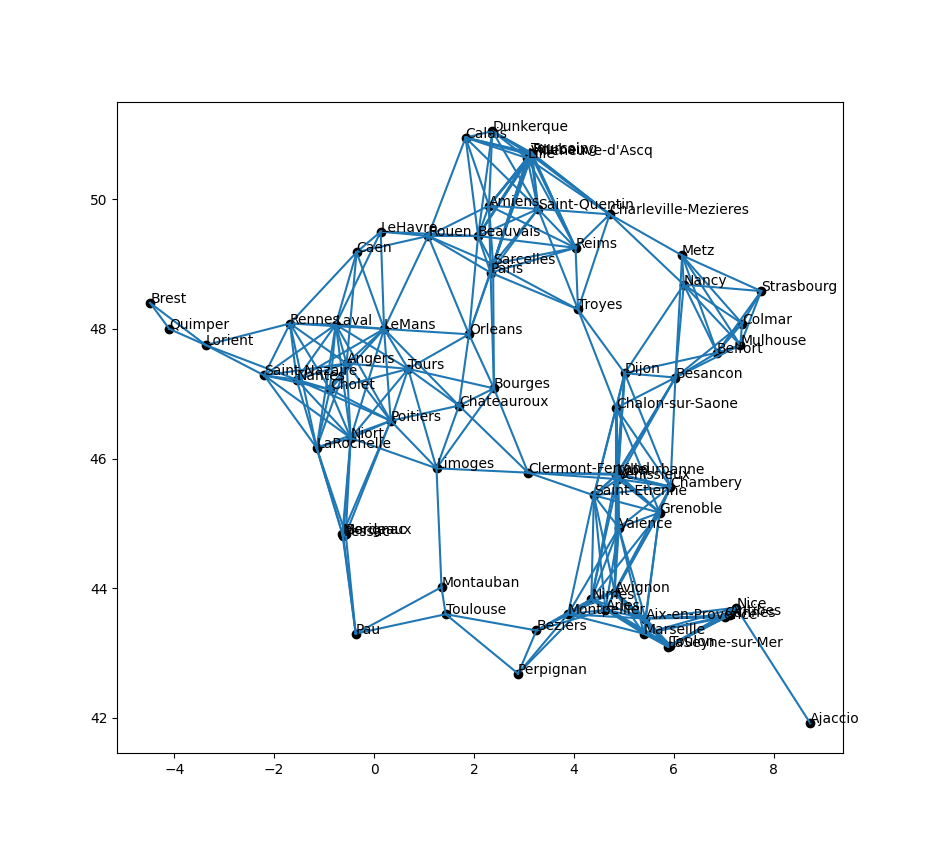

<!-- début résumé -->

Utilisation de l'algorithme de Dijkstra et de $A^\star$.

<!-- fin résumé -->

Le fichier que nous utiliserons ici est : [`villes_10000_habitants.json`{.fichier}](./villes_10000_habitants.json)


Téléchargez le fichier dans un dossier `projet-chemin-min`{.fichier}.



Il vous faudra peut-être cliquer-droit puis choisir `enregistrer le lien sous...` pour télécharger le fichier et non juste l'afficher dans votre navigateur.


## <span id="données"></span> Données

Si vous ouvrez ces fichier dans un éditeur de texte, on voit que le fichier est totalement lisible. Il est au format [json](https://fr.wikipedia.org/wiki/JavaScript_Object_Notation) et est un dictionnaire où les clés sont les noms des villes de la métropole ayant plus de 10000 habitants et les valeurs des dictionnaires regroupant leurs propriétés :

```python
{
    "voisins": [
        "Aix-en-Provence",
        "Antibes",
        "Arles",
        "Avignon",
        "Cannes",
        "Grenoble",
        "LaSeyne-sur-Mer",
        "Marseille",
        "Montpellier",
        "Nice",
        "Nimes",
        "Toulon",
        "Valence"
    ],
    "longitude": 5.4,
    "latitude": 43.3,
    "population": 800550,
},
```

Vous allez dans une première partie transformer cette liste de villes en un graphe valué.

### Chargement des données brutes


En utilisant le code suivant, chargez la liste contenue dans le fichier `villes_10000_habitants.json`{.fichier} dans une liste python nommée `villes`{.language-}.

```python
import json

with open("villes_10000_habitants.json") as entree:
    villes = json.load(entree)

```



La variable `villes`{.language-} contient un dictionnaire, chacun correspondant aux paramètres d'une ville.


Affichez les données associées à Marseille. Et à Montauban ?



```python
print("Marseille", ":")
for clé, valeur in villes["Marseille"].items():
    print(clé, valeur)
```

On a utilisé la méthode items() des dictionnaires pour itérer sur les cls et les valeurs d'un dictionnaire (voir [la doc](https://docs.python.org/3/tutorial/datastructures.html#looping-techniques))



### Création du graphe

Commençons par créer la structure de graphe et la valuation que nous allons utiliser par la suite.


En utilisant les données charges précédemment :

* créez un graphe non orienté $G$ ([encodé par un dictionnaire](../encodage#dict)) dont les sommets sont les noms de villes et ses voisins, les voisins.
* créez une fonction $f$ qui prend en paramètres deux villes et rend la distances entre ces deux villes.


### Représentation graphique

Avec matplotlib d'installé, le code suivant devrait représenter graphiquement le graphe :

```python
import matplotlib.pyplot as plt
import matplotlib.lines as mlines


fig, ax = plt.subplots(figsize=(10, 10))

ax.plot(
    [villes[x]["longitude"] for x in G],
    [villes[x]["latitude"] for x in G],
    "o",
    color="black",
)

for x in G:
    ax.text(villes[x]["longitude"], villes[x]["latitude"], x)
    for y in G[x]:
        if y > x:  # évite de tracer 2 fois la même arête
            continue

        ax.add_line(
            mlines.Line2D(
                (villes[x]["longitude"], villes[y]["longitude"]),
                (villes[x]["latitude"], villes[y]["latitude"]),
            )
        )

plt.show()
```



Utilisez le code précédent pour représenter graphiquement le graphe.


J'obtiens le graphe suivant :




## Algorithme Dijkstra


Modifiez l'[algorithme du cours](../chemin-poids-min-positif#implementation-Dijkstra-python) pour qu'il puisse utiliser notre fonction de valuation.



Utilisez votre algorithme de Dijkstra pour calculer un plus court chemin entre Marseille et Lille. Et donnez sa distance.


J'obtiens : `['Marseille', 'Valence', 'Chalon-sur-Saone', 'Troyes', 'Saint-Quentin', 'Lille']`{.language-} comme chemin, pour une distance de 7.8149063342335285




Représentez graphiquement le chemin trouvé en rouge.





## $A^\star$ et distances


Créez l'[algorithme $A^\star$](../chemin-poids-min-positif#a-star) pour résoudre notre problème de chemin de poids minimum. Vérifiez bien que votre heuristique est consistante.



On utilise comme heuristique la distance du sommet à l'arrivée.



Utilisez votre algorithme $A^\star$ pour calculer un plus court chemin entre Marseille et Lille. Et donnez sa distance.


J'obtiens : `['Marseille', 'Valence', 'Chalon-sur-Saone', 'Troyes', 'Saint-Quentin', 'Lille']`{.language-} comme chemin, pour une distance de 7.8149063342335285



On doit trouver la même distance que pour l'algorithme de Dijkstra puisque l'heuristique choisie est consistante. Normalement, elle doit considérer moins de sommet avant de répondre. Vérifions le.


Modifiez l'algorithme de Dijkstra et $A^\star$ pour qu'il rende non seulement le chemin, mais également le nombre de sommets dans `V_prim`{.language-} à la fin de l'algorithme.


Vérifiez, avec des chemins allant de Marseille à Brest, que le nombre de sommets visité est bien moins important.



Pour les deux algorithmes j'obtiens le chemin :

```python
[
    'Marseille', 
    'Avignon', 
    'Saint-Etienne', 
    'Clermont-Ferrand', 
    'Limoges', 
    'Niort', 
    'Saint-Nazaire', 
    'Lorient', 
    'Brest'
]
```

* Pour Dijkstra j'ai 72 sommets dans $V'$
* Pour $A^\star$ j'ai 18 sommets dans $V'$


