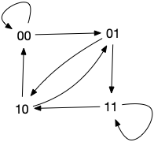

<!-- début résumé -->

Des graphes eulérien là où ne s'y attend pas. Une application qui montre encore une fois comme preuve d'existence et algorithme de création de structure sont intimement liés.

<!-- fin résumé -->

Commençons par motiver ce projet : **le problème du digicode**

> On a encore oublié ce fichu code de la porte d'entrée. Quel est le moyen le plus rapide de trouver le bon code ?

### Formalisation du problème

Il faut trouver un *mot* de longueur $p$ d'un *alphabet* $\mathcal{A}$ à $n$ caractères (un mot est une suite de $p$ caractère de $\mathcal{A}$).

**Exemple :**
Les mots de longueur $p=3$ de l'alphabet $\\{0, 1\\}$ à $n=2$ caractères. Il y a $n^p = 2^3 = 8$ mots de longueur 3 différents qui sont :

* $000$
* $001$
* $010$
* $011$
* $100$
* $101$
* $110$
* $111$

Si l'on veut trouver une chaîne de caractère qui contient tous les mots de longueur $p$ d'un alphabet à $n$ caractère on peut coller bout à bout tous les mots.

**Exemple :**
Dans l'exemple cela donne par exemple le mot : $000001010011100101110111$ de longueur $p \cdot n^p = 3 \cdot 2^3 = 24$.

### Tous les mots


Créer un programme qui, à partir d'un alphabet (une chaîne de caractère) et d'un entier $p$ rend une liste de tous les mots de longueur $p$ formable avec l'alphabet.


> TBD à détailler en commençant par les entiers de [0, p-1] et l'énumération en déterminant le successeur d'un mot.
> si [-1] < p ou si les (<p)(p...p)

### Le plus court

La longueur la plus petite possible d'une chaîne de caractère qui contiendrait tous les mots serait que les mots se chevauchent : les $p-1$ derniers caractères du i-ème mot seraient égaux aux $p-1$ derniers caractères du (i+1)-ème mot.


Montrez que la taille minimale théorique est de :
$$
1 \cdot p  + (n^p - 1) \cdot 1 = p - 1 + n^p
$$
caractères.


Dans le cas où les mots se chevauchent, chaque mot de compterait que pour 1 nouveau caractère dans la chaîne, à part le premier mot qu'il faudrait écrire entièrement : le 1er mot compte pour $p$ caractères les autres comptent uniquement pour 1 caractère, d'où la formule demandée.


Le gain serait de : $\frac{p-1 + n^p}{pn^p} \simeq \frac{1}{p}$, on diviserait donc la taille par $p$, ce qui n'est pas négligeable.

**Exemple :** La longueur minimale est de $3-1 + 2^3 = 10$, qui est bien plus petit que 24.

Sauf que l'on ne pas pas si une telle chaîne existe...

## Bruijn et Euler to the rescue

Considérons le graphe **orienté** suivant, appelé *graphe de Bruijn* $B(n, p+1) = (V, E)$ où :

* $V$ est l'ensemble des mots de longueur $p$ d'un alphabet à $n$ éléments
* $xy \in E$ si les $p-1$ derniers caractères de $x$ sont les $p-1$ premiers caractères de $y$


Donnez le graphe de Bruijn associé aux mots de longueur 3 de l'alphabet $\\{0, 1\\}$.





### Propriétés

Si $xy$ est un arc du graphe, alors on a que $x = aX$ et $y= Xb$ où $X$ est un mot de longueur $p-1$ et $a$et $b$ des caractères : l'arc correspond au mot de longueur $p + 1$ = $aXb$ et **ce mot n'apparaît qu'une fois** (car à ce mot ne correspond qu'un unique $x$ et $y$).

Réciproquement chaque mot de longueur $p + 1$ pouvant s'écrire sous la forme $aXb$ avec $X$ un mot de longueur $p-1$ et $a$ et $b$ des caractères, tout mot de longueur $p + 1$ est associé à un arc.

Enfin, pour un sommet $x$ donné, il possède $n$ arc entrant (correspondant à tous les mots de longueur $p$ dont les $p-1$ derniers caractères correspondent aux $p-1$ premiers caractères de $x$) et $n$ arc sortant (correspondant à tous les mots de longueur $p$ dont les $p-1$ premiers caractères correspondent aux $p-1$ derniers caractères de $x$) :

**le graphe $B(n, p+1)$ est eulérien** pour tout $p$ et tout $n$.

### Cycle eulérien

Un cycle eulérien du graphe $B(n, p)$ correspond à une suite comprenant tous les mots de longueur $p$. En analysant 3 sommets successifs de ce cycle $u_{i-1}u_iu_{i+1}$ on remarque que le mot correspondant à l'arc $u_{i-1}u_i$ et celui correspondant à l'arc $u_iu_{i+1}$ sont tels
que les $p-1$ derniers caractères de l'un sont les $p-1$ premiers caractères de l'autre.

### Mot de Bruijn

Un cycle eulérien $u_0\dots u_k$ (donc $u_k = u_0$) de $B(n, p)$ nous permet de construire les $n^p$ différents mots : c'est les mots correspondants aux arcs $u_iu_{i+1}$.

De là on construit le mot qui commence par le mot associé à $u_0u_1$ puis on ajoute itérativement le dernier caractère du sommet $u_i$ pour $i > 1$.

> La construction ci-dessus est équivalente à commencer par le mot associé à $u_0$ et à ajouter itérativement les derniers caractères de tous les $u_i$, $i > 0$.

Ce mot, appelé *mot de Bruijn* a bien les propriétés suivantes :

* il contient tous les mots de longueur $p$ de l'alphabet à n caractères,
* il a une taille de $p +(n^p -1)$ caractères

**Il existe bien un mot de taille minimale ($p +(n^p-1)$ caractères) contenant tous les mots de longueur $p$ d'un alphabet à $n$ lettres, et ce quelque soit $n$ et $p$.**

### Exemple

Un cycle eulérien associé est alors **10**-0**1**-1**1**-1**1**-1**0**-0**0**-0**0**-0**1**-1**0** ce qui donne le mot de Bruijn associé : 1011100010.
