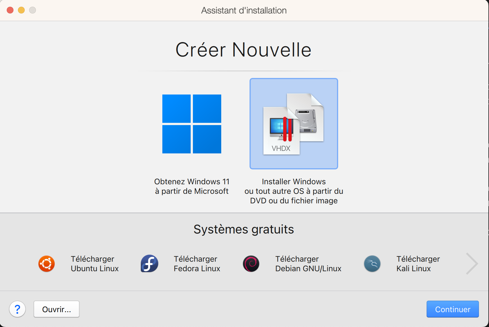
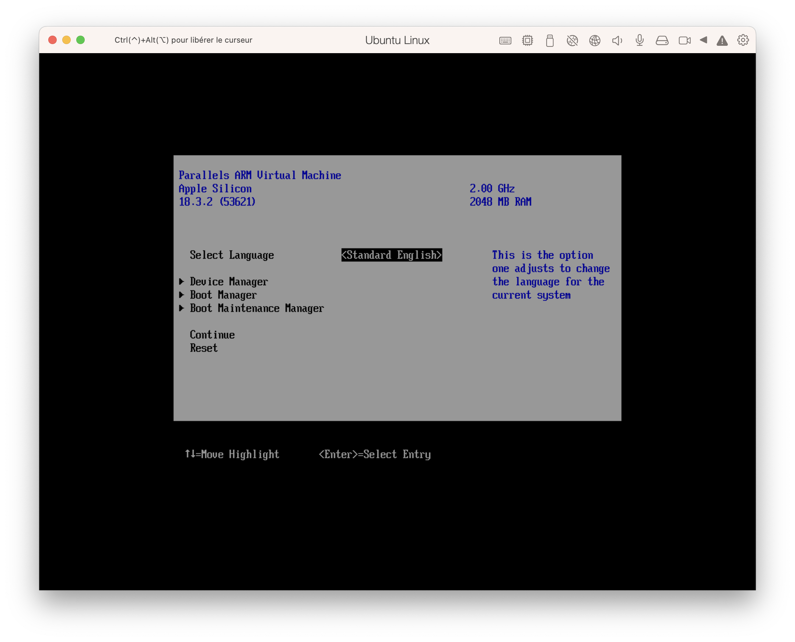
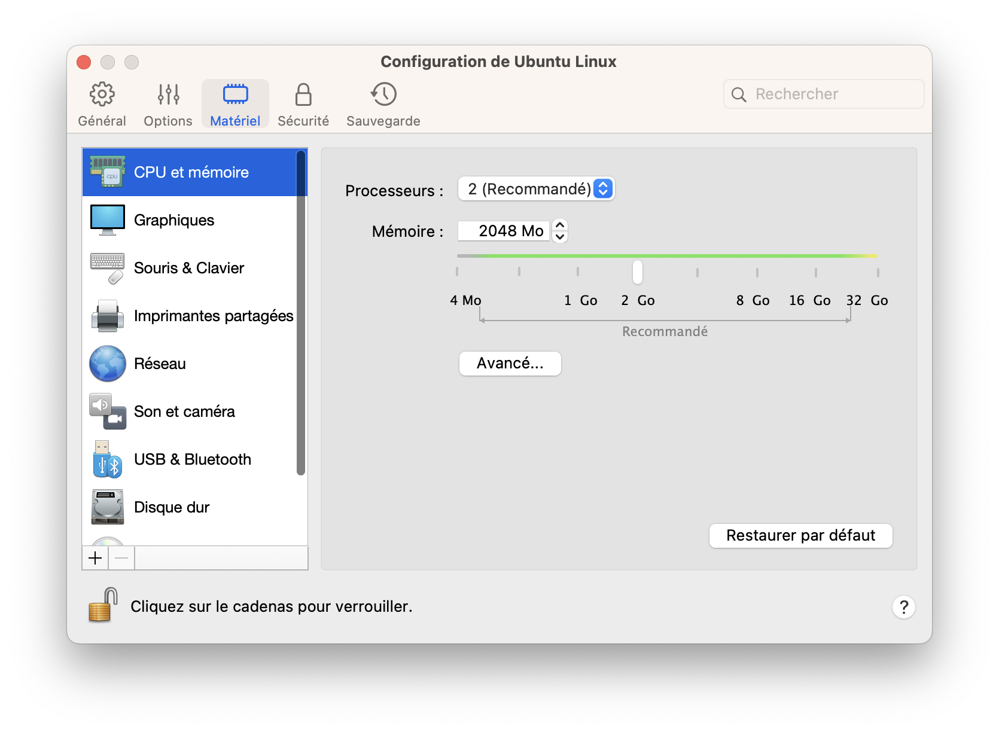
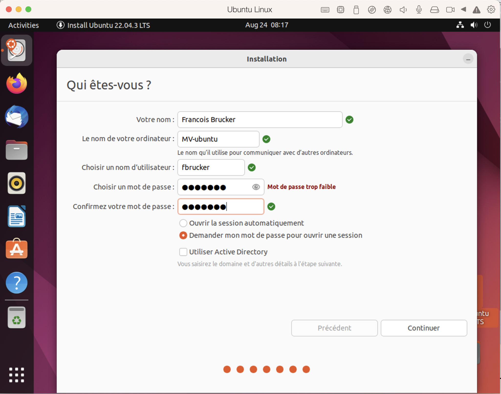
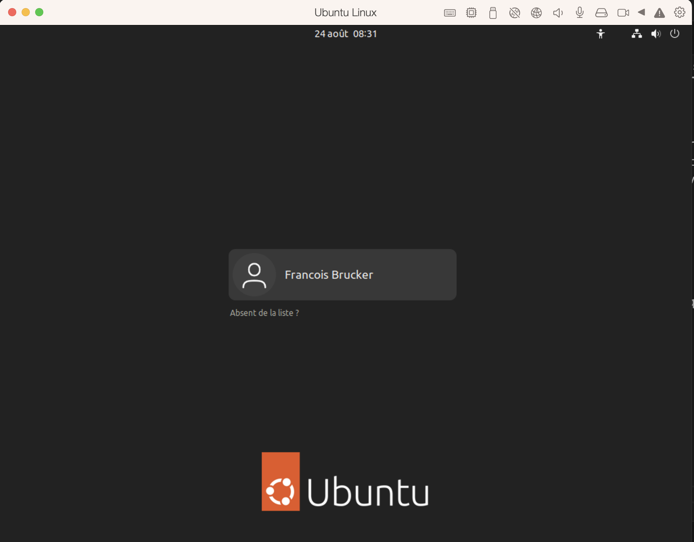

Installation d'une distribution Linux/Ubuntu sur une machine virtuelle

## Machine Virtuelle

Une [Machine Virtuelle (*VM*, Virtual Machine)](https://fr.wikipedia.org/wiki/Machine_virtuelle) permet de simuler un ordinateur complet.

C'est très utile pour essayer de nouveaux systèmes (un Linux et un Mac par exemple) ou avoir plusieurs systèmes identiques (plusieurs versions de noyaux Linux). On peut modifier un système installé sur une machine virtuelle sans alterer le système d'exploitation principal.

Il existe de nombreuses applications de machines virtuelles, gratuit ou payante. Nous allons en utiliser deux :

* <https://www.parallels.com/> : payant ais le seul utilisable (pour l'instant) sur un mac avec u processeur ARM.
* <https://www.virtualbox.org/> : gratuit et utilisable sur une machine x86, sous windows ou Linux.

Les machines virtuelles partageront souvent les périphériques USB, réseau, clavier/souris de la machine hôte, mais ce n'est pas une obligation. Tout peut être simulé si besoin.

## Création d'une machine virtuelle

Commençons par créer une machine virtuelle sur laquelle on pourra installer n'importe quel système par la suite.


On commence par créer une machine virtuelle vierge en allant dans `Fichier > nouveau...` :

1. on choisit `installer windows ou tout autre OS à partir Du DVD ou du fichier image`
2. on coche `continuer sans source` puis `continuer`
3. On choisit `ubuntu Linux` comme système d'exploitation (ceci n'a pas d'importance, c'est juste informatif)
4. puis on crée la machine virtuelle

La machine va se lancer. Comme il n'y a pas de système d'installé, c'est le Menu UEFI qui est affiché :


Le curseur de la souris et le clavier sont lié à la machine./ Pour revenir au système mac appuyez sur les touches control et option en même temps.


Arrêtons la machine (menu `Actions > Stopper`) pour voir ses paramètres (l'icône engrenage).



> TBD


## Configuration de la machine

Une fois la machine créée, on peut si besoin en changer les caractéristiques (nombre de cœur, mémoire, etc). Plus vous allouez de ressource à la machine virtuelle, moins vous en aurez pour votre machine principale : faites des compromis.



On voit le matériel qui est simulé par cette machine :



> TBD


Une dernière chose à vérifier est l'ordre de boot de la machine. IL est important que lors de la première installation, le disque de démarrage soit le lecteur de dvd, puis pour les boots ultérieurs ce soit le disque dur sur lequel le système est installé.



L'ordre est :

1. disque dur
2. dvd
3. clé usb



> TBD


## Installation de Linux/Ubuntu


Suivre le tutoriel officiel :  <https://doc.ubuntu-fr.org/tutoriel/amorcer_sur_cd_ubuntu>



On va utiliser une [image disque](https://fr.wikipedia.org/wiki/Image_disque) de ubuntu disponible sur le site. Prenez la version [LTS (Long Time Support)](https://doc.ubuntu-fr.org/lts), la 22.04.3 à l'heure où je tape ces caractères (août 2023) et l'image fait 5Go.

Les différentes images des [versions](https://wiki.ubuntu.com/Releases) sont également disponibles à l'adresse suivante (utile si vous n'avez pas un x86, mais un mac ARM par exemple) :

<https://cdimage.ubuntu.com/jammy/daily-live/current/>

Une fois l'image téléchargée, on va démarrer sur le lecteur d dvd de la machine virtuelle et suivre les instructions.



L'ordre de boot par défaut est :

1. disque dur
2. dvd
3. clé usb

Comme il n'y a rien sur le disque dur pour l'instant, le système passera automatiquement au dvd. Il faut donc faire en sorte que le lecteur de dvd contienne notre image téléchargée :


Mon ordinateur est un mac ARM, j'utilise donc une image ISO qui correspond à mon système. SI vous utilisez un ordinateur x86, ce n'est pas cette image au'il faudra utiliser, mais celle qui correspond à votre système : `ubuntu-22.04.3-desktop-amd64.iso`{.fichier}


AU boot vous devriez avoir l'image suivante, qui prouve que c'est bien l'image du dvd qui a booté :



> TBD


Suivez les instructions du logiciel d'installation, vous pouvez garder les informations par défaut. Le logiciel va vous demander de créer un compte :

* votre nom peut être ce que vous voulez.
* votre nom d'utilisateur doit en revanche ne **pas** contenir d'espace **ni** de caractères accentué ou spéciaux. Sinon, tôt ou tard, cela vous sautera à la figure. Choisissez le login que vous avez à la fac ou à l'école. Dans mon cas c'est `fbrucker`.

## Fin d'installation

Vous pouvez maintenant éteindre votre machine virtuelle. Lorsque vous rallumerez votre machine, vous serez devant une bannière de login Linux/Ubuntu :

L'ordinateur a bien démarré sur le disque dur. Rentrez le mot de passe associé à votre compte pour vous retrouver devant votre bureau :

