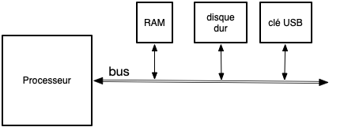
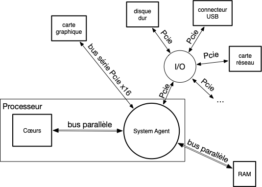

La carte mère doit rentrer dans le boîtier de l’ordinateur. Sa forme est donc importante selon qu'on ait une tour, un portable ou un mini-pc. De sa forme va dépendre les différents composant qu'on va pouvoir lui adjoindre.

Le format classique d'une tour, permettant les plus grandes cartes mères est le [format ATX](https://fr.wikipedia.org/wiki/Format_ATX). Elle possède :

- un emplacement pour placer le processeur
- des emplacements pour les barrettes de RAM [DIMM](https://fr.wikipedia.org/wiki/Dual_Inline_Memory_Module) (ou [SO-DIMM](https://fr.wikipedia.org/wiki/SO-DIMM) pour les portables). Ils sont spécifiques au type de RAM utilisé (DDR4 ou DDR5 actuellement).
- des ports [PCIe](https://fr.wikipedia.org/wiki/PCI_Express) en x4, x8 ou x16 pour brancher des périphériques. On a coutume d'y brancher des appareils nécessitant un gros [débit](https://fr.wikipedia.org/wiki/D%C3%A9bit_binaire), comme des [disques durs](https://fr.wikipedia.org/wiki/Disque_dur) ou la [carte graphique](https://fr.wikipedia.org/wiki/Carte_graphique)
- des ports pour les périphériques [USB](https://fr.wikipedia.org/wiki/USB)
- une horloge qui permet la synchronisation des différents devices. Chaque device soit fonctionner à une fréquence qui est un multiple de la fréquence d'horloge de la carte mère
- une mémoire contenant le gestionnaire [UEFI](https://fr.wikipedia.org/wiki/UEFI) de la carte mère

Tous ces composants sont reliés au processeur via le [system agent](https://en.wikipedia.org/wiki/Uncore). Les connections sont fait par des [bus](https://fr.wikipedia.org/wiki/Bus_informatique) de transmission au format [PCIe](https://fr.wikipedia.org/wiki/PCI_Express) (même les périphériques USB sont relié au processeur par des bus PCIe).


Vous allez trouver plein de vieilles choses sur internet :

- [BIOS](https://fr.wikipedia.org/wiki/BIOS_(informatique)) : n'existe plus depuis 2006, il est remplacé par l'UEFI
- [northbridge/southbridge](https://en.wikipedia.org/wiki/Northbridge_(computing)). Depuis 2019, remplacé par le system agent.


## Horloge et synchronisation

Communiquer une information binaires se fait usuellement par un signal continu :

- +5v signifie un 1
- 0v signifie un 0

Une succession d'information binaire ne peut se faire qu'à intervalle donné, sinon il serait impossible de distinguer deux 1 (respectivement deux 0) de suite :

```
mesure  :  x   x   x   x   x   x   x
signal  : __/⎺⎺⎺⎺⎺\_____/⎺⎺⎺⎺⎺⎺⎺\_____
bits    :  0   1   0   0   1   1   0
```

La mesure est synchronisée par la fréquence de l'horloge de la carte mère (ou le plus souvent un multiple de celle-ci, car la fréquence de l'horologe est basse).

Exemple de signal synchronisé à la fréquence de l'horloge. On regarde à chaque *front montant* de l'horloge le signal, qui est convertit en bit :

```
           front montant     front descendant 
           v                 v
horloge : _/⎺\_/⎺\_/⎺\_/⎺\_/⎺\_/⎺\_/⎺\
signal  : __/⎺⎺⎺⎺⎺\_____/⎺⎺⎺⎺⎺⎺⎺\_____
bits    :  0   1   0   0   1   1   0
```

Si les devices transmettent leurs données à la même vitesse, mais qu'ils ne sont pas tous synchronisé avec une même horloge, il est impossible de connaître le depart de transmission et par là de connaître le message.

Enfin, pour que des devices de vitesses différentes puissent communiquer sans perte de temps, il faut que le device le plus rapide puisse communiquer à la vitesse du plus lent : il faut que toutes leurs horloges soient des multiples de l'horloge de la carte mère.


Vir ce petit tuto sur la [transmission de données](https://www.youtube.com/watch?v=ZQ-Jb__HTyo)


## Transmissions

Les périphériques d'une carte mère ont besoin de communiquer avec le processeur, et entre eux :



Le canal de transmission entre périphérique est appelé [bus](https://fr.wikipedia.org/wiki/Bus_informatique) et permet de transmettre des données allant de un à plusieurs gigaoctets de bits.

Il existe deux types de transmissions, et donc deux types de bus :

- [transmission série](https://fr.wikipedia.org/wiki/Transmission_s%C3%A9rie) : on on transmet un bit après l'autre
- [transmission parallèle](https://fr.wikipedia.org/wiki/Transmission_parall%C3%A8le) : ou on transmet plusieurs bits (8, 16, 32, 64, ...) en une fois

Les deux types de transmissions ont leurs avantages et inconvénients voir [cette courte vidéo](https://www.youtube.com/watch?v=-iDaeZt-pYM), mais en gros :

- la transmission parallèle est utilisée pour de courtes distances (plus petit que la longueur d'onde de l'horloge pour éviter les problème de [skew](https://en.wikipedia.org/wiki/Clock_skew) c'est à dire de désynchronisation générée par le délai de propagation variable entre les différents canaux de la communication parallèle) lorsque la vitesse est primordiale.
- la transmission série est utilisée pour des distances *"longues"* et pour des gain de places (moins de cables sont nécessaires)

Ce qui donne finalement le schéma de communication des processeurs actuels (par exemple l'architecture [ice lake](https://en.wikichip.org/wiki/intel/microarchitectures/ice_lake_(client)#Entire_SoC_Overview)):



Le processeur est composé de deux parties :

- le system agent dont le but est de concentrer les transmissions de tous les périphérique en un point
- les [cœurs ou cores](https://fr.wikipedia.org/wiki/Core_(microarchitecture)) qui forment les unités de calcul proprement dites.

Les deux seuls bus en parallèles sont celui sortant des cores et celui sortant de la mémoire RAM (leurs tailles sont variables, de 64 à 512 bits). Les autres sont tous en série :

- [bus PCIe](https://fr.wikipedia.org/wiki/PCI_Express). Peuvent être plus ou moins rapide selon le nombre de *lanes*. Chaque *lane* est composée de deux fils permettant une communication en série sous la forme d'un [differential signaling](https://en.wikipedia.org/wiki/Differential_signalling). Un bus PCIe 4x est composé de 4 lanes et permet d'avoir 4 canaux de transmissions simultanés. On a coutume d'utiliser un bus PCIe x16 pour la carte graphique, et des bus plus petits pour le reste (disques dur, USB, etc) pour des questions de coût.
- [bus USB](https://www.youtube.com/watch?v=F7NlCaaL3yU) qui lie le device USB à son connecteur
- [Ethernet](https://fr.wikipedia.org/wiki/Ethernet) qui lie le câble à la carte réseau.



[Analyse des protocoles séries basiques](<https://www.youtube.com/watch?v=IyGwvGzrqp8>)



## UEFI

L'[UEFI](https://fr.wikipedia.org/wiki/UEFI) est un logiciel sur la carte mère permettant de :

1. vérifier, synchroniser et configurer si nécessaire les devices installés sur la carte
2. déterminer sur quel disque démarrer pour exécuter le système d'exploitation.

### UEFI manager

L'UEFI manager permet d'avoir accès aux paramètres de l'UEFI. Il permet de configurer divers paramètres système.

Pour accéder à l'UEFI manager, il faut au boot de l'ordinateur appuyer sur une touche. Cette touche dépend de votre ordinateur et sera affichée au boot. Cela peut être `F2`, mais aussi `ESC` ou encore `F11`. Sur le [NUC](https://www.intel.fr/content/www/fr/fr/products/details/nuc.html) de la maison, c'est `F2` au démarrage, et voici le manager qu'on obtient :


On y voit les caractéristiques du processeur (onglet de départ  `main`).

Le deuxième onglet (`advanced`) montre les différents matériels branché sur la carte mère :


Pour ma part 3 disques dur :

- Un disque SSD de 1TB sur le port [SATA](https://fr.wikipedia.org/wiki/Serial_ATA) (qui contient les données)
- deux disques un sur chaque port [M2](https://fr.wikipedia.org/wiki/M.2) :
  - un de 1TB (contient un système Linux/ArchLinux)
  - un de 240GB (contient un système Windows 11)

Le troisième onglet permet d'overclocker le processeur si on est joueur :


Le dernier onglet, `boot` permet de gérer le boot :


On voit que j'ai désactivé le [secure boot](https://fr.wikipedia.org/wiki/UEFI#Lancement_s%C3%A9curis%C3%A9_(secure_boot)) car il ne permet pas d'exécuter tous les logiciel libres (secure signifiant approuvé par microsoft... qui [refuse de signer des logiciels sous licence GPLv3](https://www.fsf.org/campaigns/secure-boot-vs-restricted-boot/whitepaper-web)) et vous aurez aussi à le faire pour booter certains disque d'installation Linux.


Lisez [ce document](https://www.rodsbooks.com/efi-bootloaders/secureboot.html) qui explique ce qu'est le secure boot.

Plus généralement vous pouvez lire [l'article complet](https://www.rodsbooks.com/efi-bootloaders/index.html) sur l'UEFI et Linux)


En cliquant sur `boot priority` on voit l'ordre de boot que j'ai choisi pour l'ordinateur :


1. Le disque LEXAR SSD de 1TB contenant ma distribution Linux/ArchLinux
2. Le disque de 240GB contenant le système Windows 11
3. l'[UEFI shell](https://papy-tux.legtux.org/doc1249/index.html) qui est un programme permettant de faire des opérations très bas niveaux sur la carte mère et les disques.

On voit de plus que si une clé USB bootable est présente dans l'ordinateur au démarrage, on boot d'abord sur elle (c'est ce que genre de chose qu'il faudra faire lorsque vous voudrez installer Linux à partir d'une clé USB par exemple)

### Boot

Le [processus de démarrage UEFI](https://wiki.archlinux.org/title/Arch_boot_process_(Fran%C3%A7ais)#Avec_un_UEFI) est le suivant :

1. mise sous tension de l'ordinateur
2. Procédure [POST](https://fr.wikipedia.org/wiki/Power-on_self-test_(informatique)) qui vérifie que tout est Ok sur la carte et que les appareils qui lui sont connectés sont reconnus
3. Pour chaque disque dans l'ordre de démarrage des disques :
   1. s'il possède une [partition EFI](https://en.wikipedia.org/wiki/EFI_system_partition)
   2. on exécute le fichier `\EFI\BOOT\BOOTx64.EFI`{.fichier} dont l'exécution charge le système d'exploitation
   3. si le fichier ou la partition EFI n'existe pas on passe au disque suivant


Pour aller plus loin :

- [interface UEFI](https://wiki.archlinux.org/title/Unified_Extensible_Firmware_Interface)
- [partition GPT](https://en.wikipedia.org/wiki/GUID_Partition_Table). FAT32 pour la partition EFI.


