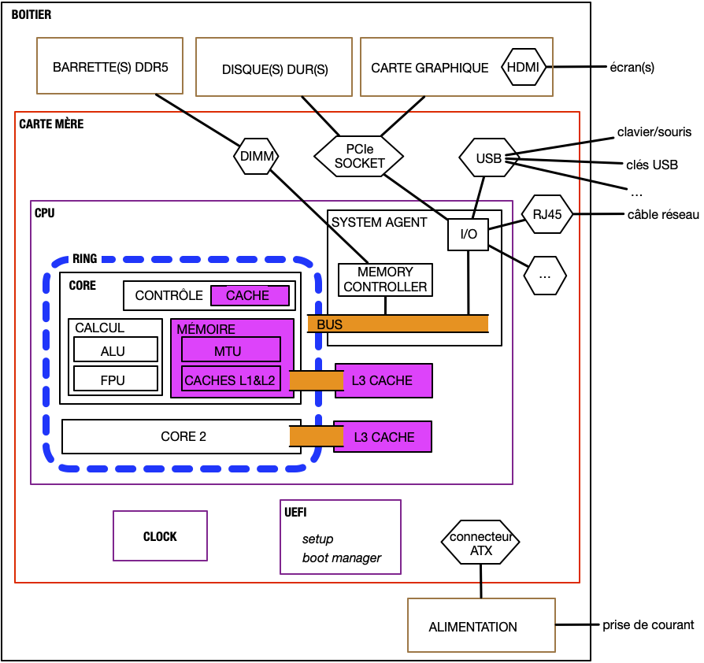

Un ordinateur est composé de plusieurs composants qui interagissent entre eux :

- le [processeur](https://fr.wikipedia.org/wiki/Processeur) : exécute des instructions sur des variables. Instructions et variables sont prisent et manipulées dans la mémoire.
- [mémoire vive](https://fr.wikipedia.org/wiki/M%C3%A9moire_vive) : un espace de stockage rapide, mais volatile (se vide lorsque l'on éteint l'ordinateur). Peut-être vu comme un grand tableau ou chaque case est un [byte](https://fr.wikipedia.org/wiki/Byte). Comme on peut accéder à tout élément sans contrainte, cette mémoire est appelée *RAM* (pour Random Access Memory)
- périphériques, appelés ***device***
  - mémoire non volatile (stockage) : On ne peut pas toujours accéder à tout byte du tableau de stockage indépendamment. Il faut utiliser un protocole. Ces devices sont plus lent que la RAM mais sont non volatiles. Par exemple :
    - disques durs : plus lent que la mémoire mais non volatile
    - USB : encore plus lent qu'un disque dur mais déplaçable facilement
  - réseau : encore plus lent que l'USB mais accessible de partout
  - [interfaces](https://fr.wikipedia.org/wiki/Interactions_homme-machine) :
    - entrée : clavier/souris
    - sortie : écran/imprimante
    - entrée/sortie : volant avec retour de force

En regroupant tous [les types de mémoires](https://fr.wikipedia.org/wiki/M%C3%A9moire_(informatique)), on obtient le schéma (très) simplifié suivant :

L'architecture d'un ordinateur et les systèmes d'exploitations ont co-évolué. Les besoins des uns modifiant l'architecture des autres et réciproquement.

L'élément central qui permet à tous les composants d'un ordinateur de communiquer entre eux est la [carte mère](https://fr.wikipedia.org/wiki/Carte_m%C3%A8re).

## Carte mère


[Carte mère](./carte-mère){.interne}


## Mémoire


[Mémoire](./mémoire){.interne}


## Processeur


[Processeur](./processeur){.interne}


## Périphériques

On y accède via des protocoles d'accès. Ensuite chaque type de périphérique aura un ou plusieurs protocoles permettant son utilisation.

Exemple du réseau :

- protocole d'accès à la carte : PCie
- protocole d'utilisation :
  - TCP
  - UDP
  - ...

Les périphériques présents sur tous les ordinateurs sont les périphériques de stockage, dont nous allons parler plus précisément :


[Disques durs et autres périphériques de stockage](./device-stockage){.interne}


## Version détaillée

> TBD : à refaire.

