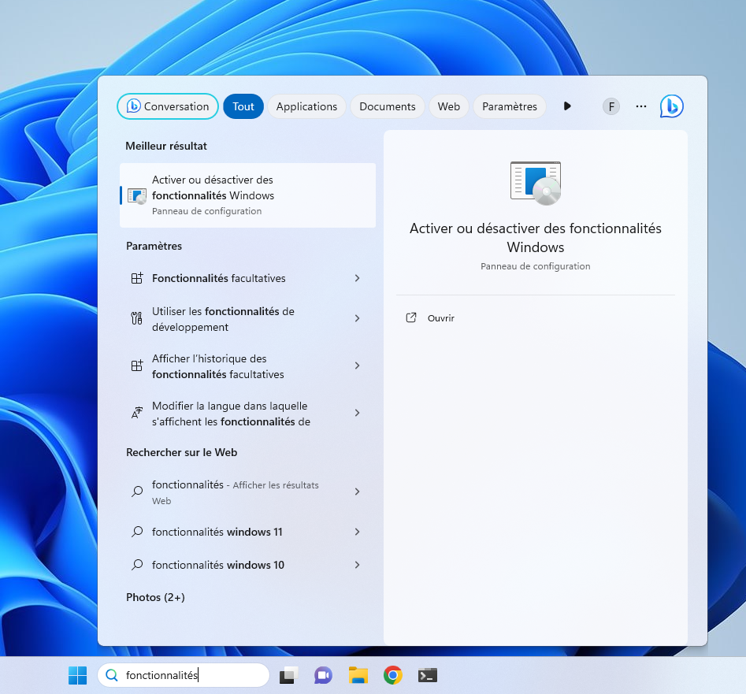
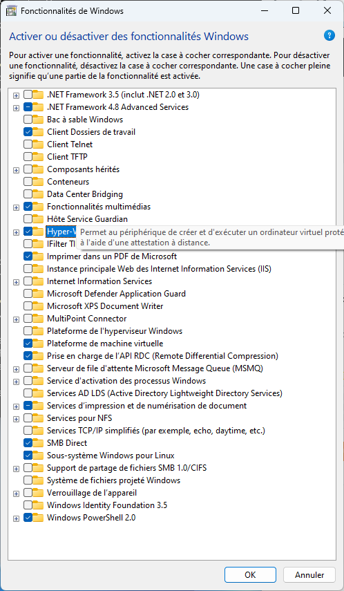

[Sous-système Windows pour Linux (WSL, Windows System for Linux)](https://learn.microsoft.com/fr-fr/windows/wsl/) est un moyen simple d'installer Linux sur un ordinateur disposant de Windows 11, car il permet de faire cohabiter les deux systèmes en une même session.

Si vous voulez apprendre ou utiliser Linux à son plein potentiel il est mieux d'installer Linux/Ubuntu sur un système à part, mais pour débuter ; se familiariser avec les commandes ou créer des applications Linux c'est un bon point de départ.

## Procédure d'installation

Nous allons suivre les instruction de la [page d'installation de la WSL de Microsoft]((https://learn.microsoft.com/fr-fr/windows/wsl/install)).

### Prérequis

Pour pouvoir installer la wsl, il faut que votre système ait quelques options d'installées :

Dans la barre de recherche, tapez `fonctionnalités` pour accéder aux fonctionnalités windows :



Une fois l'application lancée, cochez les fonctionnalités suivantes pour les activer :

* "hyper-V"
* "Plateforme machine virtuelle"
* "sous-système windows pour Linux"



### Installation

Dans un terminal tapez la commande :

```
wsl --install -s ubuntu
```

Pour installer une distribution Linux/Ubuntu. Pour le login, choisissez le même que celui de l'école/fac.

## Exécuter un terminal Linux

Accéder au système Linux se fait via un terminal Linux. Il y a deux moyens de le faire.

### Via un terminal powershell

Vous pouvez exécuter un terminal Linux depuis un terminal powershell en tapant la commande `wsl` :


### Via le menu terminal épinglé

Sur l'onglet terminal épinglé, en choisissant la ligne `ubuntu` :


## Application graphique

A priori, les applications graphiques (X11) de Linux sont directement utilisables avec la WSL.

Vous pouvez suivre [ce tutoriel](https://learn.microsoft.com/fr-fr/windows/wsl/tutorials/gui-apps) pour vérifier que tout est ok, mais ça devrait être le cas par défaut.

## Vscode et wsl

Vous pouvez configurer vscode pour qu'il puisse utiliser la wsl plutôt que le système windows 11. C'est super pratique pour le développement !

Une fois wsl installé, si vous exécutez vscode, il vous demandera s'il doit installer des choses, dites oui.


[vscode et wsl](https://learn.microsoft.com/fr-fr/windows/wsl/tutorials/wsl-vscode)


## Fichiers wsl et windows 11


[documentation Microsoft](https://learn.microsoft.com/fr-fr/windows/wsl/filesystems)


Il est tout à fait possible d'accéder aux fichiers de la wsl sous Windows 11. Lorsque vous ouvrez un explorateur, il suffit d'aller dans la partie Linux puis de choisir le lecteur Ubuntu :


Les fichiers sont identique à ceux sous wsl :



La gestion des liens n;et pas identique sous Windows 11 et Linux, ne manipulez que des fichiers ou dossiers *normaux* entre les deux systèmes.


## ssh et Wsl

Il faut configurer l'agent pour qu'il se lance au démarrage. À la fin du fichier `~/.profile` (s'il n'existe pas créez le), ajoutez le contenu de : [ajout ssh-agent](https://gist.github.com/gabetax/3756756)
