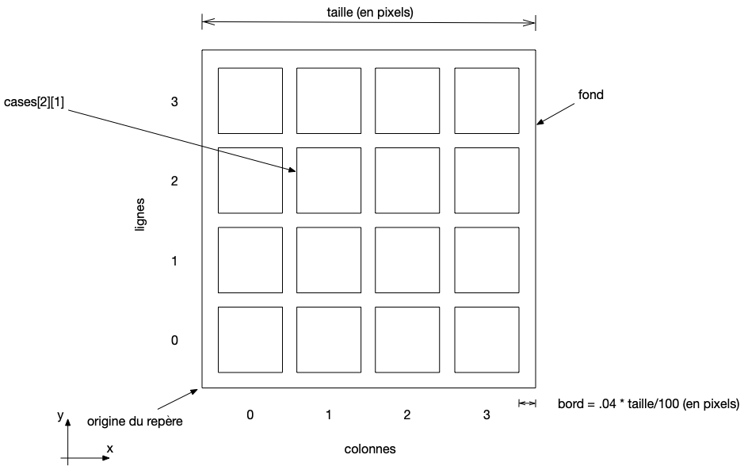
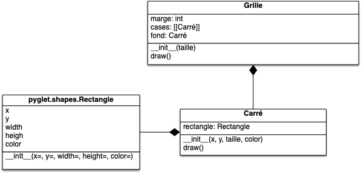

Le but de ce DS est de coder un 2048.



**Durée du contrôle** : 3 heures.

1. Faites les questions dans l'ordre
2. n'inventez pas votre propre structure, suivez celle demandée
3. rendez sur [Amétice](hhttps://ametice.univ-amu.fr/mod/assign/view.php?id=350820) un dossier contenant tout votre code ainsi qu'un fichier texte contenant les numéros des questions auxquelles vous avez répondu



Vous aurez besoin de la bibliothèque [pyglet](https://pyglet.readthedocs.io/en/latest/) pour coder les fenêtres et gérer les évènements claviers (avec la méthode `on_key_press`{.language-}) et souris (avec la méthode `on_mouse_press`{.language-}). Nous n'aurons pas besoin de gérer le temps dans ce DS. 


Toutes les informations nécessaires pour ce DS ont été prises de :

- [la description du jeu sur sa page wikipedia](https://fr.wikipedia.org/wiki/2048_(jeu_vid%C3%A9o))
- [cette implémentation du jeu](https://play2048.co/)



Commencez par bien lire la page wikipedia précédente et faites une ou deux partie pour bien comprendre comment fonctionne le jeu.

## Documents à rendre

Un dossier contenant les divers fichiers python dont vous avez eu besoin. Ce dossier **doit contenir** un fichier `main.py`{.language-} qui contient votre jeu. 

## Sujet

Le projet a été découpé en plusieurs étapes que l'on vous demande de suivre.

Vous indiquerez en commentaire de votre ficher `main.py`{.language-} l'étape à laquelle vous vous êtes arrêté.


Chaque étape est un jalon du projet et n'est pas triviale. Que cela vous prenne un peu de temps pour le faire est normal.


## Étape 1 : le fichier `main.py`{.fichier}

Cette étape va créer l'aire de jeu. À l'exécution du fichier `main.py`{.language-}, vous devez obtenir la fenêtre suivante :


Les couleurs (au format [RGBA](https://fr.wikipedia.org/wiki/RVBA), le dernier paramètre étant la transparence) sont les suivantes :

- le fond : `(185, 173, 161, 255)`
- les cases : `(202, 193, 181, 255)`

Les 16 cases de la grille (une matrice 4x4) sont séparées par des marges de 4% de la taille du fond (32 pixels de marge pour une taille de 800 pixels par exemple).



### `main.py`{.fichier}

Le fichier qui exécutera votre programme est le suivant :

```python
import pyglet

from grille import Grille


class DeuxMilleQuaranteHuit(pyglet.window.Window):
    def __init__(self):
        super().__init__(800, 800, "2048")

        self.grille = Grille(800)

    def on_draw(self):
        self.grille.draw()


window = DeuxMilleQuaranteHuit()
pyglet.app.run()
```

Vous modifierez la classe `DeuxMilleQuaranteHuit`{.language-} lorsque vous aurez besoin de gérer les évènements.


C'est dans la classe `DeuxMilleQuaranteHuit`{.language-} que vous placerez les fonctions de gestion des évènements comme `on_mouse_press(self, x, y, button, modifiers)`{.language-} à l'étape 2 ou `on_key_press(self, symbol, modifiers)`{.language-} à l'étape 5.

### La classe `Grille`{.language-}

Implémentez les classes `Grille`{.language-} et `Carré`{.language-} en respectant le diagramme UML suivant :



L'attribut `cases`{.language-} de la grille est une matrice de `Carré`{.language-}. La taille de chaque carré est identique et est calculée de telle sorte que la matrice (carrés et bords) remplisse la fenêtre.



- [Classe `pyglet.shapes.Rectangle`{.language-}](https://pyglet.readthedocs.io/en/latest/modules/shapes.html#pyglet.shapes.Rectangle)
- [Comment créer une matrice](/cours/coder-et-développer/bases-python/structurer-son-code/conteneurs/listes/#matrices)



## Étape 2

Pour pouvoir manipuler les cases de la grille, nous allons ajouter plusieurs méthodes. On ne pourra tester nos méthodes qu'à la toute fin de l'étape, lorsque l'on utilisera l'évènement qui gère les cliques de souris.

Commençons par pouvoir cliquer sur une case précise.

### Méthode `intérieur(x, y)`{.language-} pour les `Carré`{.language-}

Ajoutez une méthode `intérieur(x, y)`{.language-} à la classe `Carré`{.language-} qui rend :

- `True`{.language-} si le point de coordonnées $(x, y)$ est dans le rectangle,
- `False`{.language-} sinon.




Vous pourrez utiliser les attributs `x`{.language-} `y`{.language-}, `width`{.language-} et `height`{.language-} de la classe `pyglet.shapes.rectangle`{.language-}.



### Méthode `intérieur(x, y)`{.language-} pour la `Grille`{.language-}

Ajoutez une méthode `intérieur(x, y)`{.language-} à la classe `Grille`{.language-} qui rend :

- `(i, j)`{.language-} si le point de coordonnées $(x, y)$ est dans le rectangle de la case `cases[i][j]`{.language-},
- `None`{.language-} si le point n'est dans aucune case de la matrice `cases`{.language-}.

### Cliquer sur une case de la matrice

Utilisez l'évènement `on_mouse_press(self, x, y, button, modifiers)`{.language-} pour afficher sur le terminal avec la fonction `print`{.language-} :

- "je suis dans la case de coordonnée i, j" si le point de coordonnée $(x, y)$ est dans `cases[i][j]`{.language-},
- "je ne suis pas dans une case de la matrice" si l'on a pas cliqué sur une case.   

## Étape 3

Gestion des valeurs des cases.


### Classe `Case`{.language-}

Implémentez la classe `Case`{.language-} d'UML suivant :


L'attribut valeur peut valoir toutes les puissances de 2, allant de 1 à 2048 et est représenté graphiquement par un label de taille 40. Si la valeur vaut 1, elle n'est pas représentée graphiquement (c'est la case vide).




- [Classe `pyglet.text.Label`{.language-}](https://pyglet.readthedocs.io/en/latest/modules/text/index.html#pyglet.text.Label)
- Les couleurs des cases pour les différentes valeurs :
    - `(202, 193, 181, 255)`{.language-} pour une valeur de 1
    - `(238, 228, 218, 255)`{.language-} pour une valeur de 2
    - `(237, 224, 200, 255)`{.language-} pour une valeur de 4
    - `(242, 177, 121, 255)`{.language-} pour une valeur de 8
    - `(245, 149, 99, 255)`{.language-} pour une valeur de 16
    - `(246, 124, 95, 255)`{.language-} pour une valeur de 32
    - `(246, 94, 59, 255)`{.language-} pour une valeur de 64
    - `(237, 207, 114, 255)`{.language-} pour une valeur de 128
    - `(237, 204, 97, 255)`{.language-} pour une valeur de 256
    - `(237, 200, 80, 255`{.language-} pour une valeur de 512
    - `(237, 197, 63, 255)`{.language-} pour une valeur de 1024
    - `(237, 194, 46, 255)`{.language-} pour une valeur de 2048



### Design pattern factory

Lors de la création de la classe `Grille`{.language-} on utilise des maintenant des objets de type `Case`{.language-} de valeur 1 et non plus des `Carré`{.language-}. Pour que ce soit facile à faire, faite un design pattern factory pour créer des objets de valeur 1. La signature de ce factory doit être :

```python
vide(x, y, taille)
```

### Vérification

Lors de la création de la fenêtre, modifiez la case de la ligne d'indice 2 et de colonne 1  de la matrice pour que ce soit un objet de la classe `Case`{.language-} de valeur 512 (vous pourrez tester plusieurs valeurs pour vérifier que tout fonctionne)

## Étape 4

Nous allons préparer la modification dynamique des cases en utilisant l'évènement `on_mouse_press(self, x, y, button, modifiers)`{.language-}.



Cette étape n'est pas utile pour le jeu en lui-même, mais la coder vous aidera à avancer. Conservez cette partie même si vous allez plus loin.


### Méthode `set_valeur(v)`{.language-} de la classe `Case`{.language-}

Le jeu du 2048 passe son temps à modifier les valeurs des cases. Implémentez une une méthode `set_valeur(v)`{.language-} à la classe `Case`{.language-} dont la fonction est de modifier la valeur de la case puis de changer son fond et son label en conséquence.

Utilisez cette méthode dans le constructeur de `Case`{.language-}.

### Méthodes `incrémente()`{.language-} et `décrémente()`{.language-} de la classe `Case`{.language-}

Ajoutez les méthodes `incrémente()`{.language-} et `décrémente()`{.language-} à la classe `Valeur`{.language-} dont le rôle est de modifier la valeur de la case en l'augmentant (on multiplie la valeur par 2 si elle ne vaut pas 2048) ou la diminuant (on divise la valeur par 2 si elle ne vaut pas 1).

### Cliques gauche et clique droit

Modifiez la gestion du clique de souris pour que :


- le clique gauche augmente la valeur de la case sur laquelle on clique
- le clique droit diminue la valeur de la case sur laquelle on clique

Si vous avez un mac, vous pouvez soit simuler le clique droit soit l'activer en suivant [cette aide d'apple](https://support.apple.com/fr-fr/guide/mac-help/mh35853/mac).


## Étape 5

Tout est en place pour implémenter la mécanique de jeu.

Lorsque l'on appuie sur une flèche de direction, les cases de valeurs strictement plus grandes que 1 se déplacent, une à une, dans le sens de la flèche. L'ordre dans lequel les cases se déplacent est important :

- lorsque l'on appuie sur la flèche de droite, pour chaque ligne, on déplace les cases en commençant par celle le plus à droite
- lorsque l'on appuie sur la flèche de gauche, pour chaque ligne, on déplace les cases en commençant par celle le plus à gauche
- lorsque l'on appuie sur la flèche du bas, pour chaque colonne, on déplace les cases en commençant par celle la plus basse
- lorsque l'on appuie sur la flèche du haut, pour chaque colonne, on déplace les cases en commençant par celle la plus haute

Une case ne peut se déplacer que si la case vers la quelle elle se déplace est vide (de valeur 1) ou de même valeur qu'elle même.

### Déplacement vers une case adjacente

Commencez par gérer le déplacement vers une case **adjacente** dans la direction souhaitée en utilisant l'évènement `on_key_press(self, symbol, modifiers)`{.language-}. 

Vous tenterez de déplacer toutes les cases, une à une dans le bon ordre, **d'une seule case** dans la direction souhaitée. Par exemple si la matrice contient les valeurs suivante :


```
2114
2221
1111
1141
```

L'appui sur une touche de direction produira les matrices ci-dessous :

```
                4224               
                1111
                1141
                1111

                 ^
                haut

2141            2114            1214
4211  < gauche  2221  droite >  1222
1111            1111            1111
1411            1141            1114

                bas
                 v

                1111
                2114
                2221
                1111
```

Toutes les cases de valeurs strictement plus grandes que 1 se sont déplacés si possible, soit vers une case libre adjacente soit vers une case de même valeur et ont fusionné.

### Ajout d'une nouvelle case

Si l'appui sur une touche de direction a effectivement déplacé une case de valeur strictement plus grande que 1, une case de valeur 1 est choisie aléatoirement puis :

- 80% du temps elle est incrémentée une fois (ce qui est equivalent à ajouter une case de valeur 2)
- 20% du temps elle est incrémentée deux fois  (ce qui est equivalent à ajouter une case de valeur 4)



Vous pourrez utiliser les méthodes suivantes [du module random de python](https://docs.python.org/fr/3/library/random.html)

- [`choice`{.language-}](https://docs.python.org/fr/3/library/random.html#random.choice) pour prendre un élément au hasard parmi la liste des cases de valeur 1
- [`random`{.language-}](https://docs.python.org/fr/3/library/random.html#random.random) pour gérer les probabilités.


## Étape 6

Déplacement complet.

### Déplacement de plusieurs cases

Les cases peuvent se déplacer de plusieurs cases vides, si possible. La façon la plus simple de réaliser cette opération est d'effectuer l'opération de déplacement précédente (déplacements vers une case adjacente) 3 fois de suite.

### Nombre d'incrémentations

Une même case ne peut s'incrémenter qu'une seule fois par déplacement. Par exemple un déplacement vers la droite de la ligne : `1224` donne `1144` et non pas `1118`.

Gérer cette règle.


Vous pourrez faire cela en ajoutant un attribut à la classe `Case`{.language-}. Cet attribut est faux avant chaque déplacement et devient vrai après un incrément.

Une case ne peut fusionner qu'avec une case de même valeur et dont ce nouvel attribut est faux.


## Étape 7

Détectez après un déplacement si la partie est terminée et affichez à sur le terminal avec la fonction `print`{.language-} si le jeu est fini.
