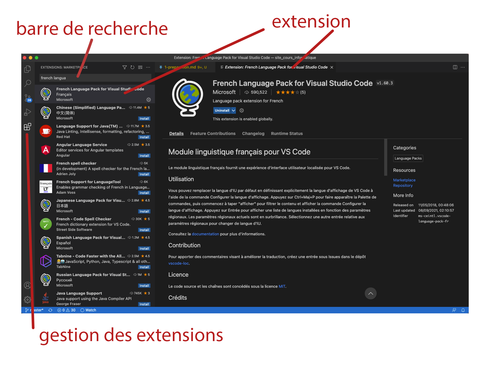
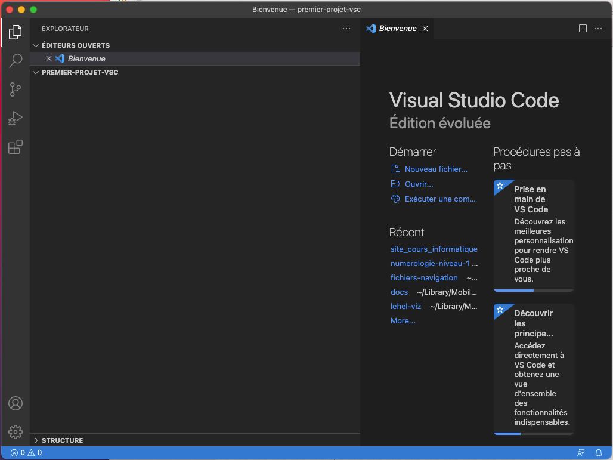


[Tutoriels]({{ ".." }}) / [{{title}}]({{ "." }})


<!-- début résumé -->

Installation et premières configurations de l'éditeur de texte [visual studio code (vsc)](https://code.visualstudio.com/).

<!-- fin résumé -->

Si vous ne l'avez pas déjà fait :


Téléchargez [vscode](https://code.visualstudio.com/) et installez le.


Sous Ubuntu, si vous voulez l'installer via le package manager, il vous sera peut-être nécessaire d'utiliser la commande `sudo snap install code --classic` dans un terminal)


## Installation d'extensions {#extensions}

Normalement, vscode a reconnu que vous êtes français et vous demande de le relancer car il a téléchargé le module Français.


On suppose dorénavant que votre vscode est en Français. Si votre vscode ne l'a pas fait tout seul, vous pouvez suivre la partie ci-après, qui vous explique également comment installer le package Français.


Regardons où l’extension Français a été installé (ou comment l'installer).



1. cliquez sur l'icône de gestion des extensions ou *menu Affichage > Extensions* (*menu View > Extensions* en anglais).
2. Dans les extensions installées vous devriez avoir : *French Language Pack for Visual Studio Code*. Si vous ne l'avez pas, installez là en :
    1. tapant dans la barre de recherche : *French Language Pack for Visual Studio Code*
    2. cliquez sur l'application correspondante (ça devrait être la première)
    3. un onglet détaillant l'extension est apparu  : cliquez sur *install* pour l'installer. vscode va se redémarrer en français.






Les extensions vscode sont très pratiques. N'hésitez pas à en installer.


## Workspace vscode

Vscode permet, comme tout éditeur de texte, d'éditer et de créer des fichiers texte mais aussi de gérer des *workspace* qui sont des dossiers contenant des projets.

Ces projets peuvent être de natures diverses, comme des projets web, du python, des rapports, etc.

Pour ce tutoriel, vous allez :



1. Créer un dossier que vous appellerez *"premier-projet-vsc"* avec votre explorateur de fichier
2. ouvrez l'application vscode
3. dans vscode, choisissez : "*menu File > open folder*" puis naviguez jusqu'à votre dossier *"premier-projet-vsc"*. On vous demande si vous faites confiances aux auteurs, puisque c'est vous dites oui.



Vous devez obtenir quelque chose du style (pris sous mac mais ça devrait être quasi-pareil sous linux et windows) :


Nous venons de créer un nouveau projet, que vscode appelle un [workspace](https://code.visualstudio.com/docs/editor/workspaces#_how-do-i-open-a-vs-code-workspace).


Un *workspace* est un endroit pour lequel on peut avoir ses propres préférences et spécificités.



 Il faut donc **toujours** ouvrir vos projet par "*menu File > open folder*" et **pas** en ouvrant seulement des fichiers contenu dans votre projet avec "*menu File > open folder*".


## Tour et aménagement du propriétaire

La barre d'activité de la fenêtre vscode (les icônes sur la gauche de la fenêtre), vous permet de choisir une icône qui correspond (de haut en bas) :

* aux fichiers et sous-dossiers de votre workspace (pour l'instant il n'y a rien)
* à une recherche de texte dans votre projet
* à la gestion des sources
* au débogage
* à la gestion des extensions de vscode
* à la gestion des comptes
* aux préférences de vscode


Les différentes parties de l'interface de la fenêtre vscode sont expliquées [dans la doc](https://code.visualstudio.com/docs/getstarted/userinterface).


Vous devriez aussi avoir un onglet ouvert qui s'appelle *welcome*.


Fermez l'onglet *welcome* en cliquant sur la croix à droite de son nom.


### Barre de statut


Créez un nouveau fichier *menu Fichier > Nouveau Fichier* et sauvez le de suite : *menu Fichier > Enregistrer* avec le nom *"hello.txt"*.


Vscode à compris que c'était du texte, il l'écrit dans la barre de statut (la dernière ligne, en bleu, de la fenêtre vscode, voir [user interface](https://code.visualstudio.com/docs/getstarted/userinterface)).


La barre de statut est très utile, elle regroupe plein d'infos relative au fichier courant :

* où on est : Ln 1; Col 1
* l'[encodage des caractères](https://www.w3.org/International/questions/qa-what-is-encoding.fr) : [UTF-8](https://fr.wikipedia.org/wiki/UTF-8). Vous ne **devez jamais** avoir autre chose lorsque vous écrivez du texte.
* l'[encodage des fin de ligne](https://fr.wikipedia.org/wiki/Fin_de_ligne) : LF (sous unix/mac) ou CRLF (sous windows). On ne s'en occupe pas trop, vscode gère tout ça pour nous
* le langage : ici texte brut
* d'autres trucs selon les extensions que vous avez ajouté.


### Créer et sauver des fichiers



1. Écrivez du texte dans notre fichier (l'onglet nommé *"hello.txt"*) :

    ```text
    Bnjour Monde !
    ```

2. Puis sauvez le fichier (*menu Fichier > Enregistrer*).



Félicitations, vous venez d'écrire votre premier texte en vscode avec un grosse faute de français !


Si vous fermez malencontreusement votre onglet (en cliquant sur la croix à droite du nom), vous pouvez toujours retrouver ce fichier en ouvrant l'explorateur (*menu Affichage > Explorateur*, ou en cliquant sur la 1ère icône de la barre d'activité) et en sélectionnant le fichier.


Bon, c'est pas trop de notre faute vu que c'était pas souligné en rouge. Remédions à cela en ajoutant un dictionnaire à vscode :


En procédant comme dans la partie [Installation d'extensions](#extensions), installez l'extension "French - Code Spell Checker". Elle ajoute un correcteur orthographique français à vscode.


Ouf, "Bnjour" est bien souligné en bleu. Si vous allez dessus avec le curseur, une ampoule jaune va apparaître : Elle va vous proposer "Bonjour". Vous pourrez ajouter les mots nouveaux soit au dictionnaire de l'utilisateur (*user*), soit juste pour ce projet (*workspace*), mais là ce n'est pas le cas :


Corrigez la faute en choisissant le bon mot dans l'ampoule jaune.



Un fichier non sauvegardé aura un disque blanc à côté de son nom à la place d'une croix. Comme le montre l'image ci-après.

Si vous ne comprenez pas pourquoi votre programme python ne fonctionne pas alors que vous avez corrigé une faute, c'est peut-être que vous n'avez pas sauvé le fichier...


|:-:|:-:
 | 
fichier non sauvé | fichier sauvé

### palette de commande {#palette-de-commande}

Ce qu'il y a de bien avec vscode c'est que toute commande est aussi appelable par son nom grâce à la [palette de commande](https://code.visualstudio.com/docs/getstarted/userinterface#_command-palette).


Invoquez la palette de commande : *menu Affichage >  Palette de commandes...*.

Puis tapez sur la touche "esc" pour la faire disparaître.


Vous pouvez taper *"save"* par exemple pour voir toutes les commandes qui contiennent save, dont celle qui sauve des fichiers *File: Save*. C'est super utile pour trouver une commande dont ne peut que deviner le nom.


Le nom des commandes est en anglais. Tapez donc des mots anglais dans la palette de commandes. Les différentes commandes seront listées sur deux lignes  la première — en Français — décrivant la commande, et la seconde — en anglais — donnant le nom de la commande.


Les commandes de la palette de commande sont accessibles si la ligne commence par un ">". S'il y a un "?" c'est l'aide et s'il n'y a rien, cela retrouve des fichiers ouverts.

Par exemple :


Taper *>spell* dans la palette de commande. Toutes les commandes commençant par *spell* sont disponibles, c'est à dire celles relatives au correcteur orthographique.


## les paramètres

La [documentation de vscode sur les paramètres](https://code.visualstudio.com/docs/getstarted/settings) est très bien faite. On retiendra que l'on peut modifier les paramètres de deux façons :

* par "Utilisateur" (*user*), ce sera les valeurs par défaut des paramètres
* par "Espace de travail" (*workspace*), spécifiques au projet courant


Par défaut, modifiez les paramètres "Utilisateur".



Le fichier stockant des paramètres utilisateurs [dépend du système d'exploitation](https://code.visualstudio.com/docs/getstarted/settings#_settings-file-locations), si vous modifiez des préférences pour l'espace de travail, un dossier *".vscode"* sera créé à la racine de votre projet, et il contiendra un fichier *"settings.json"* contenant les différentes paramètres.


Personnellement, s'il y a bien une chose qui m'ennuie c'est de constamment sauver mes fichiers. Si je fais une modification de mes fichiers, c'est parce que j'en ai besoin je ne vois pas l'intérêt de devoir sauver pour confirmer. Heureusement, vscode permet (comme tout éditeur qui se respecte) de faire ça en modifiant ses préférences :


Allez dans les préférences de vscode : *icône engrenage (en bas à gauche de la fenêtre vscode) > Paramètres*.


Un onglet nommé *Paramètre* s'ouvre Il contient :

* une barre de recherche
* deux panels : *Utilisateur* et *Espace de travail*. Par défaut, on est positionné sur *Utilisateur* (c'est en sur-brillance).


Dans le panel *Utilisateur* choisissez *Editeur de texte > Fichiers* puis cherchez *Auto Save*.


On peut ensuite régler ce paramètre :



1. Choisissez *afterDelay* dans le menu déroulant du paramètre *Auto Save*.
2. Puis changez le délai dans le champ *Auto Save Delay* (juste en-dessous du paramètre *Auto Save*) à 5000.



Vous venez de faire en sorte que le fichier ce qui fait qu'après 5 secondes de repos mon fichier est sauvé automatiquement.


On aurait pu aussi taper "auto save" dans la barre de recherche pour obtenir directement les champs possibles. Ce qui est très pratique lorsque l'on se doute du nom du paramètre que l'on veut changer.


Nous avons modifiez un paramètre *utilisateur*. Si vous ne voulez modifier un paramètre que pour un projet spécifique, modifiez le paramètre dans le panel *Espace de travail*.
