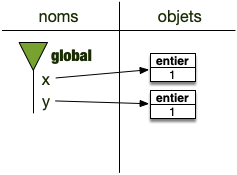
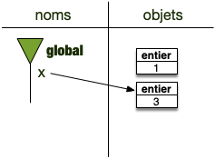
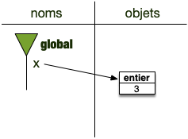
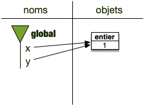
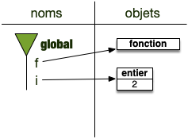
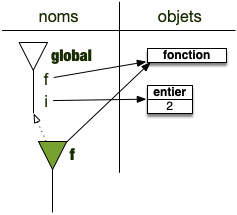
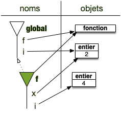
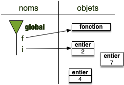
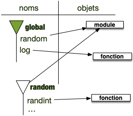

> [Algorithme, code et théorie]() / [code]() / [mémoire et espace de noms]()
>
> **prérequis :**
>
> * [coder]()
{: .chemin}

On montre comment on peut gérer les variables dans un programme, et l'utilité des espaces de noms (en prenant l'exemple de python) pour le faire.

Nous ne rentrerons pas dans les détails, la gestion de la mémoire est quelque chose de compliqué. Nous nous contenterons d'en présenter les caractéristiques fondamentales et les conséquences que cela implique sur la gestion des variables et des objets.

## la mémoire

On peut considérer la mémoire d'un ordinateur comme un long tableau de taille (habituellement mesurée en [octet](https://fr.wikipedia.org/wiki/Octet)) fixe, dépendant de votre ordinateur.

{:style="margin: auto;display: block;"}

> Cette taille est souvent plus grande que votre [RAM](https://fr.wikipedia.org/wiki/M%C3%A9moire_vive), grâce au mécanisme du [swap](https://fr.wikipedia.org/wiki/Espace_d%27%C3%A9change).

Comme un programme n'est jamais seul à être exécuté sur un ordinateur et que — pour des raisons de sécurité — un programme $A$ ne doit pas pouvoir accéder à la mémoire utilisée par un programme $B$ :

> Le **système d'exploitation** est le seul à pouvoir accéder à une case donnée de la mémoire via son indice, comme on pourrait le faire avec un tableau normal. Un programme spécifique en revanche, ne peut accéder qu'à la partie de la mémoire qui lui a été allouée par le système d'exploitation
{: .note}

### accéder/allouer de la mémoire

Comme le système d'exploitation alloue de la mémoire et que plusieurs programmes se la partagent, il est uniquement possible pour un programme donné :

* de demander un **bloc** de $k$ octets **consécutifs** de la mémoire
* de libérer un bloc de mémoire alloué.

Il lui est en revanche impossible :

* de modifier la taille d'un bloc qui lui a été alloué
* de choisir l'endroit de la mémoire qu'il veut se faire allouer

On ne sait en effet pas si la mémoire à côté d'un bloc est libre ou non. Par exemple dans la figure ci-dessous, le seul emplacement libre en mémoire est la case blanche. Le programme *vert* ne peut demander à augmenter le bloc de 3 octets qui lui est alloué, sinon il risque de rentrer en conflit avec le programme *rouge*.

{:style="margin: auto;display: block;"}

> C'est ce qui fait qu'il est impossible d'augmenter simplement la taille d'un tableau. Il faut le recréer et recopier toutes ses valeurs dans un autre endroit de la mémoire.
{: .note}

### stocker en mémoire

Avant de parler des moyens qu'à un programme de se rappeler ce qu'il a stocké, regardons comment on peut stocker des objets en mémoire en prenant l'exemple d'un entier.

La façon courante de stocker des objets est d'utiliser des **références**. Mais pour pour bien comprendre ce que c'est il faut commencer par parler (un peu) des valeurs.

#### stockage de valeurs

La mémoire étant une suite fini d'octets, si l'on veut stocker plus qu'un nombre entre 0 et 255 (ou -128, 127 s'il est [signé](https://en.wikipedia.org/wiki/Signed_number_representations)), il faut lui réserver plus d'une case.

Au début de l'informatique, il y avait plusieurs types d'entiers, selon ce qu'on voulait stocker. Par exemple :

* pour stocker des entier de 0 à 255 on avait le `char` (1 octet)
* pour stocker des entiers de -32768 à 32767 on avait le type `int` (2 octet)
* pour des entiers allant de −2147483647 à 2147483647 on avait le type `long` (4 octet)

On précisait dans notre programme quel type d'entier on voulait utiliser pour telle ou telle variable et un espace mémoire lui était alloué :

> Dans l'**ancien temps** une variable était égale à son indice en mémoire et ne contenait qu'une donnée
{: .note}

{:style="margin: auto;display: block;"}

Ce type de fonctionnement a ses avantages :

* on ne se préoccupe pas de la taille en mémoire. La taille est fixée au départ selon le type de la variable choisie
* il y a une correspondance stricte entre variable et indice dans le tableau de la mémoire
* la taille d'un tableau d'objets d'un type fixé est facile à calculer.

Mais cela avait aussi de (très) gros inconvénients :

* comment coder 32768 si j'ai décidé au départ que ma variable était un `int` ?
* on ne peut pas avoir de tableaux combinant plusieurs types d'objets car il est impossible de calculer facilement l'indice donné d'un tableau contenant plusieurs types .
* si on écrit `i = j`, il **faut** recopier le contenu de `i` (à l'adresse mémoire de `i`) dans `j` (à l'adresse mémoire de `j`) : un même objet ne peut pas avoir plusieurs noms.

#### stockage d'objets

Actuellement, on préfère ne pas avoir à gérer directement la mémoire et surtout, dissocier la variable de la valeur  : écrire `i = j` doit signifier que l'objet désigné par la variable `j` doit **aussi** être désigné par `i`.

Pour cela, il faut dissocier la variable de l'emplacement en mémoire de l'objet. La définition actuelle d'une *variable* est alors :

> Une **variable** est une référence à un objet stocké en mémoire.
{: .note}

Le moyen de le plus simple de définir une référence, c'est de prendre l'indice de la première case mémoire contenant l'objet.

Prenons un exemple : supposons que notre ordinateur dispose de 16Go (gigaoctets) de RAM. L'indice de notre tableau de mémoire va alors de $0$ à $10^9-1$ : il faut 4 octets pour stocker un indice en mémoire.

{:style="margin: auto;display: block;"}

La figure ci-dessus montre alors une variable (*verte*) représentant un objet entier (*orange*) : elle contient l'indice du tableau de la mémoire contenant le premier élément de l'objet (sa référence, $i^\star$ dans la figure).

Les bénéfices de cette méthode sont énormes :

* les objets sont uniques, en écrivant `i = j` les deux variables ont le même objet en référence
* un tableau devient un tableau de référence, il peut contenir des types d'objets différents sans soucis
* on peut facilement modifier un objet, sans avoir à changer toutes les variables qui le référencent.

> Comme on manipule directement les objets, il faut faire attention aux effets de bords lorsqu'on les modifie.
{: .attention}

Par exemple en python :

```python
t = [1, 2, 3]
u = t
u[1] = 12
print(t)
```



`[1, 12, 3]` on a modifié l'objet référencé par `u`, qui est le même que celui référencé par `t`



Plus insidieux :

```python
t = [1, 2, 3]
u = [1, t, "?"]
u[1][1] = 12
print(t)
```



`[1, 12, 3]` on a modifié l'objet référencé par `u[1]`, qui est le même que celui référencé par `t`



## programme objet

La quasi-entièreté des langages actuellement sont dit *objet*. C'est à dire que :

* ce que manipule un programme est appelé objet.
* les variables sont des références aux objets.

Ces langages permettent de créer des programmes en utilisant uniquement les deux mécanismes ci-dessous :

> Pour qu'un programme objet fonctionne, on a besoin de deux mécanismes :
>
> * un moyen de stocker des données et de les manipuler (les objets et leurs méthodes)
> * un moyen d'y accéder (les variables)
>
{: .note}

### objets

On y reviendra, mais pour l'instant considérez qu'un objet est une structure de donnée générique permettant de gérer tout ce dont à besoin un programme :

* des données
* des fonctions
* des modules
* ...

Tout est objet dans un langage objet.

### variables

Les variables sont des références aux objets. Pour ce faire, on utilise l’opérateur d’affectation `=` :

```txt
variable = objet
```

A gauche de l’opérateur `=` se trouve une **variable** (en gros, quelque chose ne pouvant commencer par un nombre) et à droite un **objet**. Dans toute la suite du programme, dès que le programme rencontrera le nom, il le remplacera par l'objet.

> Un variable n'est **PAS** une chaîne de caractères. Une chaîne de caractère est un objet alors qu’une variable est un alias vers un objet.
{: .attention}

Il est important de comprendre que l’opérateur d’affectation `=` n’est pas symétrique. À gauche, des variables et à droite, des objets.

> Une variable n'est **pas** l'objet, c'est une référence à celui-ci
{: .note}

La variable peut être vue comme un **nom** de l'objet à ce moment du programme. Un objet pourra avoir plein de noms différents au cours de l'exécution du programme, voire plusieurs noms en même temps.

Pour s'y retrouver et et avoir une procédure déterministe pour retrouver les objets associés aux variables, voire choisir parmi plusieurs variables de même noms, elles sont regroupées par ensembles — nommés **espaces de noms** — hiérarchiquement ordonnés.

## espaces de noms {#espace-noms}

Les espaces de noms nous permettent d'abstraire ce qu'il se passe en mémoire :

* on considère que les objets sont stockés dans *l'espace des objets* : cet espace est **unique**
* on accède aux objets via leurs noms, eux même stockés dans des *espaces de noms* : il y a de **nombreux** espaces de noms.

Pour chaque *espace de noms* :

* il ne peut y avoir 2 noms identiques dans un même espace de noms
* à chaque nom est associé un objet
* certains espaces de noms possèdent un parent

> Pour expliciter comment tout ça se passe, on va se concentrer sur le [langage python](https://docs.python.org/3/tutorial/classes.html#python-scopes-and-namespaces), mais la procédure est similaire pour les autres langages à objets.

Lorsque l'on exécute un programme, un premier espace de noms est créé :

> Au démarrage d'une exécution d'un programme, l'espace de noms principal, nommé `global` est créé.
{: .note}

Au départ, il ne contient rien, à part des noms commençant et finissant par `__`, qui sont utilisés par python.

> Pour voir les noms définit dans l'espace de noms global, on utilise en python la fonction `globals()`.

A tout moment de l'exécution d'un programme, un espace de noms pourra être créé. En  revanche :

> A tout moment du programme, on pourra créer un nouvel espace de noms : de nombreux espaces de noms pourront être définis, mais il existera toujours **un** espace de noms courant où l'on créera les variables et où on cherchera les noms par défaut.
{: .note}

On donnera dans la suite de cette partie des exemples qui permettront de mieux comprendre ce processus.

> Pour voir les noms définis dans l'espace de noms courant, on utilise en python la fonction `locals()`.

### noms et variables

Prenons plusieurs exemples, qui illustreront les cas principaux.

#### association objet et noms

Considérons le programme suivant :

```python
x = 1
y = 1
```

Exécutons le ligne à ligne :

1. avant l'exécution de la première ligne :
   1. on a un unique espace de noms (`global`) qui est l'espace courant (en vert sur la figure)
      {:style="margin: auto;display: block;"}
2. on exécute la première ligne. Elle s'exécute ainsi :
   1. on commence à droite du `=` : on crée un objet de type entier
   2. on crée le nom `x` dans l'espace de noms courant (ici `global`) et on lui affecte l'objet.
      {:style="margin: auto;display: block;"}
3. on exécute la deuxième ligne. Elle s'exécute ainsi :
   1. on commence à droite du `=` : on crée un objet de type entier
   2. on crée le nom `y` dans l'espace de noms courant (ici `global`) et on lui affecte l'objet.
      {:style="margin: auto;display: block;"}

A la fin du programme, il y a **2 objets entiers différents** (même si tous les 2 valent 1), dont les noms sont, dans l'espace de noms global, respectivement `x`et `y`.

#### réutilisation du même nom

```python
x = 1
x = 3
```

Exécutons le ligne à ligne :

1. avant l'exécution de la première ligne :
   1. on a un unique espace de noms (`global`) qui est l'espace courant (en vert sur la figure)
      {:style="margin: auto;display: block;"}
2. on exécute la première ligne. Elle s'exécute ainsi :
   1. on commence à droite du `=` : on crée un objet de type entier
   2. on crée le nom `x` dans l'espace de noms courant (ici `global`) et on lui affecte l'objet.
      {:style="margin: auto;display: block;"}
3. on exécute la deuxième ligne. Elle s'exécute ainsi :
   1. on commence à droite du `=` : on crée un objet de type entier
   2. on crée le nom `x` dans l'espace de noms courant (ici `global`) et on lui affecte l'objet.
      {:style="margin: auto;display: block;"}

Notez que le fait qu'un nom identique existe déjà n'est pas important. Le nouveau nom écrase l'autre :

> Dans un espace de noms, chaque nom est différent. Réutiliser le même nom remplace le nom précédent.
{: .note}

Le programme a créé **2 objets** (un entier valant 1 et un entier valant 3), mais à la fin de la deuxième ligne du programme, seul l'entier valant 3 a un nom (`x`).

Comme il est maintenant impossible d'accéder à l'entier valant `1` : python le détruit.

{:style="margin: auto;display: block;"}

> Tout objet qui n'est plus référencé par une variable est détruit par un mécanisme appelé [ramasse-miettes](https://fr.wikipedia.org/wiki/Ramasse-miettes_(informatique)).
{: .note}

#### un objet peut avoir plusieurs noms

```python
x = 1
y = x
```

Exécutons le ligne à ligne :

1. avant l'exécution de la première ligne :
   1. on a un unique espace de noms (`global`) qui est l'espace courant (en vert sur la figure)
      {:style="margin: auto;display: block;"}
2. on exécute la première ligne. Elle s'exécute ainsi :
   1. on commence à droite du `=` : on crée un objet de type entier
   2. on crée le nom `x` dans l'espace de noms courant (ici `global`) et on lui affecte l'objet.
      {:style="margin: auto;display: block;"}
3. on exécute la deuxième ligne. Elle s'exécute ainsi :
   1. on commence à droite du `=` : on cherche le nom `x` dans l'espace de noms courant. On le trouve et on lui substitue son objet (un entier valant 1)
   2. on crée le nom `x` dans l'espace de noms courant (ici `global`) et on lui affecte l'objet.
      {:style="margin: auto;display: block;"}

Le programme n'a crée qu'un objet (un entier valant 1) et il a deux noms (`x` et `y`) :

> Dans un même espace de noms, un même objet peut être référencé plusieurs fois, sous plusieurs noms différents.
{: .note}

Les noms ne sont jamais utilisés en tant que tel. Dès qu'ils sont rencontrés, ils sont immédiatement remplacés par les objets qu'ils référencent.

> Pour exécuter une instruction, on commence **toujours** par remplacer les variables par les objets qu'elles référencent.
{: .note}

La remarque précédente permet de comprendre mieux ce que fait le code suivant (et pourquoi cela fonctionne) :

```python
x = 1
y = 3
x, y = y, x
```


Il échange les objets référencés par `x` et `y`.

Cela marche car on commence par remplacer les variables par les objets (la droite du `=`) avant de créer les variables (la gauche du `=`).


### fonctions

L'exécution d'une fonction est un moment où un espace de noms est créé. Cela se passe  selon le processus suivant :

> Lorsque l'on exécute une fonction on procède comme suit :
>
> 1. on crée un nouvel espace de noms $F$
> 2. l'espace de noms courant est affecté au parent de $F$
> 3. $F$ devient le nouvel espace de noms courant.
> 4. on affecte les paramètres de la fonction à leurs noms
> 5. on exécute ligne à ligne la fonction
> 6. le parent de $F$ devient le nouvel espace de noms courant
> 7. on supprime l'espace de noms $F$
{: .note}

#### exécution d'une fonction

<style>
    table, td, tr, th, pre {
        padding:0;
        margin:0;
        border:none
    }
</style>

def f(x):
   i = 2 * x
   return i + 3

i = 2
x = f(i)


Exécutons le ligne à ligne :

1. avant l'exécution de la première ligne :
   1. on a un unique espace de noms (`global`) qui est l'espace courant (en vert sur la figure)
      {:style="margin: auto;display: block;"}
2. la ligne 2 définit une fonction de nom `f` qui est ajouté à l'espace de noms courant.
   {:style="margin: auto;display: block;"}
3. on passe directement à la ligne 5 puisque les lignes 3 et 4 sont le contenu de la fonction.
   1. Cette ligne crée un objet entier (valant 2) et l'affecte au nom `i`.
      {:style="margin: auto;display: block;"}
4. la ligne 6 est encore une affectation. On commence par trouver l'objet à droite du `=` c'est le résultat de `f(i)`. Il faut donc exécuter la fonction `f` pour connaître cet objet :
   1. on cherche l'objet associé à `i` qui sera le (premier) paramètre de la fonction
   2. on crée un espace de noms qui devient l'espace de noms courant :
      1. l'ancien espace de noms courant devient son parent
         {:style="margin: auto;display: block;"}
   3. on affecte le premier paramètre de `f` au nom `x`(le nom du premier paramètre de `f` lors de sa définition)
      1. les nouveaux noms sont **toujours** créés dans l'espace de noms courant
         {:style="margin: auto;display: block;"}
   4. on exécute la ligne 2 qui est la première ligne de la fonction `f` :
      1. on crée un objet entier (valant 4) qui est le résultat de l'opération à droite du `=` (notez que le nom `x` est bien défini dans l'espace de noms courant) et on l'affecte au nom `i` dans l'espace de noms courant
         {:style="margin: auto;display: block;"}
   5. on exécute la ligne 3 :
      1. on crée l'objet résultant de l'opération somme (un entier valant 7)
      2. la fonction est terminée, son espace de noms courant est détruit
      3. l'espace de noms courant devient le parent de l'espace de noms détruit
         {:style="margin: auto;display: block;"}
      4. on rend l'objet résultat de la fonction
   6. la droite du signe `=` de la ligne 6 est trouvée (c'est un entier valant 7) et il est affecté à la variable `x` de l'espace de noms courant (qui est à nouveau `global`)
      1. {:style="margin: auto;display: block;"}
      2. les objets sans nom sont détruits
         {:style="margin: auto;display: block;"}

#### espaces de noms parent

L'espace de noms parent sert lorsque l'on cherche un nom qui n'est pas défini dans l'espace de noms courant :

> Si un nom est recherché, mais que celui-ci n'est défini dans l'espace de noms courant, le nom est recherché dans l'espace de noms parent de l'espace courant.
{: .note}

<style>
    table, td, tr, th, pre {
        padding:0;
        margin:0;
        border:none
    }
</style>

def f(x):
   i = C * x
   return i + 3

C = 2
i = 2
x = f(i)


Lors de l'exécution de la fonction `f` (instruction de la ligne 7), sa première ligne cherche la variable nommée `C`. On se trouve dans cet état là :

{:style="margin: auto;display: block;"}

La variable `C` n'existe pas dans l'espace de noms courant (celui de `f`), le programme va alors chercher dans l'espace de noms parent s'il existe. Ici c'est le cas puisque l'espace parent de `f` est `global` dans lequel `C` est défini : le programme ne produit donc pas une erreur et trouve le bon objet.

> Les variables sont **toujours** créées dans l'espace de noms courant, mais leur recherche remonte de parent en parent jusqu'à la trouver.
{:.note}

### import

Lorsque l'on importe un fichier, un espace de noms est créé et le fichier entier est lu. Lors de sa lecture, les noms définis sont placés dans cet espace.

> Les modules possèdent un espace de noms qui contient les variables qui y sont définies
{: .note}

```python
import random
from math import log

print(log(random.randint(1, 42)))
```

Avant l'exécution de l'instruction `print` on est dans cet état :

{:style="margin: auto;display: block;"}

On accède à l'espace de noms du module par la notation pointée : `random.randint` signifie le nom `randint` dans l'espace de noms de `random`.

> notez que le module `math` n'a plus d'espace de noms associé puisque l'on a juste *récupéré* un nom qui y est défini.

## notation pointée {#notation-pointee}

En python, (pratiquement) tout a un espace de nom. On s'en sert dès qu'on utilise la notation pointée.

on l'a vue pour les modules, mais c'est aussi vrai pour les objets. En considérant le code suivant :

```pyhton
c = "coucou"
c2 = c.uppercase()
```

Le nom `uppercase` est défini dans l'espace de noms de la chaine de caractère `"coucou"` (en fait, c'est dans sa classe, mais on le verra précisément plus tard).

C'est une notation **très puissante** ! Il ne faut pas avoir peur de chainer ces notations. On appelle cela des chaînages :

```python
a.b.c.d()
```

Signifie :

1. On exécute `d` qui est dans l'espace de noms de `a.b.c`
2. `c` est dans l'espace de noms de `a.b`
3. `b` est dans l'espace de noms de `a`
4. `a` est dans l'espace de noms courant.
