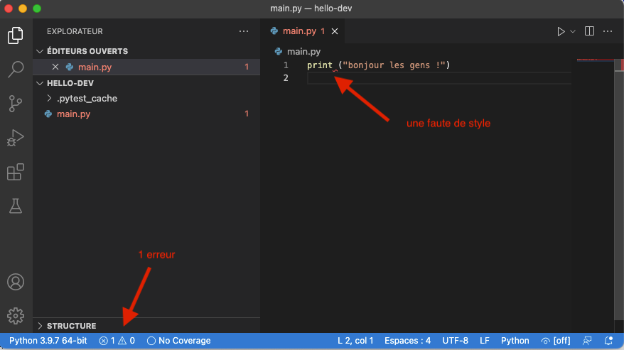
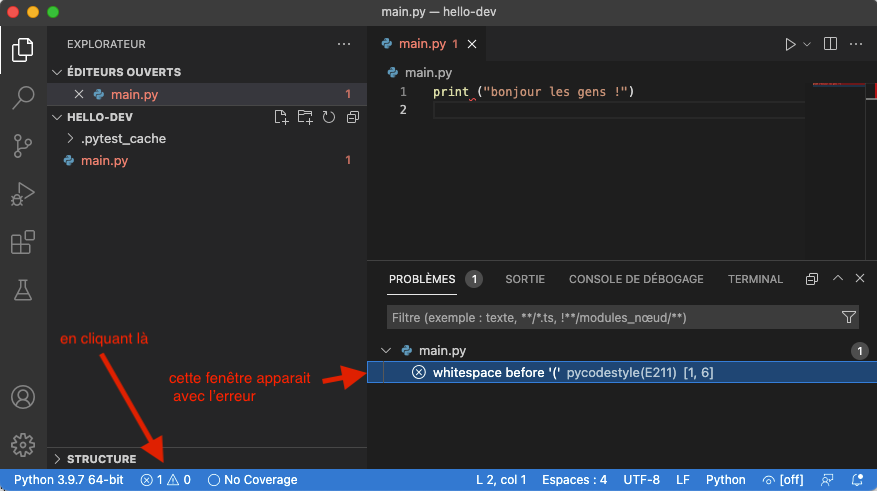
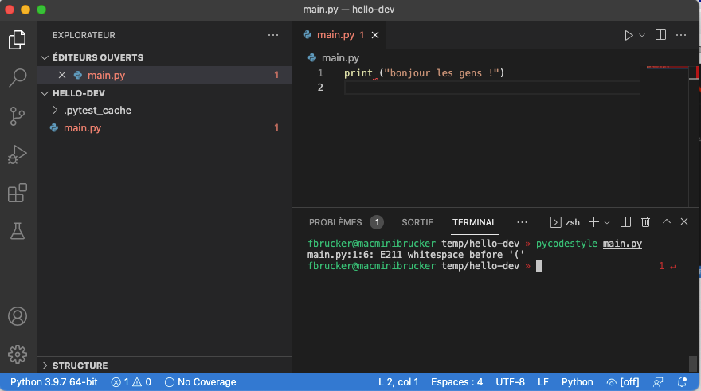
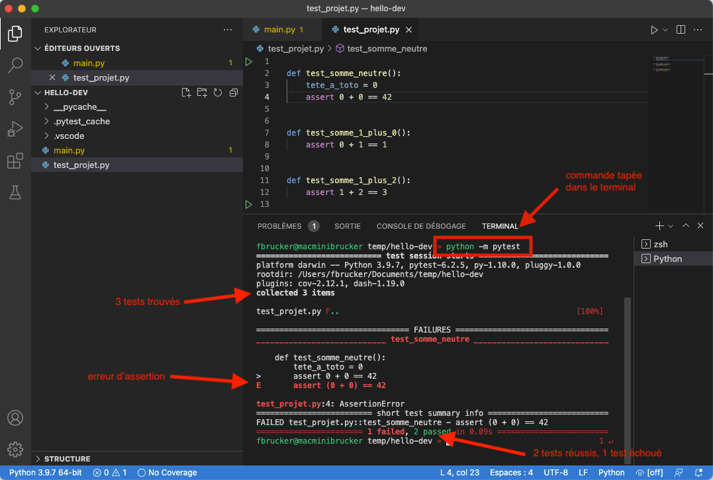
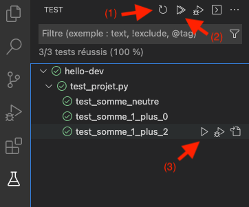

> [Algorithme, code et théorie]() / [code]() / [mise en oeuvre d'un projet]()
>
> **prérequis :**
>
>* [python et vscode]()
>
{.chemin}

Un projet informatique a un début, lorsque l'on crée le dossier qui va le contenir, mais il n'a que rarement de fin : il y a toujours des fonctionnalités à ajouter et des bugs à corriger. Enfin, et c'est le plus important, un code est fait pour être utilisé.

De ces deux constatations, on en déduit trois règles fondamentales d'un code utile. Il faut qu'il soit :

* juste pour des utilisateurs puissent s'en servir
* facilement modifiable pour que l'ajout et la correction de fonctionnalités soient aisés
* lisible pour soi et pour les autres membres de l'équipe de développement

Le langage d'application n'a que peu d'intérêt en soit. On choisit celui qui est le plus adapté à notre but. Ici, on utilisera le python mais tout ce qu'on verra est transposable pour tout autre langage sérieux. L'éditeur de texte que l'on utilisera sera vscode. Il en existe d'autres très bien aussi et tout ce qu'on verra avec vscode (les raccourcis claviers, et aides au développement) sont transposables à d'autres editeurs en lisant la doc.

> Écrire du code nécessite de nombreuses automatisations et aides pour que ce ne soit pas pénible, ne vous privez pas d'outils parce que vous n'avez pas envie d'apprendre de nouvelles choses et que *ça suffit bien pour ce que je veux faire*. Vous allez au final perdre plus de temps que l'apprentissage initial (ce qui est tarte).
{.note}

## un projet

On va créer un projet pour comprendre comment tout ça fonctionne.

Nous allons préparer le projet dans lequel nous allons coder. Ceci se fait avec vscode en ouvrant un dossier. Ce dossier sera le départ de votre projet et s'appelle *workspace*.

>
>1. Commencez par créer le dossier *"hello-dev"* dans un explorateur de fichier
>2. dans vscode, choisissez : "*fichier > ouvrir le dossier...*" puis naviguez jusqu'à votre dossier *"hello-dev"*. On vous demande si vous faites confiances aux auteurs, puisque c'est vous dites oui.
>
{.a-faire}

> Lorsque l'on code et que l'on ne veut pas de problèmes en développement, les noms de fichiers et de dossier doivent êtres **sans espaces et sans accents**.
{.note}

### fichier python

On va créer notre premier fichier python :

> 1. allez dans *menu Fichier > Nouveau Fichier*
> 2. et sauvez le de suite : *menu Fichier > Enregistrer* avec le nom *"main.py"*.
>
{.a-faire}

Vscode à compris que c'était du python, il l'écrit dans la barre de statut (la dernière ligne, en bleu, de la fenêtre vscode, voir [user interface](https://code.visualstudio.com/docs/getstarted/userinterface)).

>Si vous n'avez pas suivi le tuto d'installation de vscode et son interaction avec python, il vous demandera peut-être de :
>
>   1. choisir un interpréteur : prenez le python3 de votre distribution
>   2. choisir un lint : supprimer la fenêtre de warning, on fera ça plus tard.
>   3. choisir des tests : supprimer la fenêtre de warning, on fera ça plus tard.
>
>Si c'est le cas, arrêtez tout et **faites** les prés-requis...

### exécution d'un fichier

> Ecrivez dans le fichier *main.py* :
>
>```python
>print("bonjour les gens !")
>
>```
>
{.a-faire}

En vous rappelant ce que vous avez vu dans [le tutorial python et vscode](#execution-python) :

> Exécutez le code de deux manières différentes :
>
> * avec le terminal
> * avec le petit triangle
>
{.a-faire}

## du joli code {#linter}

Vous allez passer beaucoup de temps à lire du code, le votre et celui des autres. Il est important que ce soit facile. Pour cela il faut que le style de code soit cohérent. Python donne des règle de style, c'est ce qu'on appelle la [PEP8](https://www.python.org/dev/peps/pep-0008/).

Vous avez du installer le linter pycodestyle dans les prés-requis. Vérifions qu'il remarque bien les fautes :

> Modifiez le fichier *"main.py"* pour écrire :
>
>```python
>print ("bonjour les gens !")
>
>```
>
{.a-faire}

Une fois le fichier sauvé vous devriez voir que l'espace entre print et la parenthèse est souligné en rouge :

{:style="margin: auto;display: block"}

On peut cliquer sur la status-bar pour voir l'erreur :

{:style="margin: auto;display: block"}

OU encore utiliser le terminal :

{:style="margin: auto;display: block"}

On a mis un espace entre le nom de la fonction et ses paramètres, c'est mal.

> **style** : **NE JAMAIS METTRE D'ESPACE APRÈS UN NOM DE FONCTION**
>
> parce qu'on ne voit pas immédiatement si c'est une fonction ou un nom de variable.
{.note}

Vous devriez peut-être aussi avoir la parenthèse de fin souligné en jaune. C'est parce que la dernière ligne de votre fichier n'est pas vide. Si ce n'est pas le cas, c'est que vous avez bien que 2 lignes dans votre fichier, la seconde étant vide.

> **style** : **la dernière ligne d'un fichier python est vide**
{.note}

La documentation de pycodestyle vous indique [toutes les erreurs qu'il reconnait](https://pycodestyle.pycqa.org/en/latest/intro.html#error-codes). Elles sont conformes aux recommandations de la [PEP8](https://realpython.com/python-pep8/).

> Prenez l'habitude d'écrire du code sans aucune erreur de style. Et, surtout, **apprenez pourquoi cette règle existe**. Suivre une règle sans comprendre pourquoi elle existe n'est pas efficace... Parce qu'on ne sait pas s'il faut la suivre ou pas.
{.note}

Tout au long de ce projet et des prochains, il faut faire en sorte qu'il n'y ait jamais d'erreur de style. Soyez donc vigilant au début avant que cela devienne naturel.

### séparer code et main

> Un projet c'est trois choses d'égale importance :
>
> * le code : les fonctions utilisées
> * le main : le programme principal, c'est ce qu'on exécute lorsque veut faire marcher le projet
> * les tests : ce qui garantit que le code fonctionne
>
{.note}

Pour séparer les différentes parties vous allez :

> Créez deux fichiers dans notre projet, l'un nommé *"le_code.py"* qui contiendra notre code et l'autre nommé *"main.py"* qui sera notre programme principal
{.a-faire}

Fichier *le_code.py* :

```python
def bonjour():
    return "Bonjour les gens !"

```

Fichier *main.py* :

```python
from le_code import bonjour

print(bonjour())

```

On a importé le nom `bonjour` défini dans le fichier *"le_code.py"* grâce à un import. L'autre façon aurait été d'importer juste le fichier code. On aurait alors eu :

```python
import le_code

print(le_code.bonjour())

```

La notation pointée se lit alors : exécute le nom `bonjour` définit dans *"le_code"*.

> Pour plus d'information sur les modules vous pouvez lire [ceci]().

Ne **jamais jamais jamais** utiliser `from le_code import *` qui importe tous les noms définis dans *"le_code.py"*. On ne sait pas vraiment ce qui a été importé en lisant *"le_code.py"*. : notre code n'est pas lisible ! Le gain d'écriture de `*` plutôt que `bonjour` sera perdu au centuple plus tard lorsque l'on devra chercher dans tous les fichiers du projet où l'on a bien pu définir `bonjour`...

> Comme on va passer plus de temps à lire/comprendre du code qu'à l'écrire, il faut **optimiser la lecture et non l'écriture de code**.  On préférera toujours **la lisibilité à la rapidité**.
{.note}

## tests

Les tests permettent de vérifier que notre code fonctionne. Ils font partie du programme et on peut s'y référer quand on veut. Lorsque l'on modifie le code, on pourra toujours exécuter **tous les tests** pour vérifier que notre programme fonctionne aussi bien qu'avant.

> Vous avez du installer pytest et fait le lien avec vscode en suivant les prés-requis. Si ce n'est pas le cas, faites le.

On y reviendra plus tard et à de nombreuses reprises :

> les tests sont la pierre angulaire d'une bonne programmation : ils garantissent le fonctionnement de votre code et qu'[il ne peut régresser](https://blog.octo.com/via-negativa-tdd-et-la-conception-de-logiciel/).
{.note}

Les tests sont de petites fonctions dont le but est de *tester* une fonctionnalité du programme (souvent le résultat de l'exécution d'une fonction). Le test consiste en une [assertion](https://fr.wikipedia.org/wiki/Assertion) que l'on veut être vraie si que le code fonctionne. Si l'assertion est fausse c'est qu'il y a un bug.

### la commande assert

On utilise en python la commande [assert](https://docs.python.org/fr/3/reference/simple_stmts.html#the-assert-statement). Elle fonctionne ainsi :

```text
assert <expression logique>
```

Si l'expression logique est vraie, le programme continue sans rien dire et si l'expression logique est fausse, le programme s'arrête avec l'erreur : `AssertionError`.

Essayons ça avec la plus simple des expressions logiques : `True`

> créez un fichier nommé *test_projet.py* qui contiendra le code :
>
>```python
>print("avant l'assert")
>
>assert True
>
>print("après l'assert")
>
>```
>
> Exécutez-le.
>
{.a-faire}

Lorsque vous exécutez ce fichier, vous devez obtenir le résultat suivant :

```text
avant l'assert
après l'assert
```

La condition logique étant vraie, la commande `assert` n'a rien fait.

Changeons ça en mettant une condition logique fausse :

> Modifiez *test_projet.py* pour qu'il contienne le code :
>
>```python
>print("avant l'assert")
>
>assert False
>
>print("après l'assert")
>
>```
>
> Exécutez-le.
>
{.a-faire}

Vous devez obtenir le résultat suivant :

```text
avant l'assert
Traceback (most recent call last):
  File "/Users/fbrucker/Documents/temp/hello-dev/test_projet.py", line 3, in <module>
    assert False
AssertionError
```

La première ligne a bien été exécutée (on voit écrit `avant l'assert`), puis le programme a planté. La condition logique étant fausse, la commande `assert` a levé une exception nommée `AssertionError` qui a stoppé l'exécution du programme. La ligne `print("après l'assert")` n'a pas été exécutée.

D'habitude, nos expressions logiques vérifie qu'un comportement observé (l'exécution d'une fonction) est conforme au comportement théorique (le résultat qu'on aimerait avoir). Pour ne pas se perdre on range ce test dans une fonction dont le nom décrit le test. Par exemple, testons la somme :

> Modifiez *test_projet.py* pour qu'il contienne le code :
>
>```python
>
> def test_somme_neutre():
>     tete_a_toto = 0
>     assert 0 + 0 == tete_a_toto
>
>
> def test_somme_1_plus_0():
>     assert 0 + 1 == 1
>
>
> def test_somme_1_plus_2():
>     assert 1 + 2 == 3
> 
>```
>
> Exécutez-le.
>
{.a-faire}

Pour tester la somme, j'ai décider de faire 3 tests :

* le cas le plus simple où il ne se passe rien (`0 + 0 = 0`)
* un cas simple (`0 + 1 = 1`)
* un cas général (`1 + 2 = 3`)

Lorsque l'on exécute ce code, il ne se passe rien. Est-ce bon signe ?

> Modifiez la fonction `test_somme_neutre` du fichier *test_projet.py* pour qu'elle soit égale à  :
>
>```python
> # ...
> 
> def test_somme_neutre():
>     tete_a_toto = 0
>     assert 0 + 0 == 42
>
> # ...
>```
>
> Exécutez le fichier *test_projet.py*.
>
{.a-faire}

Le code s'exécute encore encombre. Bon, là, c'est pas normal car `0 + 0` ne peut être égal à `42`.

La raison est que *test_projet.py* définit des fonction mais ne les **exécute jamais**. Les trois fonctions de test sont définies mais jamais utilisées.

On a donc 2 choix :

* exécuter les fonctions dans le fichier après les avoir définies
* utiliser un module que le fait pour nous

Nous allons utiliser la seconde option avec pytset.

### pytest

> Tapez la commande `python -m pytest` dans un terminal.
{.a-faire}

Vous devriez obtenir quelque chose du genre :

{:style="margin: auto;display: block"}

> Corrigez le test de *test_projet.py* qui rate et re-exécutez le code pour voir les 3 tests réussir.
>
{.a-faire}

Que fait pytest :

> pytest exécute toutes les fonctions commençant par `test_` de tous les fichiers commençant par `test_` d’un projet.
{.note}

On peut aussi exécuter les tests directement avec vscode. Pour cela, cliquez sur [le petit erlenmeyer](https://code.visualstudio.com/docs/python/testing#_configure-tests). Vous pourrez ensuite :

1. découvrir les tests du projet
2. exécuter tous les tests
3. n'exécuter qu'un seul test

{:style="margin: auto;display: block"}

### test du projet

Notre projet contient pour l'instant une fonction qui rend une constante. Tester une constante n'a pas de sens, modifions notre code pour que notre fonction ait plus de sens :

> Modifiez le fichier *"le_code.py"* pour qu'il contienne le code :
>
>```python
> def bonjour(nom):
>     return "bonjour " + nom + " !"
>
>```
>
{.a-faire}

On peut maintenant remplacer les tests :

> Modifiez le fichier *"test_projet.py"* pour qu'il contienne le code :
>
>```python
> from le_code import bonjour
>
>
> def test_bonjour():
>     assert bonjour("monde") == "bonjour monde !"
>
>```
>
> Exécutez les tests pour vérifier que votre code fonctionne.
{.a-faire}

Maintenant que les tests passent, on peut modifier le programme principal.

> Modifiez le fichier *"main.py"* pour qu'il contienne le code :
>
>```python
> from le_code import bonjour
>
> print(bonjour("monde"))
>
>```
>
> Exécutez le programme principal.
{.a-faire}

Félicitations, vous avez fait votre premier projet fonctionnel !

## les fichiers

les trois fichiers du projet final sont [disponibles](https://github.com/FrancoisBrucker/cours_informatique/tree/master/docs/cours/algorithme-code-theorie/code/projets-code/hello-dev)
