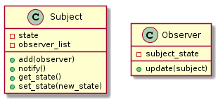

> [Algorithme, code et théorie]() / [exercices]() / [2021-2022]() / [sujet Test 5 : classes et objets (le retour)]()
{.chemin}

## 1

On utilise les deux classes de la figure suivante :

{:style="margin: auto;display: block;"}

Les attributs sont considérés comme privés

### 1.1

Explicitez le lien de dépendance entre `Store` et `StateObject`

### 1.2

Trois Propositions de code sont données :

proposition 1 :

```python
state = StateObject()
state.set_state(1)
store = Store(state)
store.saved_state = state.get_state()
```

proposition 2 :

```python
state = StateObject()
state.set_state(1)
store = Store(state)
```

proposition 3 :

```python
state = StateObject(1)
store = Store(state)
```

#### 1.2.1

Une proposition est incorrecte en python. Laquelle et pourquoi ?

#### 1.2.2

Parmi les deux propositions correctes, laquelle privilégierez vous ? Et pourquoi ?

## question 2

La figure suivante montre le diagramme UML du design pattern *Observer*. Les objets de la classe `Observer` (ou ceux héritant d'elle) s'inscrivent à un objet de la classe `Subject` (via la méthode `add`) pour être prévenus de chaque changement d'état (via la méthode `notify`).

{:style="margin: auto;display: block;"}

> On vous demande d'écrire le code en python.

### 2.1

Quel est la fonction de ce couple de classe (choisissez la bonne réponse parmi les 3 possibilités ci-après) ?

* permet aux objets observant un sujet de le modifier à tout moment ?
* permet aux objets observant un sujet d'être informé des changements d'un sujet par celui-ci ?
* permet au sujet de modifier les objets qui l'observent ?

### 2.2

Ecrivez la méthode `add` de la classe `Subject`, qui ajoute l'objet passé en paramètre à la liste des éléments observant le sujet.

### 2.3

Ecrivez la méthode update de la classe `Observer` qui place dans `subject_state` l'état courant d'objet de la classe `Subject` passé en paramètre.

### 2.4

Ecrivez la méthode `notify` de `Subject` qui permet la mise à jour des éléments observant le `Subject`

### 2.5

décrivez un cas d'utilisation possible de ce pattern bien étrange.
